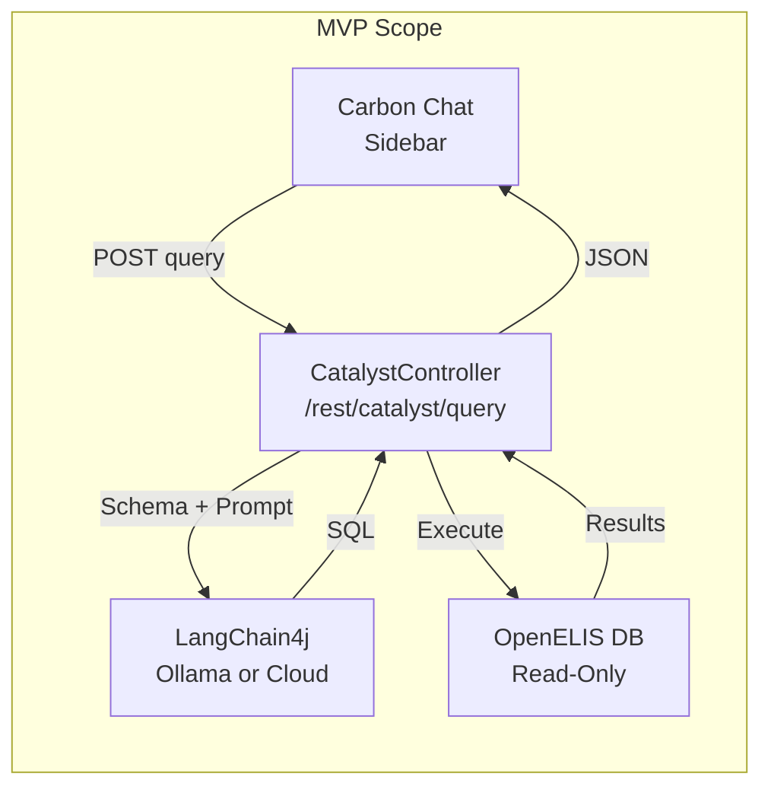
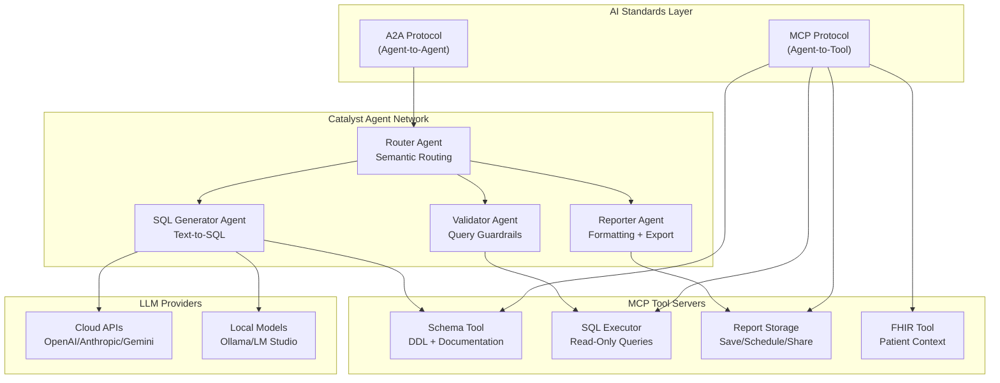
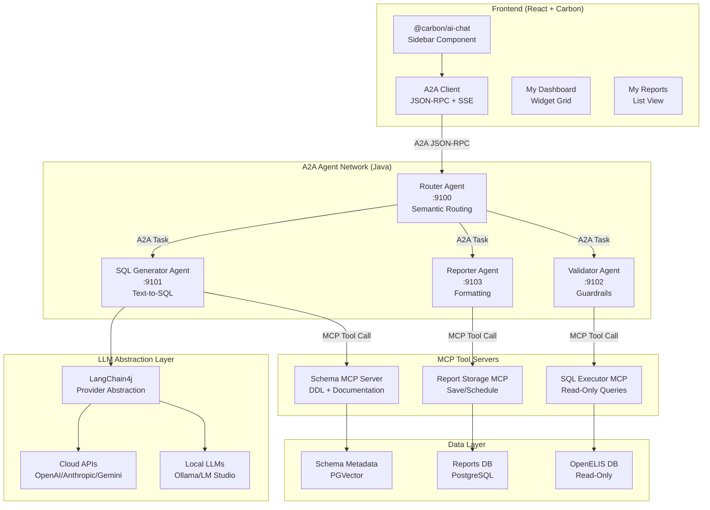
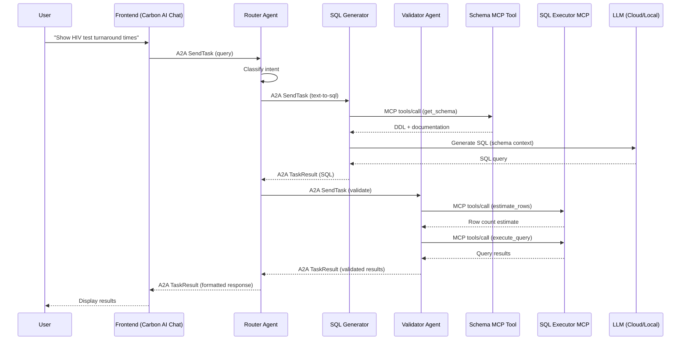
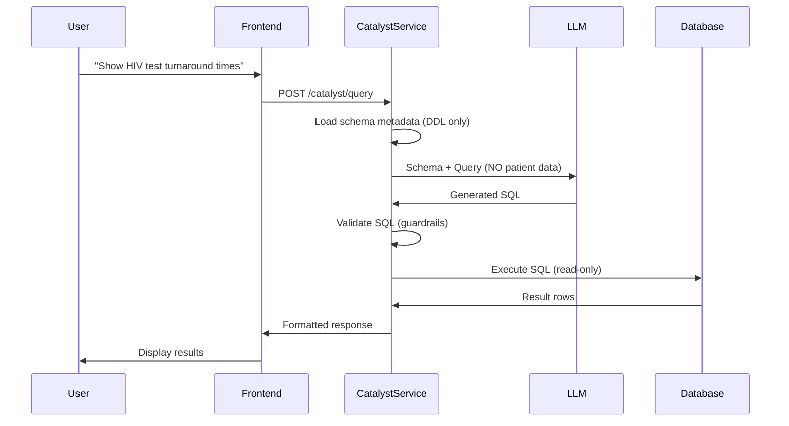

# Catalyst Development Environment Setup

## Executive Summary

OGC-70 defines **Catalyst** as an LLM-powered data assistant that converts
natural language queries into SQL reports for OpenELIS Global. The core privacy
constraint is that **the LLM only receives database schema metadata, never
patient data**.

### Primary Goal: Rapid MVP Against OpenELIS

**Get a working chat-to-SQL prototype running against OpenELIS in 1-2 sprints.**
Validate the core value proposition before investing in full architecture.

| Phase | Scope | Timeline | Deliverable |

|-------|-------|----------|-------------|

| **MVP** | Single-endpoint chat → SQL → results | 1-2 sprints | Working
prototype against OE dev DB |

| **Phase 2** | Standards refactor (MCP + A2A) | 2-3 sprints | Modular, testable
architecture |

| **Phase 3** | Full OGC-70 features | 4+ sprints | Reports, dashboards,
scheduling |

### Standards-Based Architecture (Phase 2+)

After MVP validation, refactor to industry standards:

- **Agent2Agent (A2A) Protocol** - Google's open standard for agent
  collaboration
- **Model Context Protocol (MCP)** - Anthropic's standard for LLM-tool
  integration
- **Google HAI-DEF patterns** - Healthcare AI agentic workflows

**Reference Implementations:**

- [pmanko/med-agent-hub](https://github.com/pmanko/med-agent-hub) - A2A + MCP
  multi-agent system
- [pmanko/omrs-ai-playground](https://github.com/pmanko/omrs-ai-playground) -
  Healthcare AI platform

---

## MVP Architecture (Sprint 1-2)



### MVP Scope Definition

| Include in MVP | Defer to Phase 2+ |

|----------------|-------------------|

| Single REST endpoint `/rest/catalyst/query` | Multi-agent A2A orchestration |

| LangChain4j with Ollama OR cloud API | MCP tool servers |

| Static schema context file (DDL dump) | Dynamic schema RAG with PGVector |

| Basic Carbon chat sidebar | Wizard mode, report builder |

| JSON/CSV response only | PDF, Excel, charts |

| 3-5 hardcoded example prompts | Full NL understanding |

| Manual SQL review before execute | Auto-execute with guardrails |

### MVP Implementation Steps

```bash
# Step 1: Extract OpenELIS schema (one-time, ~5 min)
docker exec oe-postgres psql -U clinlims -d clinlims \
  -c "SELECT table_name, column_name, data_type FROM information_schema.columns WHERE table_schema = 'clinlims'" \
  > volume/catalyst/schema_context.sql

# Step 2: Start Ollama with SQLCoder (~10 min with GPU)
docker compose -f catalyst-dev.docker-compose.yml up -d
# OR use cloud API for faster iteration:
export CATALYST_LLM_PROVIDER=openai
export OPENAI_API_KEY=sk-xxx

# Step 3: Build and run backend with Catalyst endpoint
mvn clean install -DskipTests -Dmaven.test.skip=true
docker compose -f dev.docker-compose.yml up -d

# Step 4: Test the MVP endpoint
curl -X POST https://localhost/rest/catalyst/query \
  -H "Content-Type: application/json" \
  -d '{"query": "How many samples were entered today?"}'
```

### MVP Files to Create

| File | Purpose | LOC Est. |

|------|---------|----------|

| `CatalystRestController.java` | Single `/query` endpoint | ~100 |

| `CatalystQueryService.java` | LangChain4j integration | ~150 |

| `CatalystLLMConfig.java` | Provider switching | ~80 |

| `schema_context.sql` | Static DDL for prompts | ~500 |

| `CatalystSidebar.jsx` | Basic chat UI | ~200 |

| `catalyst-dev.docker-compose.yml` | Ollama setup | ~30 |

**Total MVP estimate: ~1,000 lines of code**

---

## Standards-Driven AI Architecture (Phase 2+)

### Why Standards Matter for Healthcare AI

1. **Interoperability**: A2A enables Catalyst agents to collaborate with
   external AI systems (OpenMRS, FHIR servers)
2. **Tool Standardization**: MCP provides a universal interface for database
   access, eliminating custom integrations
3. **Vendor Independence**: Switch between cloud (OpenAI, Anthropic) and local
   (Ollama, LM Studio) without code changes
4. **Auditability**: Standardized message formats enable comprehensive logging
   for HIPAA/SLIPTA compliance

### Protocol Stack



### Agent2Agent (A2A) Protocol Integration

**What is A2A?** Google's open protocol (donated to Linux Foundation,
April 2025) enabling AI agents to discover, authenticate, and delegate tasks
regardless of framework.

**Core Concepts:**

| Concept | Description | Catalyst Usage |

|---------|-------------|----------------|

| **Agent Card** | JSON metadata at `/.well-known/agent.json` | Each Catalyst
agent publishes capabilities |

| **Task** | Unit of work with lifecycle (submitted → working → completed) |
Query generation, validation, execution |

| **Message/Parts** | Multimodal communication (text, JSON, files) | Schema
context, SQL results, charts |

| **Skills** | Typed capabilities agents expose | `text-to-sql`,
`validate-query`, `format-report` |

**Java Implementation Options:**

| Library | Best For | Features |

|---------|----------|----------|

| [a2ajava](https://github.com/vishalmysore/a2ajava) | Spring Boot integration |
`@Agent`, `@Action` annotations, MCP support |

| [a2a4j](https://github.com/pheonixhkbxoic/a2a4j) | Enterprise Spring | Spring
Boot starters (MVC + WebFlux) |

| [Official A2A SDK](https://github.com/a2aproject/a2a-java) | Quarkus/Jakarta
EE | Google + Red Hat maintained |

**Recommended for Catalyst:** `a2ajava` - provides both A2A and MCP support with
Spring Boot annotations.

```xml
<!-- pom.xml -->
<dependency>
    <groupId>io.github.vishalmysore</groupId>
    <artifactId>a2ajava</artifactId>
    <version>0.0.9</version>
</dependency>
```

### Model Context Protocol (MCP) Integration

**What is MCP?** Anthropic's open standard (adopted by OpenAI, March 2025) for
connecting LLMs to data sources and tools.

**MCP vs A2A (Complementary Protocols):**

| Protocol | Layer | Purpose | Catalyst Usage |

|----------|-------|---------|----------------|

| **A2A** | Horizontal | Agent-to-Agent collaboration | Router → SQL Generator →
Validator |

| **MCP** | Vertical | Agent-to-Tool integration | SQL Generator → Schema Tool |

**MCP Java SDK (Official):**

```xml
<!-- pom.xml -->
<dependency>
    <groupId>io.modelcontextprotocol</groupId>
    <artifactId>mcp-java-sdk</artifactId>
    <version>0.8.0</version>
</dependency>
<!-- Spring AI MCP integration -->
<dependency>
    <groupId>org.springframework.ai</groupId>
    <artifactId>spring-ai-mcp-client-spring-boot-starter</artifactId>
    <version>1.0.0</version>
</dependency>
```

**LangChain4j MCP Support:**

```xml
<dependency>
    <groupId>dev.langchain4j</groupId>
    <artifactId>langchain4j-mcp</artifactId>
    <version>1.1.0</version>
</dependency>
```

---

## Architecture Overview (Updated with Standards)



### A2A Agent Communication Flow



---

## Technology Stack Decisions

### 1. LLM Integration Layer (Backend)

**Recommended: LangChain4j + Spring Boot Starter**

LangChain4j provides Java-native LLM integration with:

- Unified API across providers (OpenAI, Anthropic, Ollama, etc.)
- Built-in RAG support for schema retrieval
- Tool calling for SQL execution
- Spring Boot auto-configuration

```xml
<!-- pom.xml additions -->
<dependency>
    <groupId>dev.langchain4j</groupId>
    <artifactId>langchain4j-spring-boot-starter</artifactId>
    <version>1.1.0</version>
</dependency>
<dependency>
    <groupId>dev.langchain4j</groupId>
    <artifactId>langchain4j-ollama-spring-boot-starter</artifactId>
    <version>1.1.0</version>
</dependency>
<dependency>
    <groupId>dev.langchain4j</groupId>
    <artifactId>langchain4j-open-ai-spring-boot-starter</artifactId>
    <version>1.1.0</version>
</dependency>
```

### 2. Text-to-SQL Strategy

**Hybrid Approach:**

| Component | Cloud Development | Local/Production |

|-----------|-------------------|------------------|

| Primary Model | GPT-4o / Claude Sonnet | SQLCoder-7B via Ollama |

| Fallback | Structured Query Builder UI | Same |

| Schema RAG | Embedded (PGVector) | Same |

| Guardrails | Row estimation, complexity limits | Same |

**Key Insight from Research:** Modern text-to-SQL requires **agentic RAG** -
retrieving relevant schema chunks before generation. Vanna.ai's approach of
training on DDL + documentation + example queries is the current best practice.

### 3. Local LLM Infrastructure

**Development Setup (Docker Compose):**

```yaml
# catalyst-dev.docker-compose.yml
services:
  ollama:
    image: ollama/ollama:latest
    ports:
      - "11434:11434"
    volumes:
      - ollama_data:/root/.ollama
    deploy:
      resources:
        reservations:
          devices:
            - driver: nvidia
              count: all
              capabilities: [gpu]

  # Pre-pull SQLCoder model on startup
  ollama-init:
    image: ollama/ollama:latest
    depends_on:
      - ollama
    entrypoint: ["/bin/sh", "-c"]
    command:
      - |
        sleep 5
        ollama pull sqlcoder:7b
        ollama pull llama3.2:3b
```

**Model Selection:**

- **SQLCoder-7B** (defog/sqlcoder-7b-2): State-of-the-art for SQL generation,
  outperforms GPT-3.5
- **Llama 3.2 3B**: Lightweight fallback for reasoning/explanation
- **Quantization**: GGUF Q4 format reduces VRAM to ~6GB (runs on most developer
  GPUs)

### 4. Frontend Chat Component

**Recommended: @carbon/ai-chat v1.0**

IBM's official Carbon AI Chat library provides:

- Carbon Design System compliance (Constitution Principle II)
- ChatContainer for sidebar implementation
- AI labeling and "light-inspired" styling
- SSR caveat: client-side rendering only

```bash
npm install @carbon/ai-chat @carbon/ai-chat-components
```

**Alternative for deeper customization:** `assistant-ui/assistant-ui` - more
flexible but requires manual Carbon styling.

### 5. Multi-Agent Orchestration (A2A Protocol)

**Recommended: A2A Protocol with a2ajava SDK**

Based on patterns from `med-agent-hub`, Catalyst uses independent A2A agent
services:

**Agent Roles (A2A Services):**

| Agent | Port | Skill | LLM Model | Description |

|-------|------|-------|-----------|-------------|

| Router | 9100 | `route-query` | Llama-3.1 8B | Semantic routing, orchestration
|

| SQL Generator | 9101 | `text-to-sql` | SQLCoder-7B | Schema-aware SQL
generation |

| Validator | 9102 | `validate-sql` | Gemma-3 1B | Guardrails, row estimation |

| Reporter | 9103 | `format-report` | Llama-3.2 3B | Charts, tables, exports |

**A2A Agent Card Example (Router):**

```json
{
  "name": "catalyst-router",
  "description": "Semantic router for lab data queries",
  "url": "http://localhost:9100",
  "version": "1.0.0",
  "preferred_transport": "jsonrpc",
  "capabilities": { "streaming": true },
  "skills": [
    {
      "id": "route-query",
      "name": "Route Natural Language Query",
      "input_schema": {
        "type": "object",
        "properties": { "query": { "type": "string" } },
        "required": ["query"]
      }
    }
  ]
}
```

### 6. Hybrid Cloud + Local Development

**Key Requirement:** Enable seamless switching between:

- **Cloud APIs**: Fast iteration (GPT-4o, Claude)
- **Local (LM Studio)**: Development with UI model management
- **Local (Ollama)**: Air-gapped production deployment
- **Mock**: Deterministic CI/CD testing

**Environment-Based Provider Selection:**

```properties
# .env.cloud (Development)
CATALYST_LLM_PROVIDER=openai
OPENAI_API_KEY=sk-xxx

# .env.local (LM Studio)
CATALYST_LLM_PROVIDER=lmstudio
LLM_BASE_URL=http://localhost:1234

# .env.ollama (Production)
CATALYST_LLM_PROVIDER=ollama
OLLAMA_BASE_URL=http://ollama:11434
```

---

## Development Environment Configuration

### Phase 1: Core Infrastructure

**Directory Structure (A2A + MCP Pattern):**

```
src/main/java/org/openelisglobal/catalyst/
├── controller/
│   └── CatalystRestController.java
├── service/
│   ├── CatalystQueryService.java
│   ├── SchemaMetadataService.java
│   └── ReportStorageService.java
├── valueholder/
│   ├── CatalystReport.java
│   ├── CatalystQuery.java
│   └── SchemaMetadata.java
├── dao/
│   └── CatalystReportDAO.java
├── config/
│   ├── CatalystLLMConfig.java
│   └── CatalystA2AConfig.java
├── a2a/
│   ├── agents/
│   │   ├── RouterAgent.java           # @Agent annotation
│   │   ├── SQLGeneratorAgent.java
│   │   ├── ValidatorAgent.java
│   │   └── ReporterAgent.java
│   ├── skills/
│   │   ├── RouteQuerySkill.java       # @Action annotation
│   │   ├── TextToSQLSkill.java
│   │   └── ValidateSQLSkill.java
│   └── client/
│       └── A2AAgentClient.java
└── mcp/
    ├── tools/
    │   ├── SchemaTool.java            # MCP tool implementation
    │   ├── SQLExecutorTool.java
    │   └── ReportStorageTool.java
    └── server/
        └── CatalystMCPServer.java

frontend/src/components/catalyst/
├── CatalystSidebar.jsx
├── ChatInterface.jsx
├── A2AClient.js                       # A2A JSON-RPC client
├── QueryBuilder.jsx
├── ReportList.jsx
└── DashboardWidget.jsx
```

**Configuration (application.yml):**

```yaml
# LLM Provider Configuration
catalyst:
  llm:
    provider: ${CATALYST_LLM_PROVIDER:ollama} # ollama, openai, anthropic

    ollama:
      base-url: ${OLLAMA_BASE_URL:http://localhost:11434}
      model: sqlcoder:7b
      timeout: 60s

    openai:
      api-key: ${OPENAI_API_KEY:}
      model: gpt-4o

    anthropic:
      api-key: ${ANTHROPIC_API_KEY:}
      model: claude-sonnet-4-20250514

  guardrails:
    max-rows: 10000
    query-timeout: 30s
    blocked-tables:
      - sys_user
      - login_user
      - user_role
    required-filters:
      - date_range
```

### Phase 2: Schema Metadata Pipeline

**Critical for Accuracy:** The LLM needs rich schema context without patient
data.

**Schema Extraction Service:**

```java
@Service
public class SchemaMetadataService {

    // Extract DDL from PostgreSQL information_schema
    public List<TableMetadata> extractSchema() {
        // SELECT table_name, column_name, data_type, ...
        // FROM information_schema.columns
        // WHERE table_schema = 'clinlims'
    }

    // Enrich with business documentation
    public void addDocumentation(String tableName, String description) {
        // Store human-readable descriptions
        // e.g., "sample" -> "Laboratory sample with accession number"
    }

    // Generate training examples
    public List<QueryExample> getExampleQueries() {
        // Return validated SQL examples for RAG training
    }
}
```

**Vector Store for Schema RAG:**

```xml
<dependency>
    <groupId>dev.langchain4j</groupId>
    <artifactId>langchain4j-pgvector</artifactId>
    <version>1.1.0</version>
</dependency>
```

### Phase 3: Testing Infrastructure

**Mock LLM for Development:**

```java
@Profile("test")
@Component
public class MockLLMProvider implements LLMProvider {

    private final Map<String, String> cannedResponses = Map.of(
        "show all samples from today",
        "SELECT * FROM sample WHERE entered_date = CURRENT_DATE",

        "count HIV tests this month",
        "SELECT COUNT(*) FROM analysis a JOIN test t ON a.test_id = t.id " +
        "WHERE t.name LIKE '%HIV%' AND a.started_date >= DATE_TRUNC('month', CURRENT_DATE)"
    );

    @Override
    public String generateSQL(String prompt, String schemaContext) {
        return cannedResponses.getOrDefault(prompt, "SELECT 1"); // Deterministic
    }
}
```

**LLM Response Recording (VCR Pattern):**

```java
@Component
public class LLMResponseRecorder {
    // Record real LLM responses during development
    // Replay in CI/CD for deterministic tests
}
```

---

## Privacy-First Architecture

**Key Principle:** LLM receives schema metadata only, never patient data.



**Security Controls:**

1. LLM prompts contain only: schema DDL, column descriptions, example queries
2. Read-only database connection for query execution
3. Row-level security via user permissions (existing OpenELIS RBAC)
4. Audit logging of all generated queries
5. Blocked table list (sys_user, login_user, etc.)

---

## Local vs Cloud LLM Decision Matrix

| Factor | Cloud (OpenAI/Anthropic) | Local (Ollama + SQLCoder) |

|--------|--------------------------|---------------------------|

| Setup Complexity | Low (API key only) | Medium (Docker + GPU) |

| Cost | ~$0.01-0.03 per query | Hardware only |

| Latency | 500-1000ms | 100-300ms |

| Privacy | Data leaves network | Fully air-gapped |

| Accuracy (SQL) | GPT-4o: 72% | SQLCoder-7B: 70%+ |

| Multi-language | Excellent | Limited (English best) |

| Deployment | Any environment | Requires GPU (8GB+ VRAM) |

**Recommendation:** Start with cloud APIs for rapid iteration, deploy local for
production in privacy-sensitive environments.

---

## Implementation Milestones

### MVP Phase (Sprint 1-2) - Get It Working

| ID | Scope | Verification | Est. |

|----|-------|--------------|------|

| MVP-1 | Extract OpenELIS schema DDL to context file | File exists, covers key
tables | 2h |

| MVP-2 | `CatalystLLMConfig.java` - provider switching (cloud/Ollama) | Unit
test passes | 4h |

| MVP-3 | `CatalystQueryService.java` - LangChain4j text-to-SQL | Returns valid
SQL for 3 test prompts | 8h |

| MVP-4 | `CatalystRestController.java` - `/query` endpoint | curl returns SQL +
results | 4h |

| MVP-5 | Basic `CatalystSidebar.jsx` with Carbon AI Chat | Renders, sends
query, shows response | 8h |

| MVP-6 | One Cypress E2E test - full flow | Test passes | 4h |

**MVP Total: ~30 hours (1 sprint)**

### Phase 2 - Standards Refactor (Sprint 3-4)

| ID | Scope | Verification | Dependencies |

|----|-------|--------------|--------------|

| P2-1 | MCP Schema Tool server | Tool responds to `get_schema` | MVP complete |

| P2-2 | MCP SQL Executor Tool | Tool executes validated SQL | MVP complete |

| P2-3 | A2A Router Agent | Routes to correct specialist | P2-1, P2-2 |

| P2-4 | A2A SQL Generator Agent | Generates SQL via MCP tools | P2-1 |

| P2-5 | A2A Validator Agent | Row estimation, guardrails | P2-2 |

| P2-6 | Refactor frontend for A2A client | Chat uses A2A protocol | P2-3 |

### Phase 3 - Full OGC-70 Features (Sprint 5+)

| ID | Scope | Dependencies |

|----|-------|--------------|

| P3-1 | Report storage (save, name, share) | Phase 2 |

| P3-2 | Scheduling (cron, quiet hours) | P3-1 |

| P3-3 | Dashboard widgets (charts, KPIs) | P3-1 |

| P3-4 | Export formats (PDF, Excel) | P3-1 |

| P3-5 | Wizard mode UI | P3-3 |

| P3-6 | Admin controls (quotas, blocked tables) | P3-1 |

---

## Quick Start Commands

### MVP Quick Start (Fastest Path)

```bash
# Option A: Use Cloud API (fastest iteration, no GPU needed)
export CATALYST_LLM_PROVIDER=openai
export OPENAI_API_KEY=sk-xxx  # or ANTHROPIC_API_KEY for Claude

# Start OpenELIS dev environment
docker compose -f dev.docker-compose.yml up -d

# Build and run (skip tests for speed)
mvn clean install -DskipTests -Dmaven.test.skip=true
# Backend starts automatically in Docker

# Test MVP endpoint
curl -X POST https://localhost/rest/catalyst/query \
  -H "Content-Type: application/json" \
  -d '{"query": "How many samples were entered today?"}'
```

### Local LLM Setup (Privacy-First)

```bash
# 1. Start Ollama with GPU support
docker compose -f catalyst-dev.docker-compose.yml up -d

# 2. Pull SQLCoder model (~4GB download)
docker exec -it catalyst-ollama ollama pull sqlcoder:7b

# 3. Verify model is ready
curl http://localhost:11434/api/tags

# 4. Test text-to-SQL directly
curl http://localhost:11434/api/generate -d '{
  "model": "sqlcoder:7b",
  "prompt": "### Task: Generate SQL\n### Schema:\nCREATE TABLE sample (id INT, accession_number VARCHAR, entered_date DATE);\n### Question: show all samples from today\n### SQL:",
  "stream": false
}'

# 5. Run backend with local LLM
export CATALYST_LLM_PROVIDER=ollama
export OLLAMA_BASE_URL=http://localhost:11434
mvn spring-boot:run
```

### LM Studio Setup (Development with UI)

```bash
# 1. Download LM Studio from https://lmstudio.ai
# 2. Load sqlcoder-7b-2 or meta-llama-3.1-8b-instruct
# 3. Start local server on port 1234

# 4. Configure Catalyst to use LM Studio
export CATALYST_LLM_PROVIDER=lmstudio
export LLM_BASE_URL=http://localhost:1234
mvn spring-boot:run
```

---

## Key Files to Create

### MVP Files (Sprint 1-2)

| File | Purpose |

|------|---------|

| `catalyst-dev.docker-compose.yml` | Ollama container with SQLCoder model |

| `volume/catalyst/schema_context.sql` | Static DDL dump from OpenELIS |

| `src/.../catalyst/config/CatalystLLMConfig.java` | LangChain4j provider
switching |

| `src/.../catalyst/service/CatalystQueryService.java` | Text-to-SQL generation
|

| `src/.../catalyst/controller/CatalystRestController.java` |
`/rest/catalyst/query` endpoint |

| `frontend/src/components/catalyst/CatalystSidebar.jsx` | Basic Carbon chat UI
|

| `frontend/cypress/e2e/catalyst.cy.js` | MVP E2E test |

### Phase 2 Files (Standards Refactor)

| File | Purpose |

|------|---------|

| `src/.../catalyst/mcp/SchemaToolServer.java` | MCP tool for schema access |

| `src/.../catalyst/mcp/SQLExecutorToolServer.java` | MCP tool for SQL execution
|

| `src/.../catalyst/a2a/RouterAgent.java` | A2A routing agent |

| `src/.../catalyst/a2a/SQLGeneratorAgent.java` | A2A SQL specialist |

| `src/.../catalyst/a2a/ValidatorAgent.java` | A2A validation agent |

| `server/agent_cards/router.json` | A2A Agent Card for discovery |

### Phase 3 Files (Full Features)

| File | Purpose |

|------|---------|

| `src/.../catalyst/valueholder/CatalystReport.java` | Report entity |

| `src/.../catalyst/dao/CatalystReportDAO.java` | Report persistence |

| `src/main/resources/liquibase/catalyst/` | Database migrations |

| `frontend/src/components/catalyst/ReportList.jsx` | My Reports UI |

| `frontend/src/components/catalyst/DashboardWidget.jsx` | Dashboard widgets |

---

## Research References

### AI Standards and Protocols

**Agent2Agent (A2A) Protocol:**

- [A2A Official Documentation](https://google.github.io/A2A/) - Google's agent
  interoperability standard
- [A2A Specification v0.1.0](https://google.github.io/A2A/specification/) -
  Protocol specification
- [A2A Key Concepts](https://google.github.io/A2A/topics/key-concepts/) - Agent
  Cards, Tasks, Messages
- [A2A GitHub Repository](https://github.com/a2aproject/A2A) - Reference
  implementations
- [a2ajava](https://github.com/vishalmysore/a2ajava) - Java/Spring Boot A2A
  implementation

**Model Context Protocol (MCP):**

- [MCP Official Documentation](https://modelcontextprotocol.io/) - Anthropic's
  LLM-tool standard
- [MCP Specification 2025-11-25](https://modelcontextprotocol.io/specification/2025-11-25) -
  Latest spec
- [MCP Java SDK](https://github.com/modelcontextprotocol/java-sdk) - Official
  Java SDK (Spring AI collab)
- [Spring AI MCP Integration](https://spring.io/blog/2025/02/14/mcp-java-sdk-released-2) -
  Spring Boot starters
- [LangChain4j MCP Support](https://docs.langchain4j.dev/tutorials/mcp/) - MCP
  with LangChain4j

**Google Agent Development Kit (ADK):**

- [ADK with A2A](https://google.github.io/adk-docs/a2a/) - Combining A2A and MCP
- [Getting Started with MCP, ADK and A2A](https://codelabs.developers.google.com/codelabs/currency-agent) -
  Google Codelab
- [Google's Agent Stack in Action](https://codelabs.developers.google.com/instavibe-adk-multi-agents/instructions) -
  Multi-agent tutorial

### Google Health AI Developer Foundations (HAI-DEF)

**Overview:**

- [HAI-DEF Developer Portal](https://developers.google.com/health-ai-developer-foundations) -
  Main documentation
- [HAI-DEF on Hugging Face](https://huggingface.co/collections/google/health-ai-developer-foundations-hai-def) -
  Model collection

**MedGemma (Clinical Reasoning):**

- [MedGemma Documentation](https://developers.google.com/health-ai-developer-foundations/medgemma) -
  Model card and usage
- [MedGemma FHIR Integration](https://cloud.google.com/blog/topics/developers-practitioners/integrating-medgemma-into-clinical-workflows-just-got-easier) -
  FHIR navigation agent
- [MedGemma Technical Report](https://arxiv.org/html/2507.05201v3) -
  Architecture details

**TxGemma (Agentic Patterns):**

- [TxGemma Documentation](https://developers.google.com/health-ai-developer-foundations/txgemma) -
  Therapeutic AI
- [TxGemma Agentic Demo](https://github.com/google-gemini/gemma-cookbook/blob/main/TxGemma/%5BTxGemma%5DAgentic_Demo_with_Hugging_Face.ipynb) -
  Multi-agent example
- [Agentic-Tx Paper](https://arxiv.org/pdf/2504.06196) - Orchestration
  architecture
- [Agentic AI for Life Sciences](https://cloud.google.com/blog/topics/healthcare-life-sciences/agentic-ai-framework-in-life-sciences-for-rd) -
  Google Cloud patterns

### Text-to-SQL and LLM Integration

**Text-to-SQL:**

- [SQLCoder-7B on Ollama](https://ollama.com/library/sqlcoder:7b) - Local SQL
  model
- [SQLCoder GitHub](https://github.com/defog-ai/sqlcoder) - Defog.ai's
  text-to-SQL model
- [Vanna.ai PostgreSQL Training](https://vanna.ai/docs/postgres-openai-standard-vannadb.html) -
  RAG-based SQL generation
- [Text-to-SQL Comparison 2026](https://research.aimultiple.com/text-to-sql/) -
  Model benchmarks

**LLM Frameworks:**

- [LangChain4j Documentation](https://docs.langchain4j.dev/) - Java LLM
  framework
- [LangChain4j Spring Boot](https://docs.langchain4j.dev/integrations/frameworks/spring-boot/) -
  Spring integration
- [Ollama Documentation](https://ollama.com/) - Local LLM deployment

### Frontend and UI

- [Carbon AI Chat v1.0](https://chat.carbondesignsystem.com/tag/latest/docs/documents/Overview.html) -
  IBM chat components
- [Carbon Design System](https://carbondesignsystem.com/) - UI framework
- [Carbon for AI Guidelines](https://carbondesignsystem.com/guidelines/carbon-for-ai/) -
  AI-specific styling

### Reference Implementations

- [pmanko/med-agent-hub](https://github.com/pmanko/med-agent-hub) - A2A + MCP
  medical multi-agent system
- [pmanko/omrs-ai-playground](https://github.com/pmanko/omrs-ai-playground) -
  Healthcare AI research platform
- [Google Gemma Cookbook](https://github.com/google-gemini/gemma-cookbook) -
  Agentic workflow examples

---

## Healthcare AI Context (HAI-DEF Patterns)

Catalyst's architecture draws inspiration from Google's **Health AI Developer
Foundations (HAI-DEF)** agentic patterns:

### Agentic-Tx Architecture (Reference Pattern)

The TxGemma **Agentic-Tx** system demonstrates a multi-agent orchestration
pattern applicable to Catalyst:

| Agent Role | TxGemma System | Catalyst Equivalent |

|------------|----------------|---------------------|

| Cognitive Orchestrator | Gemini 2.5 Pro | Router Agent |

| Strategic Intelligence | MedGemma | (Future) Clinical Context Agent |

| Specialist Analyst | TxGemma | SQL Generator Agent |

| Validator | Built-in guardrails | Validator Agent |

### MedGemma FHIR Navigation Pattern

MedGemma demonstrates **FHIR-aware clinical reasoning** - the model understands
healthcare data standards and can formulate targeted queries rather than
requiring full patient records in context. This pattern applies to Catalyst's
schema-aware SQL generation:

```
User Query: "Show HIV test turnaround times"
    ↓
Agent: Understands clinical context (HIV = specific test codes)
    ↓
Agent: Formulates targeted SQL (JOIN analysis + test + result tables)
    ↓
Agent: Returns structured results (not raw rows)
```

### Key Lessons for Catalyst

1. **Schema as Context**: Like MedGemma's FHIR awareness, SQLCoder needs rich
   schema context (DDL + descriptions + examples)
2. **Specialist Models**: Use domain-specific models (SQLCoder for SQL, not
   general LLMs)
3. **Orchestration Layer**: Separate routing/orchestration from specialist
   execution
4. **Guardrails**: Validate outputs before execution (row estimation, blocked
   tables)
