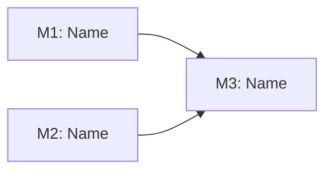

# Implementation Plan: [FEATURE]

**Branch**: `[###-feature-name]` | **Date**: [DATE] | **Spec**: [link]
**Input**: Feature specification from `/specs/[###-feature-name]/spec.md`

**Note**: This template is filled in by the `/speckit.plan` command. See
`.specify/templates/commands/plan.md` for the execution workflow.

## Summary

[Extract from feature spec: primary requirement + technical approach from
research]

## Technical Context

<!--
  ACTION REQUIRED: Replace the content in this section with the technical details
  for the project. The structure here is presented in advisory capacity to guide
  the iteration process.
-->

**Language/Version**: [e.g., Python 3.11, Swift 5.9, Rust 1.75 or NEEDS
CLARIFICATION]  
**Primary Dependencies**: [e.g., FastAPI, UIKit, LLVM or NEEDS CLARIFICATION]  
**Storage**: [if applicable, e.g., PostgreSQL, CoreData, files or N/A]  
**Testing**: [e.g., pytest, XCTest, cargo test or NEEDS CLARIFICATION]  
**Target Platform**: [e.g., Linux server, iOS 15+, WASM or NEEDS CLARIFICATION]
**Project Type**: [single/web/mobile - determines source structure]  
**Performance Goals**: [domain-specific, e.g., 1000 req/s, 10k lines/sec, 60 fps
or NEEDS CLARIFICATION]  
**Constraints**: [domain-specific, e.g., <200ms p95, <100MB memory,
offline-capable or NEEDS CLARIFICATION]  
**Scale/Scope**: [domain-specific, e.g., 10k users, 1M LOC, 50 screens or NEEDS
CLARIFICATION]

## Constitution Check

_GATE: Must pass before Phase 0 research. Re-check after Phase 1 design._

Verify compliance with
[OpenELIS Global Constitution](../.specify/memory/constitution.md):

- [ ] **Configuration-Driven**: No country-specific code branches planned
- [ ] **Carbon Design System**: UI uses @carbon/react exclusively (NO
      Bootstrap/Tailwind)
- [ ] **FHIR/IHE Compliance**: External data integrates via FHIR R4 + IHE
      profiles
- [ ] **Layered Architecture**: Backend follows 5-layer pattern
      (Valueholder→DAO→Service→Controller→Form)
  - **Valueholders MUST use JPA/Hibernate annotations** (NO XML mapping files -
    legacy exempt until refactored)
  - **Transaction management MUST be in service layer only** - NO
    `@Transactional` annotations on controller methods
- [ ] **Test Coverage**: Unit + ORM validation (if applicable) + integration +
      E2E tests planned (>80% backend, >70% frontend coverage goal per
      Constitution V)
  - E2E tests MUST follow Cypress best practices (Constitution V.5):
    - Run tests individually during development (not full suite)
    - Browser console logging enabled and reviewed after each run
    - Video recording disabled by default
    - Post-run review of console logs and screenshots required
    - Use data-testid selectors (PREFERRED)
    - Use cy.session() for login state (10-20x faster)
    - Use API-based test data setup (10x faster than UI)
    - See
      [Testing Roadmap](.specify/guides/testing-roadmap.md#cypress-e2e-testing)
      for comprehensive Cypress guidance
- [ ] **Schema Management**: Database changes via Liquibase changesets only
- [ ] **Internationalization**: All UI strings use React Intl (no hardcoded
      text)
- [ ] **Security & Compliance**: RBAC, audit trail, input validation included

**Complexity Justification Required If**:

- Adding custom CSS framework alongside Carbon
- Using native SQL instead of JPA/Hibernate
- Hardcoding country-specific logic instead of configuration
- Bypassing FHIR for external integration
- Skipping test implementation

## Milestone Plan

_GATE: Features >3 days MUST define milestones per Constitution Principle IX.
Each milestone = 1 PR. Use `[P]` prefix for parallel milestones._

### Milestone Table

| ID     | Branch Suffix | Scope                    | User Stories | Verification           | Depends On |
| ------ | ------------- | ------------------------ | ------------ | ---------------------- | ---------- |
| M1     | m1-[name]     | [Layers/Stories covered] | [Stories]    | [Tests that must pass] | -          |
| [P] M2 | m2-[name]     | [Layers/Stories covered] | [Stories]    | [Tests that must pass] | -          |
| M3     | m3-[name]     | [Layers/Stories covered] | [Stories]    | [Tests that must pass] | M1, M2     |

**Legend**:

- **[P]**: Parallel milestone - can be developed alongside other milestones
- **Sequential** (no prefix): Must complete before dependent milestones
- **Branch**: Use constitution Principle IX naming (avoid Git ref prefix
  collisions): `feat/{NNN}[-{jira}]-{name}-m{N}-{desc}`

### Milestone Dependency Graph



### PR Strategy

- **Spec PR**: `spec/{NNN}[-{jira}]-{name}` → `develop` (specification documents
  only)
- **Milestone PRs**: `feat/{NNN}[-{jira}]-{name}-m{N}-{desc}` → `develop`

**Small Features (<3 days)**: May use a single milestone-style branch
(`feat/{NNN}[-{jira}]-{name}-m1-{desc}`) without additional milestones.

## Project Structure

### Documentation (this feature)

```text
specs/[###-feature]/
├── plan.md              # This file (/speckit.plan command output)
├── research.md          # Phase 0 output (/speckit.plan command)
├── data-model.md        # Phase 1 output (/speckit.plan command)
├── quickstart.md        # Phase 1 output (/speckit.plan command)
├── contracts/           # Phase 1 output (/speckit.plan command)
└── tasks.md             # Phase 2 output (/speckit.tasks command - NOT created by /speckit.plan)
```

### Source Code (repository root)

<!--
  ACTION REQUIRED: Replace the placeholder tree below with the concrete layout
  for this feature. Delete unused options and expand the chosen structure with
  real paths (e.g., apps/admin, packages/something). The delivered plan must
  not include Option labels.
-->

```text
# [REMOVE IF UNUSED] Option 1: Single project (DEFAULT)
src/
├── models/
├── services/
├── cli/
└── lib/

tests/
├── contract/
├── integration/
└── unit/

# [REMOVE IF UNUSED] Option 2: Web application (when "frontend" + "backend" detected)
backend/
├── src/
│   ├── models/
│   ├── services/
│   └── api/
└── tests/

frontend/
├── src/
│   ├── components/
│   ├── pages/
│   └── services/
└── tests/

# [REMOVE IF UNUSED] Option 3: Mobile + API (when "iOS/Android" detected)
api/
└── [same as backend above]

ios/ or android/
└── [platform-specific structure: feature modules, UI flows, platform tests]
```

**Structure Decision**: [Document the selected structure and reference the real
directories captured above]

## Complexity Tracking

> **Fill ONLY if Constitution Check has violations that must be justified**

| Violation                  | Why Needed         | Simpler Alternative Rejected Because |
| -------------------------- | ------------------ | ------------------------------------ |
| [e.g., 4th project]        | [current need]     | [why 3 projects insufficient]        |
| [e.g., Repository pattern] | [specific problem] | [why direct DB access insufficient]  |

## Testing Strategy

**Reference**: [OpenELIS Testing Roadmap](.specify/guides/testing-roadmap.md)

**MANDATORY**: Every plan MUST include a complete testing strategy that
references the Testing Roadmap and documents test coverage goals, test types,
data management, and checkpoint validations.

### Coverage Goals

- **Backend**: >80% code coverage (measured via JaCoCo)
- **Frontend**: >70% code coverage (measured via Jest)
- **Critical Paths**: 100% coverage (authentication, authorization, data
  validation)

### Test Types

Document which test types will be used for this feature:

- [ ] **Unit Tests**: Service layer business logic (JUnit 4 + Mockito)

  - Template: `.specify/templates/testing/JUnit4ServiceTest.java.template`
  - **Reference**:
    [Testing Roadmap - Unit Tests (JUnit 4 + Mockito)](.specify/guides/testing-roadmap.md#unit-tests-junit-4--mockito)
  - **Coverage Goal**: >80% (measured via JaCoCo)
  - **SDD Checkpoint**: After Phase 2 (Services), all unit tests MUST pass
  - **Test Slicing**: Use `@RunWith(MockitoJUnitRunner.class)` for isolated unit
    tests (this repo is Traditional Spring MVC)
  - **Mocking**: Use `@Mock` (NOT `@MockBean`) for isolated unit tests

- [ ] **DAO Tests**: Persistence layer testing (Traditional Spring MVC)

  - Template: `.specify/templates/testing/DataJpaTestDao.java.template`
  - **Reference**:
    [Testing Roadmap - Backend Testing](.specify/guides/testing-roadmap.md#backend-testing)
  - **Project Note**: This repo uses traditional Spring MVC test patterns (no
    Boot test slices).
  - **Pattern**: Use `BaseWebContextSensitiveTest` and real DAO beans; rely on
    rollback/fixture reset patterns from the Testing Roadmap.

- [ ] **Controller Tests**: REST API endpoints (Traditional Spring MVC)

  - Template: `.specify/templates/testing/WebMvcTestController.java.template`
  - **Reference**:
    [Testing Roadmap - Backend Testing](.specify/guides/testing-roadmap.md#backend-testing)
  - **Project Note**: `@WebMvcTest` is not used in this repository; use
    `BaseWebContextSensitiveTest`.
  - **Pattern**: Use `BaseWebContextSensitiveTest` + `MockMvc`.

- [ ] **ORM Validation Tests**: Entity mapping validation (Constitution V.4)

  - **Reference**:
    [Testing Roadmap - ORM Validation Tests](.specify/guides/testing-roadmap.md#orm-validation-tests-constitution-v4)
  - **SDD Checkpoint**: After Phase 1 (Entities), ORM validation tests MUST pass
  - **Requirements**: MUST execute in <5 seconds, MUST NOT require database
    connection

- [ ] **Integration Tests**: Full workflow testing (Traditional Spring MVC)

  - **Reference**:
    [Testing Roadmap - Backend Testing](.specify/guides/testing-roadmap.md#backend-testing)
  - **Project Note**: `@SpringBootTest` is not used in this repository; use
    `BaseWebContextSensitiveTest`.
  - **Pattern**: Use `BaseWebContextSensitiveTest` for full-context integration
    tests.
  - **SDD Checkpoint**: After Phase 3 (Controllers), integration tests MUST pass

- [ ] **Frontend Unit Tests**: React component logic (Jest + React Testing
      Library)

  - Template: `.specify/templates/testing/JestComponent.test.jsx.template`
  - **Reference**:
    [Testing Roadmap - Jest + React Testing Library](.specify/guides/testing-roadmap.md#jest--react-testing-library-unit-tests)
  - **Coverage Goal**: >70% (measured via Jest)
  - **SDD Checkpoint**: After Phase 4 (Frontend), all unit tests MUST pass

- [ ] **E2E Tests**: Critical user workflows (Cypress)
  - Template: `.specify/templates/testing/CypressE2E.cy.js.template`
  - **Reference**:
    [Constitution Section V.5](.specify/memory/constitution.md#section-v5-cypress-e2e-testing-best-practices)
  - **Reference**:
    [Testing Roadmap - Cypress E2E Testing](.specify/guides/testing-roadmap.md#cypress-e2e-testing)

### Test Data Management

Document how test data will be created and cleaned up:

- **Backend**:

  - **Unit Tests**: Use builders/factories for test data (NOT hardcoded values)
  - **DAO/Integration**: Use `TestEntityManager` or `@Transactional` rollback

- **Frontend**:
  - **E2E Tests (Cypress)**:
    - [ ] Use API-based setup via `cy.request()` (NOT slow UI interactions) -
          10x faster
    - [ ] Prefer the unified fixture loader for stable baseline data:
          `./src/test/resources/load-test-fixtures.sh` (see
          `src/test/resources/FIXTURE_LOADER_README.md`)
    - [ ] Use `cy.intercept()` as **spy-first** (alias + assertions). Avoid
          stubbing backend responses in real E2E tests.
    - [ ] **DO NOT** stub the mutation endpoint under test
          (`PUT|POST|PATCH|DELETE`) in `frontend/cypress/e2e/` (if backend is
          stubbed, it is not E2E).
    - [ ] Use `cy.session()` for login state (10-20x faster than per-test login)

### Checkpoint Validations

Document which tests must pass at each SDD phase checkpoint:

- [ ] **After Phase 1 (Entities)**: ORM validation tests must pass
- [ ] **After Phase 2 (Services)**: Backend unit tests must pass
- [ ] **After Phase 3 (Controllers)**: Integration tests must pass
- [ ] **After Phase 4 (Frontend)**: Frontend unit tests (Jest) AND E2E tests
      (Cypress) must pass
