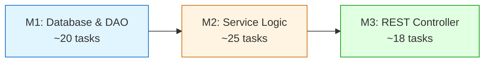

# Implementation Plan: Patient Merge Backend

**Branch**: `008-patient-merge-backend` | **Date**: 2025-12-05 | **Spec**:
[spec.md](./spec.md) **Input**: Feature specification from
`/specs/008-patient-merge-backend/spec.md`

## Summary

Implement backend infrastructure for patient record merging, enabling Global
Administrators to consolidate duplicate patient records while maintaining
complete data history, FHIR R4 compliance, and comprehensive audit trails. The
system will support transactional data consolidation across all related tables
(samples, orders, results, identities) with automatic rollback on failure,
preserve all identifiers from both patients, and complete merge operations
involving up to 500 test results within 30 seconds.

## Technical Context

**Language/Version**: Java 21 LTS (OpenJDK/Temurin) - MANDATORY per constitution
**Primary Dependencies**: Spring Boot 3.x, Hibernate 6.x, Spring Framework
6.2.2, Jakarta EE 9, HAPI FHIR R4 (6.6.2) **Storage**: PostgreSQL 14+
(production database with Liquibase 4.8.0 for migrations) **Testing**: JUnit 4
(4.13.1) + Mockito 2.21.0, Spring Test, @DataJpaTest, @WebMvcTest,
@SpringBootTest, Testcontainers **Target Platform**: Ubuntu 20.04+ server,
Tomcat 10/Jakarta EE 9 application server, Docker + Docker Compose deployment
**Project Type**: Web application backend (5-layer architecture:
Valueholder→DAO→Service→Controller→Form) **Performance Goals**: Merge operations
with 500+ test results complete within 30 seconds, batch UPDATE statements for
efficient data consolidation, transaction rollback in <2 seconds on failure
**Constraints**: Single database transaction for entire merge (atomic
operation), FHIR R4 compliance required, Global Administrator permission
enforcement at service and controller layers, zero partial merge states (100%
rollback on failure) **Scale/Scope**: Support typical maximum of 500 results per
patient, handle concurrent merge prevention via database locking, manage complex
relationship hierarchies (patient→sample→order→result→audit), preserve 100% of
identifiers and audit trail across merge

## Constitution Check

_GATE: Must pass before Phase 0 research. Re-check after Phase 1 design._

Verify compliance with
[OpenELIS Global 3.0 Constitution](../../.specify/memory/constitution.md):

- [x] **Configuration-Driven (Principle I)**: ✅ No country-specific code
      branches planned. Merge functionality is universal - applies equally to
      all deployments. No configuration variation needed for core merge logic.
- [x] **Carbon Design System (Principle II)**: ✅ N/A - Backend only feature.
      Frontend will use Carbon Design System (handled in separate frontend
      branch 009-patient-merge-frontend).
- [x] **FHIR/IHE Compliance (Principle III)**: ✅ FHIR R4 Patient resources will
      be updated with proper `link` relationships (type: "replaces" and
      "replaced-by") per FHIR specification. Historical identifiers preserved
      with `use: "old"` and `period.end`. All FHIR resources (ServiceRequest,
      Specimen, Observation, DiagnosticReport) updated to reference primary
      patient. Uses existing `FhirPersistanceService` and
      `FhirTransformService`.
- [x] **Layered Architecture (Principle IV)**: ✅ Strict 5-layer pattern
      planned:
  - **Valueholders**: `PatientMergeAudit` (new), enhanced `Patient` entity with
    merge tracking fields
  - **Valueholders use JPA/Hibernate annotations**: ✅ All entities use
    `@Entity`, `@Table`, `@Column`, `@ManyToOne` annotations (NO XML mapping
    files)
  - **DAOs**: `PatientMergeAuditDAO` (new), enhanced `PatientDAO` with
    merge-specific queries
  - **Services**: `PatientMergeService` (new) - orchestrates merge, validation,
    data consolidation, FHIR updates
  - **Transaction management in service layer ONLY**: ✅ `@Transactional`
    annotations ONLY on service methods, NEVER on controllers
  - **Services compile all data within transaction**: ✅ Service returns
    complete DTOs/maps with all data resolved (prevents
    LazyInitializationException)
  - **Controllers**: `PatientMergeRestController` (new) - thin HTTP layer,
    delegates to service
  - **Forms/DTOs**: `PatientMergeForm` (new), `PatientMergeValidationResult`,
    `PatientMergeDataSummary`
- [x] **Test Coverage (Principle V)**: ✅ Comprehensive test plan:
  - **Unit Tests**: Service validation logic, permission checks (JUnit 4 +
    Mockito) - >80% coverage goal
  - **ORM Validation Tests**: Entity mapping validation (Constitution V.4) -
    builds SessionFactory, verifies no getter conflicts, <5 seconds
  - **DAO Tests**: @DataJpaTest for CRUD operations, custom queries,
    relationship loading
  - **Integration Tests**: @SpringBootTest with @Transactional for full workflow
    testing, rollback scenarios
  - **Controller Tests**: @WebMvcTest for REST API endpoints, HTTP status codes,
    JSON serialization
  - **E2E Tests**: N/A - Backend only (frontend branch handles E2E)
  - **TDD Workflow**: Red-Green-Refactor for complex merge logic
  - **Reference**: [Testing Roadmap](../../.specify/guides/testing-roadmap.md)
    for detailed patterns
- [x] **Schema Management (Principle VI)**: ✅ Database changes via Liquibase
      changesets only:
  - New table: `patient_merge_audit` with proper indexes
  - Modified table: `patient` with merge tracking columns
  - Foreign key updates: All related tables (sample_human, patient_identity,
    etc.)
  - Rollback scripts provided for structural changes
  - Changeset IDs: `patient-merge-001-create-audit-table`,
    `patient-merge-002-alter-patient-table`, etc.
- [x] **Internationalization (Principle VII)**: ✅ N/A - Backend only (no
      user-facing strings). Frontend branch handles React Intl for UI strings.
- [x] **Security & Compliance (Principle VIII)**: ✅ Full RBAC and audit trail:
  - **RBAC**: Global Administrator permission required at service AND controller
    layers
  - **Audit Trail**: All merge operations logged with user ID, timestamp,
    reason, data summary
  - **Input Validation**: Controller layer validates merge request before
    service invocation
  - **CSRF Protection**: Implemented on merge execution endpoint
  - **Data Privacy**: PHI access logged, merged patient marked inactive but data
    preserved
  - **Logging**: Unauthorized attempts logged with user ID, IP, timestamp

**Complexity Justification**: None required - all constitution principles are
followed.

## Milestone Plan

_GATE: Features >3 days MUST define milestones per Constitution Principle IX.
Each milestone = 1 PR._

**Effort Estimate**: 8-10 days (definitely >3 days) - Milestones REQUIRED

**Milestone Strategy**: Sequential milestones following layered architecture
(database → services → controllers). Each milestone represents a complete,
testable layer that can be merged independently.

### Milestone Table

| ID  | Branch Suffix      | Scope                                                                                          | User Stories                                          | Verification                                                                                        | Depends On | Est. Tasks |
| --- | ------------------ | ---------------------------------------------------------------------------------------------- | ----------------------------------------------------- | --------------------------------------------------------------------------------------------------- | ---------- | ---------- |
| M1  | m1-database-dao    | Database schema (Liquibase), Entities (PatientMergeAudit, Patient enhancements), DAO layer     | US1 (Database Schema)                                 | ORM validation tests pass, DAO tests pass, migrations execute cleanly, rollback scripts validated   | -          | 18-22      |
| M2  | m2-service-logic   | Service layer (PatientMergeService), validation, consolidation logic, FHIR integration         | US2 (Service Layer), US3 (Validation), US7 (Security) | Unit tests pass (>80% coverage), integration tests pass, FHIR tests pass, transaction tests pass    | M1         | 22-28      |
| M3  | m3-rest-controller | REST controllers (PatientMergeRestController), Forms/DTOs, API endpoints, security integration | US4 (REST API), US5 (FHIR), US6 (Audit)               | Controller tests pass (@WebMvcTest), API integration tests pass, security tests pass, E2E API tests | M2         | 16-20      |

**Total Estimated Tasks**: 56-70 tasks across 3 milestones

**Legend**:

- **Sequential milestones**: M1 → M2 → M3 (each builds on previous)
- **Branch naming**: `008-patient-merge-backend/m1-database-dao`,
  `008-patient-merge-backend/m2-service-logic`,
  `008-patient-merge-backend/m3-rest-controller`
- **Each milestone = 1 PR**: Merged to feature branch or directly to `develop`

### Milestone Dependency Graph



### Milestone Details

**M1: Database & DAO Layer (Foundation)**

- **Goal**: Complete persistence layer with proper schema and entity mappings
- **Key Deliverables**:
  - Liquibase changesets for `patient_merge_audit` table creation
  - Liquibase changesets for `patient` table enhancements (merge tracking
    fields)
  - `PatientMergeAudit` entity with JPA annotations
  - Enhanced `Patient` entity with merge fields
  - `PatientMergeAuditDAO` with CRUD operations
  - Enhanced `PatientDAO` with merge-specific queries
  - ORM validation tests (SessionFactory build verification)
  - DAO tests (@DataJpaTest) for all operations
- **Exit Criteria**: All ORM validation tests pass, DAO tests achieve >80%
  coverage, migrations execute without errors

**M2: Service Layer & Business Logic (Core Functionality)**

- **Goal**: Complete merge orchestration, validation, and FHIR integration
- **Key Deliverables**:
  - `PatientMergeService` interface and implementation
  - Validation logic (permission checks, patient eligibility, circular
    references)
  - Data consolidation logic (batch updates for related tables)
  - FHIR integration (Patient resource updates with `link` relationships)
  - Transaction management (@Transactional)
  - Audit trail creation logic
  - Unit tests (JUnit 4 + Mockito) for service methods
  - Integration tests (@SpringBootTest) for full workflow
  - FHIR integration tests
  - Transaction rollback tests
- **Exit Criteria**: Unit tests pass with >80% coverage, integration tests
  verify full merge workflow, FHIR resources correctly updated

**M3: REST Controller & API Layer (HTTP Interface)**

- **Goal**: Complete REST API with proper HTTP handling and security
- **Key Deliverables**:
  - `PatientMergeRestController` with endpoints: GET merge-details, POST
    validate, POST execute
  - Form/DTO classes (`PatientMergeForm`, `PatientMergeValidationResult`,
    `PatientMergeDataSummary`)
  - Security integration (Global Administrator permission checks)
  - CSRF protection
  - Input validation
  - Error handling and HTTP status codes
  - Controller tests (@WebMvcTest) for HTTP layer
  - API integration tests
  - Security tests (unauthorized access, permission enforcement)
- **Exit Criteria**: Controller tests pass, API integration tests verify all
  endpoints, security tests confirm permission enforcement

### PR Strategy

- **Spec PR**: Already created in branch `008-patient-merge-backend` (this plan)
- **Milestone PRs**:
  - `008-patient-merge-backend/m1-database-dao` → `develop` (or
    `008-patient-merge-backend` if using feature branch)
  - `008-patient-merge-backend/m2-service-logic` → `develop` (or
    `008-patient-merge-backend`)
  - `008-patient-merge-backend/m3-rest-controller` → `develop` (or
    `008-patient-merge-backend`)
- **Integration PR** (if using feature branch): `008-patient-merge-backend` →
  `develop` (merges all milestones)

**Rationale for Sequential Milestones**:

- M1 must complete first: Service layer depends on entities and DAOs
- M2 must complete before M3: Controllers depend on service layer
- Each milestone is independently testable and deployable
- Clear separation of concerns (database → business logic → HTTP layer)

## Testing Strategy

**Reference**:
[OpenELIS Testing Roadmap](../../.specify/guides/testing-roadmap.md)

**MANDATORY**: Comprehensive testing strategy following Test-Driven Development
(TDD) workflow.

### Coverage Goals

- **Backend**: >80% code coverage (measured via JaCoCo) - **TARGET for this
  feature**
- **Frontend**: N/A - Backend only feature (frontend in separate branch
  009-patient-merge-frontend)
- **Critical Paths**: 100% coverage required for:
  - Permission validation (Global Administrator checks)
  - Merge validation logic (circular references, already merged, same patient)
  - Data consolidation logic (foreign key updates, identifier preservation)
  - Transaction rollback scenarios (failure mid-merge)
  - FHIR resource updates (Patient link relationships)

### Test Types

**Backend Test Pyramid** (this feature):

- **75% Unit Tests**: Service layer business logic (validation, consolidation,
  FHIR mapping)
- **15% Integration Tests**: Full merge workflow with database and transactions
- **5% DAO Tests**: Persistence layer CRUD and custom queries
- **5% ORM Validation**: Entity mapping verification (Hibernate SessionFactory
  build)

#### ✅ Unit Tests (JUnit 4 + Mockito) - **PRIMARY FOCUS**

- **Template**: `.specify/templates/testing/JUnit4ServiceTest.java.template`
- **Reference**:
  [Testing Roadmap - Unit Tests](../../.specify/guides/testing-roadmap.md#unit-tests-junit-4--mockito)
- **Coverage Goal**: >80% for service layer (PatientMergeService, validation
  methods)
- **SDD Checkpoint**: After Milestone M2 (Services), ALL unit tests MUST pass
- **TDD Workflow**: Red-Green-Refactor cycle MANDATORY for:
  - Merge validation logic (permission, patient eligibility, circular
    references)
  - Data summary calculation (orders, results, samples counts)
  - Conflict detection (phone, email, address differences)
  - FHIR resource transformation (Patient link relationships)
- **Test Slicing**: Use `@RunWith(MockitoJUnitRunner.class)` - NO Spring context
- **Mocking**: Use `@Mock` for DAOs and FHIR services, `@InjectMocks` for
  service under test
- **Test Classes**:
  - `PatientMergeServiceTest` - Core merge orchestration
  - `PatientMergeValidationTest` - Validation rules (permission, eligibility,
    circular refs)
  - `PatientMergeDataSummaryTest` - Data calculation logic
  - `FhirPatientLinkServiceTest` - FHIR link relationship logic

#### ✅ DAO Tests (@DataJpaTest)

- **Template**: `.specify/templates/testing/DataJpaTestDao.java.template`
- **Reference**:
  [Testing Roadmap - @DataJpaTest](../../.specify/guides/testing-roadmap.md#datajpatest-daorepository-layer)
- **SDD Checkpoint**: After Milestone M1 (Database & DAO), ALL DAO tests MUST
  pass
- **Test Slicing**: Use `@DataJpaTest` for focused persistence testing
- **Test Data**: Use `TestEntityManager` for test data setup (NOT JdbcTemplate)
- **Transaction Management**: Automatic rollback (no manual cleanup)
- **Test Classes**:
  - `PatientMergeAuditDAOTest` - CRUD operations for audit records
  - `PatientDAOTest` - Merge-specific queries (find merged patients, find by
    merged_into_patient_id)
- **Test Scenarios**:
  - Insert audit record with valid data
  - Query patients by merge status (is_merged = true/false)
  - Find merged patient by primary patient ID
  - Verify foreign key relationships (patient → merged_into_patient)

#### ✅ Controller Tests (@WebMvcTest)

- **Template**: `.specify/templates/testing/WebMvcTestController.java.template`
- **Reference**:
  [Testing Roadmap - @WebMvcTest](../../.specify/guides/testing-roadmap.md#webmvctest-controller-layer)
- **SDD Checkpoint**: After Milestone M3 (REST Controller), ALL controller tests
  MUST pass
- **Test Slicing**: Use `@WebMvcTest(PatientMergeRestController.class)` for HTTP
  layer only
- **Mocking**: Use `@MockBean` for service layer (PatientMergeService)
- **HTTP Testing**: Use `MockMvc` for request/response validation
- **Test Classes**:
  - `PatientMergeRestControllerTest` - All REST endpoints
- **Test Scenarios**:
  - GET `/api/patient/merge-details/{id}` returns 200 OK with patient data
  - POST `/api/patient/merge/validate` returns validation result with data
    summary
  - POST `/api/patient/merge/execute` returns 200 OK with merge audit ID
  - POST with missing permission returns 403 Forbidden
  - POST with invalid patient ID returns 404 Not Found
  - POST with validation error returns 400 Bad Request

#### ✅ ORM Validation Tests (Constitution V.4) - **MANDATORY**

- **Reference**:
  [Testing Roadmap - ORM Validation](../../.specify/guides/testing-roadmap.md#orm-validation-tests-constitution-v4)
- **SDD Checkpoint**: After Milestone M1 (Entities), ORM validation MUST pass
- **Requirements**: MUST execute in <5 seconds, MUST NOT require database
  connection
- **Test Class**: `PatientMergeHibernateMappingValidationTest`
- **Verification**:
  - Hibernate SessionFactory builds successfully for `PatientMergeAudit` entity
  - Hibernate SessionFactory builds for enhanced `Patient` entity with merge
    fields
  - No JavaBean getter/setter naming conflicts
  - All JPA annotations correctly configured (@Entity, @Table, @Column,
    @ManyToOne)

#### ✅ Integration Tests (@SpringBootTest)

- **Reference**:
  [Testing Roadmap - @SpringBootTest](../../.specify/guides/testing-roadmap.md#springboottest-full-integration)
- **SDD Checkpoint**: After Milestone M2 (Services), integration tests MUST pass
- **Test Slicing**: Use `@SpringBootTest` for full application context
- **Transaction Management**: Use `@Transactional` for automatic rollback
- **Test Classes**:
  - `PatientMergeServiceIntegrationTest` - Full merge workflow end-to-end
  - `PatientMergeFhirIntegrationTest` - FHIR resource updates verification
  - `PatientMergeTransactionTest` - Transaction rollback scenarios
- **Test Scenarios**:
  - **Complete Merge Workflow**: Two patients merged successfully, data
    consolidated, audit created, FHIR updated
  - **Transaction Rollback**: Merge fails mid-process, all changes reverted, no
    partial state
  - **Performance Test**: Merge with 500 results completes within 30 seconds
  - **Concurrent Merge Prevention**: Two simultaneous merges of same patient
    blocked
  - **FHIR Synchronization**: Primary patient has `link` with type "replaces",
    merged patient has type "replaced-by"
  - **Identifier Preservation**: All identifiers from both patients present in
    primary patient
  - **Audit Trail**: Merge audit record created with correct user ID, timestamp,
    reason, data summary

#### ❌ Frontend Tests - N/A (Backend Only)

Frontend testing (Jest + Cypress) will be handled in separate branch
`009-patient-merge-frontend`.

### Test Data Management

#### Backend Test Data Strategy

**Unit Tests (JUnit 4 + Mockito)**:

- ✅ Use builder pattern for test entities (NO hardcoded values)
- ✅ Create `PatientBuilder` for patient test data
- ✅ Create `PatientMergeAuditBuilder` for audit test data
- ✅ Test edge cases:
  - Null patient IDs (validation should fail)
  - Same patient ID for both patients (validation should fail)
  - Patient already merged (is_merged = true, validation should fail)
  - Circular merge reference (A→B→A, validation should fail)
  - 500+ results (performance edge case)

**DAO Tests (@DataJpaTest)**:

- ✅ Use `TestEntityManager` for test data setup
- ✅ Use builders for entity creation
- ✅ Automatic transaction rollback (no manual cleanup)
- ✅ Test ID generation:
  - Patient IDs >= 1000 for test data
  - Audit IDs auto-generated via sequence

**Integration Tests (@SpringBootTest)**:

- ✅ Use builders for complex test scenarios
- ✅ Use `@Transactional` for automatic rollback
- ✅ Use `@Sql` scripts ONLY for complex multi-table setup if needed
- ✅ Test data isolation:
  - Each test creates own patients (unique IDs)
  - No shared state between tests
  - Rollback ensures clean state

**Builder Examples**:

```java
// PatientBuilder.java
public class PatientBuilder {
    private Patient patient = new Patient();

    public static PatientBuilder create() {
        return new PatientBuilder();
    }

    public PatientBuilder withId(String id) {
        patient.setId(id);
        return this;
    }

    public PatientBuilder withMerged(boolean merged, String mergedIntoId) {
        patient.setIsMerged(merged);
        patient.setMergedIntoPatientId(mergedIntoId);
        return this;
    }

    public Patient build() { return patient; }
}

// Usage in tests
Patient primaryPatient = PatientBuilder.create()
    .withId("1000")
    .withMerged(false, null)
    .build();
```

### Checkpoint Validations

**SDD Phase Checkpoints** (MANDATORY - gates to next phase):

- ✅ **After Milestone M1 (Database & DAO)**:

  - ORM validation tests MUST pass (<5 seconds execution)
  - DAO tests MUST pass (>80% DAO layer coverage)
  - Liquibase migrations execute without errors
  - Rollback scripts validated

- ✅ **After Milestone M2 (Service Layer)**:

  - Unit tests MUST pass (>80% service layer coverage)
  - Integration tests MUST pass (full merge workflow verified)
  - FHIR integration tests MUST pass (link relationships verified)
  - Transaction rollback tests MUST pass (no partial merge states)

- ✅ **After Milestone M3 (REST Controller)**:
  - Controller tests MUST pass (@WebMvcTest for HTTP layer)
  - API integration tests MUST pass (all endpoints verified)
  - Security tests MUST pass (permission enforcement confirmed)
  - Overall backend coverage >80% (JaCoCo report)

### TDD Workflow (MANDATORY)

**Red-Green-Refactor Cycle** - REQUIRED for complex logic:

1. **RED**: Write failing test first

   - Define expected behavior (validation rule, merge outcome, FHIR structure)
   - Test fails because implementation doesn't exist yet

2. **GREEN**: Write minimal implementation to pass test

   - Implement just enough code to make test pass
   - No premature optimization

3. **REFACTOR**: Improve code quality while tests stay green
   - Extract methods, improve naming, remove duplication
   - Tests continue to pass throughout refactoring

**Test-First Development Process**:

- ✅ Write test BEFORE implementation
- ✅ Test defines the contract/interface
- ✅ Implementation satisfies the test
- ✅ Enables confident refactoring

**Tasks.md Structure** (MANDATORY):

```markdown
## Milestone M2: Service Layer

### Tests (WRITE FIRST)

- [ ] T020 [M2] Unit test for merge validation logic
- [ ] T021 [M2] Unit test for data consolidation logic
- [ ] T022 [M2] Integration test for full merge workflow

### Implementation (WRITE AFTER TESTS PASS)

- [ ] T023 [M2] Implement PatientMergeService (depends on T020, T021, T022)
```

**Checkpoint Enforcement**:

- Tests MUST pass before proceeding to next milestone
- Pull request CANNOT merge if tests fail
- JaCoCo coverage report MUST show >80% for service layer

## Project Structure

### Documentation (this feature)

```text
specs/008-patient-merge-backend/
├── plan.md              # This file (Implementation plan)
├── research.md          # Technical research and decisions
├── data-model.md        # Entity and database schema design
├── quickstart.md        # Development setup and workflow
├── contracts/           # REST API OpenAPI/Swagger contracts
│   ├── patient-merge-api.yaml
│   └── README.md
└── tasks.md             # Generated by /speckit.tasks (NOT by this plan)
```

### Source Code (Backend - OpenELIS Global 2 Structure)

**Project Type**: Web application backend (Spring Boot + Hibernate)

```text
src/main/java/org/openelisglobal/
├── patient/
│   ├── valueholder/
│   │   ├── Patient.java                    # Enhanced with merge tracking fields
│   │   └── PatientMergeAudit.java          # NEW - Audit record entity
│   ├── dao/
│   │   ├── PatientDAO.java                 # Enhanced with merge-specific queries
│   │   └── PatientMergeAuditDAO.java       # NEW - Audit DAO
│   ├── daoimpl/
│   │   ├── PatientDAOImpl.java             # Enhanced implementations
│   │   └── PatientMergeAuditDAOImpl.java   # NEW - Audit DAO implementation
│   ├── service/
│   │   ├── PatientMergeService.java        # NEW - Service interface
│   │   └── PatientMergeServiceImpl.java    # NEW - Service implementation
│   ├── controller/
│   │   └── rest/
│   │       └── PatientMergeRestController.java  # NEW - REST API endpoints
│   └── form/
│       ├── PatientMergeForm.java           # NEW - Merge request DTO
│       ├── PatientMergeValidationResult.java    # NEW - Validation result DTO
│       └── PatientMergeDataSummary.java    # NEW - Data summary DTO
├── fhir/
│   └── service/
│       └── FhirPatientLinkService.java     # NEW - FHIR link relationship logic
└── common/
    └── exception/
        └── PatientMergeException.java      # NEW - Custom exception for merge errors

src/main/resources/
└── liquibase/
    └── 2.8.x/
        └── patient-merge/
            ├── patient-merge-001-create-audit-table.xml        # NEW - Create patient_merge_audit
            ├── patient-merge-002-alter-patient-table.xml       # NEW - Add merge tracking fields
            └── patient-merge-003-create-indexes.xml            # NEW - Add performance indexes

src/test/java/org/openelisglobal/
├── patient/
│   ├── service/
│   │   ├── PatientMergeServiceTest.java              # NEW - Unit tests (Mockito)
│   │   ├── PatientMergeServiceIntegrationTest.java   # NEW - Integration tests (@SpringBootTest)
│   │   ├── PatientMergeValidationTest.java           # NEW - Validation logic tests
│   │   └── PatientMergeTransactionTest.java          # NEW - Transaction rollback tests
│   ├── dao/
│   │   ├── PatientMergeAuditDAOTest.java             # NEW - DAO tests (@DataJpaTest)
│   │   └── PatientDAOTest.java                       # Enhanced with merge query tests
│   ├── controller/
│   │   └── rest/
│   │       └── PatientMergeRestControllerTest.java   # NEW - Controller tests (@WebMvcTest)
│   ├── hibernate/
│   │   └── PatientMergeHibernateMappingValidationTest.java  # NEW - ORM validation
│   └── builder/
│       ├── PatientBuilder.java                       # NEW - Test data builder
│       └── PatientMergeAuditBuilder.java             # NEW - Test data builder
└── fhir/
    └── service/
        ├── FhirPatientLinkServiceTest.java           # NEW - FHIR integration tests
        └── PatientMergeFhirIntegrationTest.java      # NEW - FHIR workflow tests
```

### Frontend (Separate Branch)

Frontend implementation is handled in branch `009-patient-merge-frontend`:

```text
frontend/
├── src/
│   ├── components/
│   │   └── patient/
│   │       └── PatientMerge/           # Patient merge UI components
│   └── utils/
└── cypress/
    └── e2e/
        └── patientMerge.cy.js          # E2E tests for merge workflow
```

**Structure Decision**:

- Backend follows OpenELIS Global 2 standard 5-layer architecture (Valueholder →
  DAO → Service → Controller → Form)
- All new classes in `org.openelisglobal.patient` package
- Liquibase changesets in `src/main/resources/liquibase/2.8.x/patient-merge/`
- Tests mirror main package structure in `src/test/java/`
- Builder pattern for test data in `src/test/java/.../builder/`
- Frontend completely separate (different PR, different branch)

## Complexity Tracking

**No complexity violations** - All constitution principles are followed. No
additional justification required.

---

**Plan Status**: ✅ Complete - Ready for Phase 0 (Research) and Phase 1 (Design)

**Next Steps**:

1. Review `research.md` for technical decisions and FHIR patterns
2. Review `data-model.md` for entity design and database schema
3. Review `contracts/patient-merge-api.yaml` for REST API specification
4. Review `quickstart.md` for development workflow
5. Run `/speckit.tasks` to generate `tasks.md` for implementation
