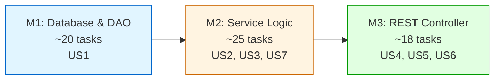

# Tasks: Patient Merge Backend

**Feature Branch**: `008-patient-merge-backend` **Input**: Design documents from
`/specs/008-patient-merge-backend/` **Prerequisites**: plan.md (required),
spec.md (required for user stories), research.md, data-model.md, contracts/

**Tests**: Tests are MANDATORY for all user stories (per Constitution V and
Testing Roadmap). Test tasks MUST appear BEFORE implementation tasks to enforce
TDD workflow (Red-Green-Refactor cycle).

**TDD Enforcement**:

- Write test FIRST → Verify it FAILS (Red)
- Write minimal code to pass → Verify it PASSES (Green)
- Refactor while keeping tests green
- Reference: [Testing Roadmap](../../.specify/guides/testing-roadmap.md)

**Organization**: Tasks are grouped by **Milestone** (per Constitution Principle
IX). Each Milestone = 1 PR. All milestones are sequential (M1 → M2 → M3).

## Format: `[ID] [P?] [M#] Description`

- **[P]**: Can run in parallel (different files, no dependencies)
- **[M#]**: Which milestone this task belongs to (e.g., M1, M2, M3)
- Include exact file paths in descriptions

## Path Conventions

- Backend: `src/main/java/org/openelisglobal/`
- Tests: `src/test/java/org/openelisglobal/`
- Resources: `src/main/resources/`
- Liquibase: `src/main/resources/liquibase/3.3.x.x/`

## Milestone Dependency Graph



**Legend**: Sequential milestones (M1 → M2 → M3). Each milestone = 1 PR.

---

## Milestone 1: Database & DAO Layer (Branch: `008-patient-merge-backend/m1-database-dao`)

**Type**: Sequential (blocks M2) **PR Target**: `develop` (or
`008-patient-merge-backend` if using feature branch) **Scope**: Database schema
(Liquibase), Entities (PatientMergeAudit, Patient enhancements), DAO layer
**Verification**: ORM validation tests pass, DAO tests pass, migrations execute
cleanly, rollback scripts validated **User Stories**: US1 (Database Schema
Support for Patient Merge)

### Branch Setup (MANDATORY - First Task)

- [ ] T001 [M1] Create milestone branch:
      `git checkout -b 008-patient-merge-backend/m1-database-dao`

### Liquibase Migrations

- [ ] T002 [M1] Create Liquibase changeset
      `patient-merge-001-create-audit-table.xml` in
      src/main/resources/liquibase/3.3.x.x/ - creates patient_merge_audit table
      with columns: id, primary_patient_id, merged_patient_id, merge_date,
      performed_by_user_id, reason, data_summary (JSONB), lastupdated,
      sys_user_id
- [ ] T003 [M1] Add indexes to patient_merge_audit table in changeset:
      idx_pma_primary_patient, idx_pma_merged_patient, idx_pma_merge_date,
      idx_pma_performed_by, idx_pma_data_summary (GIN index for JSONB)
- [ ] T004 [M1] Add foreign key constraints to patient_merge_audit in changeset:
      fk_pma_primary_patient → patient(id), fk_pma_merged_patient → patient(id),
      fk_pma_performed_by → system_user(id), fk_pma_sys_user → system_user(id)
- [ ] T005 [M1] Create rollback script for patient_merge_audit table in same
      changeset: DROP TABLE IF EXISTS patient_merge_audit CASCADE
- [ ] T006 [M1] Create Liquibase changeset
      `patient-merge-002-alter-patient-table.xml` in
      src/main/resources/liquibase/3.3.x.x/ - adds columns to patient table:
      merged_into_patient_id (BIGINT), is_merged (BOOLEAN DEFAULT FALSE),
      merge_date (TIMESTAMP)
- [ ] T007 [M1] Add foreign key constraint to patient table in changeset:
      fk_patient_merged_into → patient(id) (self-referencing)
- [ ] T008 [M1] Add indexes to patient table in changeset:
      idx_patient_is_merged, idx_patient_merged_into
- [ ] T009 [M1] Add check constraint to patient table in changeset:
      chk_patient_merge_consistency - ensures (is_merged=TRUE AND
      merged_into_patient_id IS NOT NULL AND merge_date IS NOT NULL) OR
      (is_merged=FALSE AND merged_into_patient_id IS NULL AND merge_date IS
      NULL)
- [ ] T010 [M1] Create rollback script for patient table alterations in same
      changeset
- [ ] T011 [M1] Update base-changelog.xml in
      src/main/resources/liquibase/3.3.x.x/ to include new changesets

### Tests for Milestone 1 (MANDATORY - TDD Enforcement)

> **CRITICAL: Write these tests FIRST, run them, and verify they FAIL (Red
> phase)**
>
> - Tests MUST fail before implementation code exists
> - After implementation, tests MUST pass (Green phase)
> - PR will NOT be approved if tests were written after implementation
>
> Reference:
> [OpenELIS Testing Roadmap](../../.specify/guides/testing-roadmap.md)

- [ ] T012 [P] [M1] **[RED]** ORM validation test for PatientMergeAudit in
      src/test/java/org/openelisglobal/patient/merge/valueholder/PatientMergeAuditHibernateMappingValidationTest.java -
      verifies SessionFactory builds, no getter conflicts, entity mappings
      correct → Run test with
      `mvn test -Dtest=PatientMergeAuditHibernateMappingValidationTest`, verify
      FAILS before T015
- [ ] T013 [P] [M1] **[RED]** ORM validation test for Patient enhancements in
      src/test/java/org/openelisglobal/patient/valueholder/PatientHibernateMappingValidationTest.java -
      verifies new merge tracking fields map correctly → Run test, verify FAILS
      before T016
- [ ] T014 [P] [M1] **[RED]** DAO test for PatientMergeAuditDAO in
      src/test/java/org/openelisglobal/patient/merge/dao/PatientMergeAuditDAOTest.java -
      uses @DataJpaTest, tests CRUD operations (save, findById, delete), custom
      queries → Run test with `mvn test -Dtest=PatientMergeAuditDAOTest`, verify
      FAILS before T018

### Implementation for Milestone 1

> **CRITICAL: Implementation tasks depend on test tasks. After each
> implementation task, run related tests and verify they now PASS (Green
> phase).**

- [ ] T015 [P] [M1] **[GREEN]** Create PatientMergeAudit entity in
      src/main/java/org/openelisglobal/patient/merge/valueholder/PatientMergeAudit.java -
      extends BaseObject&lt;String&gt;, uses JPA annotations (@Entity, @Table,
      @Column, @Type for JSONB), includes all fields from data-model.md → Run
      T012, verify it PASSES
- [ ] T016 [P] [M1] **[GREEN]** Update Patient entity in
      src/main/java/org/openelisglobal/patient/valueholder/Patient.java - add
      merge tracking fields: mergedIntoPatientId, isMerged (Boolean), mergeDate
      (Timestamp) with proper JPA annotations → Run T013, verify it PASSES
- [ ] T017 [M1] Create PatientMergeAuditDAO interface in
      src/main/java/org/openelisglobal/patient/merge/dao/PatientMergeAuditDAO.java -
      extends BaseDAO&lt;PatientMergeAudit, String&gt;, declares custom query
      methods
- [ ] T018 [M1] **[GREEN]** Create PatientMergeAuditDAOImpl in
      src/main/java/org/openelisglobal/patient/merge/dao/PatientMergeAuditDAOImpl.java -
      extends BaseDAOImpl, implements custom query methods → Run T014, verify it
      PASSES

### Milestone 1 Verification

- [ ] T019 [M1] Execute Liquibase migrations: `mvn liquibase:update` - verify
      patient_merge_audit table created with all columns, indexes, and foreign
      keys
- [ ] T020 [M1] Verify patient table alterations:
      `psql -d clinlims -c "\d patient"` - confirm merge tracking fields exist
- [ ] T021 [M1] Test Liquibase rollback:
      `mvn liquibase:rollback -Dliquibase.rollbackCount=2` then
      `mvn liquibase:update` - verify rollback scripts work correctly
- [ ] T022 [M1] Run all M1 ORM validation tests:
      `mvn test -Dtest=*HibernateMappingValidationTest` - verify all pass
- [ ] T023 [M1] Run all M1 DAO tests: `mvn test -Dtest=*patient.merge.dao*` -
      verify >80% coverage for DAO layer
- [ ] T024 [M1] Run code formatting: `mvn spotless:apply` - MANDATORY before
      commit
- [ ] T025 [M1] Create PR for M1: `008-patient-merge-backend/m1-database-dao` →
      `develop` (or feature branch)

**Checkpoint**: Milestone 1 PR ready for review. All ORM validation tests
passing. DAO tests >80% coverage. Migrations execute cleanly.

---

## Milestone 2: Service Logic & Business Logic (Branch: `008-patient-merge-backend/m2-service-logic`)

**Type**: Sequential (depends on M1) **PR Target**: `develop` (or
`008-patient-merge-backend`) **Scope**: Service layer (PatientMergeService),
validation, consolidation logic, FHIR integration **Verification**: Unit tests
pass (>80% coverage), integration tests pass, FHIR tests pass, transaction tests
pass **User Stories**: US2 (Patient Merge Service Layer), US3 (Merge Validation
Logic), US7 (Permission Enforcement and Security)

### Branch Setup (MANDATORY - First Task)

- [ ] T026 [M2] Create milestone branch:
      `git checkout -b 008-patient-merge-backend/m2-service-logic`

### DTOs (Data Transfer Objects)

- [ ] T027 [P] [M2] Create PatientMergeRequestDTO in
      src/main/java/org/openelisglobal/patient/merge/dto/PatientMergeRequestDTO.java -
      uses Lombok @Data, includes validation annotations (@NotBlank for
      patient1Id, patient2Id, primaryPatientId, reason; @NotNull for confirmed)
- [ ] T028 [P] [M2] Create PatientMergeValidationResultDTO in
      src/main/java/org/openelisglobal/patient/merge/dto/PatientMergeValidationResultDTO.java -
      uses Lombok @Data, includes valid (boolean), errors (List&lt;String&gt;),
      warnings (List&lt;String&gt;), dataSummary, static factory methods
- [ ] T029 [P] [M2] Create PatientMergeDataSummaryDTO in
      src/main/java/org/openelisglobal/patient/merge/dto/PatientMergeDataSummaryDTO.java -
      uses Lombok @Data, includes all count fields per data-model.md,
      conflictingFields, conflictingIdentityTypes
- [ ] T030 [P] [M2] Create PatientMergeDetailsDTO in
      src/main/java/org/openelisglobal/patient/merge/dto/PatientMergeDetailsDTO.java -
      uses Lombok @Data, includes patient demographics, data summary fields,
      identifiers (List&lt;IdentifierDTO&gt;), conflictingFields
- [ ] T031 [P] [M2] Create PatientMergeExecutionResultDTO in
      src/main/java/org/openelisglobal/patient/merge/dto/PatientMergeExecutionResultDTO.java -
      uses Lombok @Data, includes success, mergeAuditId, message,
      primaryPatientId, mergedPatientId, mergeDurationMs

### Tests for Milestone 2 (MANDATORY - TDD Enforcement)

> **CRITICAL: Write these tests FIRST, run them, and verify they FAIL (Red
> phase)**

- [ ] T032 [P] [M2] **[RED]** Unit test for PatientMergeService.validateMerge()
      in
      src/test/java/org/openelisglobal/patient/merge/service/PatientMergeServiceImplTest.java -
      uses JUnit 4 + Mockito, tests same patient ID check, already merged check,
      circular reference check, permission check → Run
      `mvn test -Dtest=PatientMergeServiceImplTest`, verify FAILS before T040
- [ ] T033 [P] [M2] **[RED]** Unit test for PatientMergeService.executeMerge()
      in same test file - tests successful merge, rollback on failure, FHIR sync
      failure handling → Run test, verify FAILS before T041
- [ ] T034 [P] [M2] **[RED]** Unit test for permission enforcement in
      src/test/java/org/openelisglobal/patient/merge/service/PatientMergeServicePermissionTest.java -
      tests Global Administrator permission required at service layer → Run
      test, verify FAILS before T040
- [ ] T035 [P] [M2] **[RED]** Integration test for full merge workflow in
      src/test/java/org/openelisglobal/patient/merge/service/PatientMergeServiceIntegrationTest.java -
      uses @SpringBootTest + @Transactional, tests end-to-end merge with real
      database, transaction rollback → Run `mvn verify`, verify FAILS before
      T042
- [ ] T036 [P] [M2] **[RED]** FHIR integration test in
      src/test/java/org/openelisglobal/patient/merge/service/PatientMergeFhirIntegrationTest.java -
      tests Patient resource link creation (replaces/replaced-by), identifier
      preservation → Run test, verify FAILS before T044

### Implementation for Milestone 2

> **CRITICAL: Implementation tasks depend on test tasks. After each
> implementation task, run related tests and verify they now PASS (Green
> phase).**

- [ ] T037 [M2] Create PatientMergeService interface in
      src/main/java/org/openelisglobal/patient/merge/service/PatientMergeService.java -
      declares methods: validateMerge(), getMergeDetails(), executeMerge()
- [ ] T038 [M2] Create PatientMergeServiceImpl skeleton in
      src/main/java/org/openelisglobal/patient/merge/service/PatientMergeServiceImpl.java -
      implements interface, injects DAOs (PatientDAO, PatientMergeAuditDAO),
      uses @Service and @Transactional annotations
- [ ] T039 [M2] Implement getMergeDetails() method in PatientMergeServiceImpl -
      fetches patient demographics, calculates data summary (orders, results,
      samples counts), compiles identifiers, returns PatientMergeDetailsDTO
- [ ] T040 [M2] **[GREEN]** Implement validateMerge() method in
      PatientMergeServiceImpl - checks Global Admin permission, same patient
      check, already merged check, circular reference check, returns
      PatientMergeValidationResultDTO → Run T032, T034, verify they PASS
- [ ] T041 [M2] **[GREEN]** Implement executeMerge() core logic in
      PatientMergeServiceImpl - locks patients (SELECT FOR UPDATE), validates
      eligibility, marks merged patient (is_merged=true, merged_into_patient_id,
      merge_date), creates audit entry → Run T033, verify it PASSES
- [ ] T042 [M2] **[GREEN]** Implement data consolidation logic in
      executeMerge() - HQL bulk UPDATEs for patient_identity, patient_contact,
      external_patient_id, patient_relations, sample_human, electronic_order
      tables → Run T035, verify it PASSES
- [ ] T043 [M2] Add identifier consolidation placeholder with TODO(BLOCKER-001)
      in consolidateIdentifiers() method - logs warning, does NOT update
      patient_identity foreign keys yet (awaiting PM decision per BLOCKERS.md)
- [ ] T044 [M2] **[GREEN]** Create FhirPatientLinkService in
      src/main/java/org/openelisglobal/patient/merge/service/FhirPatientLinkService.java -
      updates FHIR Patient resources with bidirectional links (type: "replaces"
      for primary, "replaced-by" for merged), sets active=false for merged
      patient → Run T036, verify it PASSES
- [ ] T045 [M2] Integrate FhirPatientLinkService into executeMerge() - calls
      createMergeLinks() after database consolidation, handles
      FhirUpdateException (logs critical error, does NOT rollback database
      transaction)
- [ ] T046 [M2] Add HQL bulk UPDATE methods to existing DAOs -
      PatientIdentityDAO.updatePatientIdForIdentityType(),
      PatientContactDAO.updatePatientId(), SampleHumanDAO.updatePatientId(),
      ElectronicOrderDAO.updatePatientId() - uses @Modifying @Query annotations

### DAO Enhancement Tests

- [ ] T047 [P] [M2] **[RED]** DAO test for HQL bulk UPDATE in
      src/test/java/org/openelisglobal/patientidentity/dao/PatientIdentityDAOTest.java -
      uses @DataJpaTest, verifies bulk UPDATE updates patient_id correctly → Run
      test, verify FAILS before T046
- [ ] T048 [P] [M2] **[GREEN]** Verify T047 now passes after T046 implementation

### Milestone 2 Verification

- [ ] T049 [M2] Run all M2 unit tests:
      `mvn test -Dtest=*patient.merge.service*` - verify >80% coverage for
      service layer
- [ ] T050 [M2] Run all M2 integration tests:
      `mvn verify -Dtest=*PatientMerge*IntegrationTest` - verify full workflow
      tests pass
- [ ] T051 [M2] Run transaction rollback test: verify database rollback works
      correctly when merge fails mid-process
- [ ] T052 [M2] Run code formatting: `mvn spotless:apply` - MANDATORY before
      commit
- [ ] T053 [M2] Create PR for M2: `008-patient-merge-backend/m2-service-logic` →
      `develop` (or feature branch)

**Checkpoint**: Milestone 2 PR ready for review. Unit tests >80% coverage.
Integration tests verify full merge workflow. FHIR integration working.
Transaction rollback validated.

---

## Milestone 3: REST Controller & API Layer (Branch: `008-patient-merge-backend/m3-rest-controller`)

**Type**: Sequential (depends on M2) **PR Target**: `develop` (or
`008-patient-merge-backend`) **Scope**: REST controllers
(PatientMergeRestController), Forms/DTOs, API endpoints, security integration
**Verification**: Controller tests pass (@WebMvcTest), API integration tests
pass, security tests pass, E2E API tests **User Stories**: US4 (RESTful Merge
API Endpoints), US5 (FHIR R4 Compliance and Synchronization), US6 (Comprehensive
Audit Trail)

### Branch Setup (MANDATORY - First Task)

- [ ] T054 [M3] Create milestone branch:
      `git checkout -b 008-patient-merge-backend/m3-rest-controller`

### Tests for Milestone 3 (MANDATORY - TDD Enforcement)

> **CRITICAL: Write these tests FIRST, run them, and verify they FAIL (Red
> phase)**
>
> References:
>
> - [Backend Testing Best Practices](../../.specify/guides/backend-testing-best-practices.md)
> - Template:
>   `.specify/templates/testing/SpringBootRestControllerTest.java.template`

- [ ] T055 [P] [M3] **[RED]** Controller test for GET
      /api/patient/merge-details/{patientId} in
      src/test/java/org/openelisglobal/patient/merge/controller/rest/PatientMergeRestControllerTest.java -
      uses @WebMvcTest, mocks PatientMergeService, tests 200 OK response, 403
      Forbidden (no permission), 404 Not Found → Run
      `mvn test -Dtest=PatientMergeRestControllerTest`, verify FAILS before T060
- [ ] T056 [P] [M3] **[RED]** Controller test for POST
      /api/patient/merge/validate in same test file - tests 200 OK with
      validation result, 400 Bad Request (invalid input), 403 Forbidden → Run
      test, verify FAILS before T060
- [ ] T057 [P] [M3] **[RED]** Controller test for POST
      /api/patient/merge/execute in same test file - tests 200 OK with execution
      result, 400 Bad Request (not confirmed), 403 Forbidden, 500 Internal
      Server Error → Run test, verify FAILS before T060
- [ ] T058 [P] [M3] **[RED]** Security test for permission enforcement in
      src/test/java/org/openelisglobal/patient/merge/controller/rest/PatientMergeSecurityTest.java -
      uses @WithMockUser(roles="USER"), @WithMockUser(roles="GLOBAL_ADMIN"),
      verifies 403 for non-admin, 200 for admin → Run test, verify FAILS before
      T060
- [ ] T059 [P] [M3] **[RED]** API integration test in
      src/test/java/org/openelisglobal/patient/merge/integration/PatientMergeApiIntegrationTest.java -
      uses @SpringBootTest(webEnvironment=RANDOM_PORT), tests full API workflow
      (get details → validate → execute), verifies HTTP status codes, JSON
      responses → Run `mvn verify`, verify FAILS before T061

### Implementation for Milestone 3

> **CRITICAL: Implementation tasks depend on test tasks. After each
> implementation task, run related tests and verify they now PASS (Green
> phase).**

- [ ] T060 [M3] **[GREEN]** Create PatientMergeRestController in
      src/main/java/org/openelisglobal/patient/merge/controller/rest/PatientMergeRestController.java -
      uses @RestController, @RequestMapping("/api/patient/merge"),
      @PreAuthorize("hasRole('ROLE_GLOBAL_ADMIN')"), implements GET
      /merge-details/{patientId}, POST /validate, POST /execute endpoints → Run
      T055, T056, T057, T058, verify they PASS
- [ ] T061 [M3] **[GREEN]** Implement input validation in controller - uses
      @Valid on request bodies, validates patient IDs with @Pattern regex,
      handles BindingResult errors → Run T059, verify it PASSES
- [ ] T062 [M3] Implement error handling in controller - catches exceptions
      (PermissionException, PatientNotFoundException, ValidationException),
      returns appropriate HTTP status codes (400, 403, 404, 500), returns
      ErrorResponse DTO with proper error messages
- [ ] T063 [M3] Add CSRF protection to POST /execute endpoint - uses Spring
      Security CSRF token validation
- [ ] T064 [M3] Create custom exceptions: PermissionException,
      PatientNotFoundException, MergeValidationException in
      src/main/java/org/openelisglobal/patient/merge/exception/
- [ ] T065 [M3] Create ErrorResponse DTO in
      src/main/java/org/openelisglobal/patient/merge/dto/ErrorResponse.java -
      includes error, message, status, timestamp fields

### OpenAPI Contract Validation

- [ ] T066 [M3] Verify API endpoints match OpenAPI spec in
      contracts/patient-merge-api.yaml - all request/response schemas, HTTP
      status codes, error responses match specification
- [ ] T067 [M3] Test all API examples from OpenAPI spec - verify example
      payloads work correctly

### Milestone 3 Verification

- [ ] T068 [M3] Run all M3 controller tests:
      `mvn test -Dtest=*PatientMergeRestControllerTest` - verify all pass
- [ ] T069 [M3] Run all M3 security tests:
      `mvn test -Dtest=*PatientMergeSecurityTest` - verify permission
      enforcement works
- [ ] T070 [M3] Run all M3 API integration tests:
      `mvn verify -Dtest=*PatientMergeApiIntegrationTest` - verify end-to-end
      API workflow
- [ ] T071 [M3] Manual API testing with curl or Postman - test all 3 endpoints
      with valid and invalid inputs
- [ ] T072 [M3] Run code formatting: `mvn spotless:apply` - MANDATORY before
      commit
- [ ] T073 [M3] Create PR for M3: `008-patient-merge-backend/m3-rest-controller`
      → `develop` (or feature branch)

**Checkpoint**: Milestone 3 PR ready for review. All controller tests passing.
Security tests confirm permission enforcement. API integration tests verify all
endpoints work correctly.

---

## Dependencies & Execution Order

### Milestone Dependencies

- **Milestone 1 (M1)**: Database & DAO - No dependencies, starts immediately
- **Milestone 2 (M2)**: Service Logic - Depends on M1 completion
- **Milestone 3 (M3)**: REST Controller - Depends on M2 completion

### PR Flow

```
develop
  └── 008-patient-merge-backend (Feature Integration Branch - optional)
        ├── 008-patient-merge-backend/m1-database-dao (Milestone PR #1)
        ├── 008-patient-merge-backend/m2-service-logic (Milestone PR #2)
        └── 008-patient-merge-backend/m3-rest-controller (Milestone PR #3)
```

### Within Each Milestone

- Branch setup task MUST be first
- Tests MUST be written and FAIL before implementation
- Implementation tasks follow dependency order
- PR creation task is last
- All tests must pass before creating milestone PR

### Parallel Opportunities

**At Task Level**:

- Tasks marked `[P]` within a milestone can run in parallel
- Entity/model tasks often parallelize well (T015, T016 in M1)
- DTO creation tasks parallelize well (T027-T031 in M2)
- Test creation tasks parallelize well (T032-T036 in M2, T055-T059 in M3)

---

## Implementation Strategy

### Sequential Milestone Approach (Recommended)

1. Complete Milestone 1: Database & DAO Layer
2. **STOP and VALIDATE**: Create M1 PR, get review, merge
3. Complete Milestone 2: Service Logic & Business Logic
4. **STOP and VALIDATE**: Create M2 PR, get review, merge
5. Complete Milestone 3: REST Controller & API Layer
6. **STOP and VALIDATE**: Create M3 PR, get review, merge
7. Feature complete! Backend is ready for frontend integration

### Incremental Delivery Benefits

- Each milestone adds value independently
- Each PR is small and reviewable (~20 tasks each)
- Database layer can be reviewed by DB experts
- Service layer can be reviewed by backend developers
- API layer can be reviewed by API/integration developers
- Faster feedback, better code quality

---

## Verification Commands

**Backend: Code formatting (MUST run before each commit) + build + tests**

```bash
mvn spotless:apply && mvn spotless:check && mvn clean install
```

**Run specific milestone tests**

```bash
# Milestone 1 tests
mvn test -Dtest=*patient.merge.dao*,*HibernateMappingValidationTest

# Milestone 2 tests
mvn test -Dtest=*patient.merge.service*
mvn verify -Dtest=*PatientMerge*IntegrationTest

# Milestone 3 tests
mvn test -Dtest=*PatientMergeRestControllerTest,*PatientMergeSecurityTest
mvn verify -Dtest=*PatientMergeApiIntegrationTest
```

**Coverage reports**

```bash
mvn verify  # JaCoCo report in target/site/jacoco/
```

**Liquibase commands**

```bash
# Run migrations
mvn liquibase:update

# Rollback
mvn liquibase:rollback -Dliquibase.rollbackCount=2

# Verify migrations execute cleanly
mvn liquibase:status
```

---

## Notes

- **TODO(BLOCKER-001)**: Identifier consolidation logic (T043) has placeholder
  implementation pending PM decision. See [BLOCKERS.md](./BLOCKERS.md) for
  details.
- `[P]` on tasks = can run in parallel within the same milestone
- `[M#]` label maps task to specific milestone for traceability
- Each milestone should be independently completable and reviewable
- Branch setup task is MANDATORY as first task of each milestone
- Verify tests fail before implementing (Red phase)
- Create PR after all milestone tasks complete
- **TDD is MANDATORY**: All test tasks marked **[RED]** must fail before
  implementation, all implementation tasks marked **[GREEN]** must make tests
  pass
