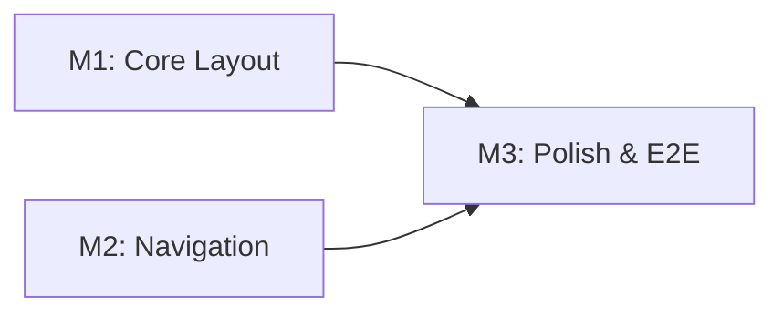

# Implementation Plan: Carbon Design System Sidenav

**Branch**: `009-carbon-sidenav` | **Date**: December 4, 2025 | **Spec**:
[spec.md](spec.md) **Input**: Feature specification from
`/specs/009-carbon-sidenav/spec.md`

## Summary

Implement a two-mode sidenav (expanded/collapsed) following Carbon Design System
best practices. The layout will bypass `HeaderContainer`'s render prop pattern
in favor of direct state control, use `isFixedNav` to properly push content,
persist user preference to localStorage, and auto-expand the active menu branch
on navigation. This refactors the existing `Header.js` approach based on
patterns validated in the `analyzer-layout-poc` branch.

## Technical Context

**Language/Version**: JavaScript (ES2020+), React 17  
**Primary Dependencies**: @carbon/react v1.15+, react-router-dom 5.2.0, React
Intl 5.20.12  
**Storage**: localStorage (browser) for preference persistence  
**Testing**: Jest + React Testing Library (unit), Cypress 12.17.3 (E2E)  
**Target Platform**: Modern browsers (Chrome, Firefox, Safari, Edge - desktop
primary)  
**Project Type**: Web application - Frontend only (no backend changes)  
**Performance Goals**: 150ms perceived response time for toggle, <5s full page
load  
**Constraints**: Must not break existing navigation functionality, must support
4 levels of menu nesting  
**Scale/Scope**: Applied to analyzer routes initially (`/analyzers/*`), gradual
rollout to other sections

## Constitution Check

_GATE: Must pass before Phase 0 research. Re-check after Phase 1 design._

Verify compliance with
[OpenELIS Global 3.0 Constitution](../../.specify/memory/constitution.md):

- [x] **Configuration-Driven**: No country-specific code branches - sidenav mode
      configurable via props
- [x] **Carbon Design System**: UI uses @carbon/react exclusively - Header,
      SideNav, SideNavItems, SideNavMenu, SideNavMenuItem, Content, Theme
      components
- [N/A] **FHIR/IHE Compliance**: No external data integration - frontend-only
  feature
- [N/A] **Layered Architecture**: Frontend-only feature - no backend changes
- [x] **Test Coverage**: Unit tests (Jest) + E2E tests (Cypress) planned
  - E2E tests MUST follow Cypress best practices (Constitution V.5):
    - Run tests individually during development (not full suite)
    - Browser console logging enabled and reviewed after each run
    - Video recording disabled by default
    - Post-run review of console logs and screenshots required
    - Use data-testid selectors (PREFERRED)
    - Use cy.session() for login state (10-20x faster)
- [N/A] **Schema Management**: No database changes
- [x] **Internationalization**: All UI strings use React Intl - existing menu
      labels already internationalized
- [x] **Security & Compliance**: Uses existing menu API which filters by user
      permissions

**Complexity Justification Required If**:

- None identified - this feature aligns with all constitution principles

## Milestone Plan

_GATE: Features >3 days MUST define milestones per Constitution Principle IX.
Each milestone = 1 PR. Use `[P]` prefix for parallel milestones._

### Milestone Table

| ID     | Branch Suffix | Scope                                          | User Stories | Verification                     | Depends On |
| ------ | ------------- | ---------------------------------------------- | ------------ | -------------------------------- | ---------- |
| M1     | m1-core       | TwoModeLayout component, toggle, localStorage  | P1 (both)    | Jest unit tests pass             | -          |
| [P] M2 | m2-nav        | Hierarchical menus, auto-expand, page config   | P2 (both)    | Jest tests + manual verification | -          |
| M3     | m3-polish     | Icons/tooltips, responsive behavior, E2E tests | P3 (both)    | E2E tests pass                   | M1, M2     |

**Legend**:

- **[P]**: Parallel milestone - M2 can be developed alongside M1
- **Sequential**: M3 depends on M1 and M2 completion
- **Branch**: Full path is `feat/OGC-009-sidenav/{suffix}`

### Milestone Dependency Graph



### PR Strategy

- **Spec PR**: `spec/OGC-009-sidenav` → `develop` (this specification - already
  created)
- **M1 PR**: `feat/OGC-009-sidenav/m1-core` → `develop`
- **M2 PR**: `feat/OGC-009-sidenav/m2-nav` → `develop` (can be parallel with M1)
- **M3 PR**: `feat/OGC-009-sidenav/m3-polish` → `develop` (after M1 + M2 merged)

**Estimated Effort**: ~4-5 days total (justifies milestone breakdown per
Principle IX)

## Testing Strategy

**Reference**:
[OpenELIS Testing Roadmap](../../.specify/guides/testing-roadmap.md)

### Coverage Goals

- **Backend**: N/A - Frontend-only feature
- **Frontend**: >70% code coverage (measured via Jest)
- **Critical Paths**: 100% coverage (toggle functionality, preference
  persistence)

### Test Types

- [x] **Frontend Unit Tests**: React component logic (Jest + React Testing
      Library)
  - Template: `.specify/templates/testing/JestComponent.test.jsx.template`
  - **Reference**:
    [Testing Roadmap - Jest + React Testing Library](../../.specify/guides/testing-roadmap.md#jest--react-testing-library-unit-tests)
  - **Reference**:
    [Jest Best Practices](../../.specify/guides/jest-best-practices.md)
  - **Coverage Goal**: >70% (measured via Jest)
  - **TDD Workflow**: Red-Green-Refactor cycle for toggle logic and preference
    persistence
- [x] **E2E Tests**: Critical user workflows (Cypress)
  - Template: `.specify/templates/testing/CypressE2E.cy.js.template`
  - **Reference**:
    [Constitution Section V.5](../../.specify/memory/constitution.md#section-v5-cypress-e2e-testing-best-practices)
  - **Reference**:
    [Testing Roadmap - Cypress E2E Testing](../../.specify/guides/testing-roadmap.md#cypress-e2e-testing)
  - **Reference**:
    [Cypress Best Practices](../../.specify/guides/cypress-best-practices.md)

### Test Data Management

- **Frontend**:
  - **E2E Tests (Cypress)**:
    - [x] Use `cy.session()` for login state (10-20x faster than per-test login)
    - [x] Use `cy.intercept()` for menu API responses with consistent test data
    - [x] Use custom Cypress commands for reusable navigation setup
  - **Unit Tests (Jest)**:
    - [x] Mock menu data with hierarchical structure
    - [x] Mock localStorage for preference persistence testing
    - [x] Use `renderWithIntl()` helper for consistent component rendering

### Checkpoint Validations

- [x] **After Phase 4 (Frontend)**: Frontend unit tests (Jest) AND E2E tests
      (Cypress) must pass

### TDD Workflow

- [x] **TDD Mandatory**: Red-Green-Refactor cycle for toggle logic and
      localStorage persistence
- [x] **Test Tasks First**: Test tasks MUST appear before implementation tasks
      in tasks.md
- [x] **Checkpoint Enforcement**: Tests must pass before proceeding to next
      phase

## Project Structure

### Documentation (this feature)

```text
specs/009-carbon-sidenav/
├── plan.md              # This file
├── research.md          # Carbon SideNav patterns research
├── data-model.md        # Component state model
├── quickstart.md        # Developer setup guide
├── contracts/           # Component interface contracts
│   └── layout-props.md  # Layout component props interface
└── tasks.md             # Implementation tasks (created by /speckit.tasks)
```

### Source Code (repository root)

```text
frontend/
├── src/
│   ├── components/
│   │   └── layout/
│   │       ├── Layout.js              # Existing - will be modified
│   │       ├── Header.js              # Existing - kept for backward compatibility
│   │       ├── AnalyzerLayout.js      # POC - will be refactored into reusable component
│   │       ├── AnalyzerLayout.css     # POC styles - will be moved to shared
│   │       ├── TwoModeLayout.js       # NEW - Reusable two-mode layout component
│   │       ├── TwoModeLayout.css      # NEW - Shared layout styles
│   │       ├── TwoModeLayout.test.js  # NEW - Unit tests
│   │       └── useSideNavPreference.js # NEW - Custom hook for preference persistence
│   └── pages/
│       └── [existing pages]
├── cypress/
│   └── e2e/
│       └── sidenavNavigation.cy.js    # NEW - E2E tests for sidenav
└── package.json
```

**Structure Decision**: Frontend-only feature with new reusable layout
component. The existing `AnalyzerLayout.js` POC will be refactored into a
generic `TwoModeLayout` component that can be used across all application
sections.

## Complexity Tracking

> No constitution violations - table not applicable.

## Design Decisions

### D1: Direct State Control vs HeaderContainer

**Decision**: Use direct React state (`useState`) for sidenav state instead of
Carbon's `HeaderContainer` render prop pattern.

**Rationale**:

- `HeaderContainer` manages sidenav state internally, making it difficult to
  persist or control externally
- Direct state control enables localStorage persistence
- Enables page-level default configuration via props
- Reduces component complexity by removing render prop indirection

**Implementation**: See `AnalyzerLayout.js` lines 71-76 for reference pattern.

### D2: isFixedNav for Content Pushing

**Decision**: Use `isFixedNav={true}` + `isChildOfHeader={true}` on SideNav
component.

**Rationale**:

- `isPersistent={false}` (current Header.js) causes overlay behavior
- `isFixedNav={true}` makes sidenav push content, which is the expected desktop
  UX
- Content must be positioned as sibling to Header/SideNav, not nested within

**Implementation**: CSS classes `content-expanded` and `content-collapsed`
handle dynamic margins.

### D3: localStorage Key Strategy

**Decision**: Use layout-specific keys: `{layoutName}SideNavExpanded` (e.g.,
`analyzerSideNavExpanded`).

**Rationale**:

- Different layouts may have different default preferences
- Users can have separate preferences for analyzer vs other sections
- Global key would force same preference everywhere

### D4: Menu Auto-Expansion

**Decision**: Auto-expand parent menu items that contain the current route on
navigation.

**Rationale**:

- Users should see their location in the navigation hierarchy
- Prevents users from being "lost" in collapsed menus
- Implemented via recursive `markActiveExpanded()` function on route change

## Risk Assessment

| Risk                         | Impact | Likelihood | Mitigation                                                 |
| ---------------------------- | ------ | ---------- | ---------------------------------------------------------- |
| Breaking existing navigation | High   | Low        | Keep Header.js for backward compatibility, gradual rollout |
| Mobile responsiveness issues | Medium | Medium     | Test on multiple viewport sizes, use Carbon breakpoints    |
| localStorage unavailable     | Low    | Low        | Graceful fallback to page default, log warning             |
| Performance degradation      | Medium | Low        | CSS transitions only (no JS animation), minimal re-renders |

## Dependencies

1. **@carbon/react v1.15+** - Already installed
2. **react-router-dom 5.2.0** - Already installed (for `useLocation`)
3. **React Intl 5.20.12** - Already installed (for internationalized menu
   labels)
4. **Existing menu API** - `/rest/menu` endpoint must continue working (no
   changes required)
