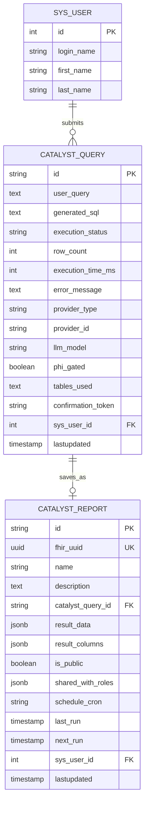

# Data Model: Catalyst - LLM-Powered Lab Data Assistant

**Feature**: OGC-070-catalyst-assistant  
**Date**: 2026-01-20  
**Status**: Draft

## Overview

Catalyst MVP requires minimal new database entities. The primary entity is
`CatalystQuery` for audit logging. Future phases will add `CatalystReport` for
saved reports.

---

## Entity: CatalystQuery (MVP)

**Purpose**: Audit logging of all generated SQL queries for compliance and
debugging.

### Table Definition

```sql
-- Table: catalyst_query
-- Purpose: Audit log for all Catalyst-generated queries (FR-010, FR-019)
-- Note: fhir_uuid omitted for MVP (internal audit entity, not exposed via FHIR)
CREATE TABLE catalyst_query (
    id VARCHAR(36) PRIMARY KEY,

    -- Query content
    user_query TEXT NOT NULL,                    -- Natural language question
    generated_sql TEXT,                          -- LLM-generated SQL (null if failed)

    -- Execution details
    execution_status VARCHAR(50) NOT NULL,       -- SUBMITTED, VALIDATED, REJECTED, ACCEPTED, EXECUTED, FAILED
    row_count INTEGER,                           -- Number of rows returned (null if not executed)
    execution_time_ms INTEGER,                   -- Query execution time in milliseconds
    error_message TEXT,                          -- Error details if failed

    -- Audit fields (BaseObject pattern)
    sys_user_id INTEGER NOT NULL REFERENCES sys_user(id),
    lastupdated TIMESTAMP WITH TIME ZONE NOT NULL DEFAULT NOW(),

    -- Provider info (FR-019)
    provider_type VARCHAR(50),                    -- external, on-premises
    provider_id VARCHAR(50),                      -- gemini, lmstudio (MVP providers)
    llm_model VARCHAR(100),                       -- Model identifier (provider-specific)

    -- PHI gating (FR-018, FR-019) - Added in M4
    phi_gated BOOLEAN DEFAULT FALSE,              -- Whether PHI detection triggered provider gating

    -- Schema context metadata (FR-019)
    tables_used TEXT,                             -- Comma-separated list of table names provided as schema context (NOT raw DDL)

    -- Review-before-execute (FR-016) - Added in M4
    confirmation_token VARCHAR(255),              -- Token computed from generated SQL for execution confirmation
);

-- Index for user query history
CREATE INDEX idx_catalyst_query_user ON catalyst_query(sys_user_id, lastupdated DESC);

-- Index for status monitoring
CREATE INDEX idx_catalyst_query_status ON catalyst_query(execution_status, lastupdated DESC);
```

### Entity Class

```java
@Entity
@Table(name = "catalyst_query")
public class CatalystQuery extends BaseObject<String> {

    @Id
    @GeneratedValue(generator = "uuid-generator")
    @GenericGenerator(name = "uuid-generator", strategy = "uuid2")
    @Column(name = "id", length = 36)
    private String id;

    @Column(name = "user_query", nullable = false, columnDefinition = "TEXT")
    private String userQuery;

    @Column(name = "generated_sql", columnDefinition = "TEXT")
    private String generatedSql;

    @Enumerated(EnumType.STRING)
    @Column(name = "execution_status", nullable = false, length = 50)
    private ExecutionStatus executionStatus;

    @Column(name = "row_count")
    private Integer rowCount;

    @Column(name = "execution_time_ms")
    private Integer executionTimeMs;

    @Column(name = "error_message", columnDefinition = "TEXT")
    private String errorMessage;

    // Provider info (FR-019)
    @Column(name = "provider_type", length = 50)
    private String providerType;  // external, on-premises

    @Column(name = "provider_id", length = 50)
    private String providerId;  // gemini, lmstudio

    @Column(name = "llm_model", length = 100)
    private String llmModel;

    // PHI gating (FR-018, FR-019) - Added in M4
    @Column(name = "phi_gated")
    private Boolean phiGated;

    // Schema context metadata (FR-019)
    @Column(name = "tables_used", columnDefinition = "TEXT")
    private String tablesUsed;  // Comma-separated table names (NOT raw DDL)

    // Review-before-execute (FR-016) - Added in M4
    @Column(name = "confirmation_token", length = 255)
    private String confirmationToken;

    // BaseObject fields: sysUserId, lastUpdated inherited
}
```

### ExecutionStatus Enum

```java
public enum ExecutionStatus {
    SUBMITTED,  // Agent generated SQL and submitted to system
    VALIDATED,  // Passed guardrails validation, ready for user review
    REJECTED,   // Failed validation (blocked table, too many rows, syntax error)
    ACCEPTED,   // User confirmed execution (token validated)
    EXECUTED,   // SQL executed successfully
    FAILED      // Execution failed (timeout, runtime error)
}
```

### State Transitions

1. **Agent Work** (No persisted state): Agent calls MCP tools
   (get_relevant_tables, get_table_ddl, validate_sql), generates SQL
2. **SUBMITTED**: Agent submits SQL to Java backend
3. **VALIDATED**: SQL passes `SQLGuardrails.validate()`, `confirmationToken`
   generated
4. **REJECTED**: SQL fails validation (blocked table, excessive rows, syntax
   error)
5. **ACCEPTED**: User submits `queryId` + `confirmationToken`, backend validates
   token
6. **EXECUTED**: Backend executes SQL against read-only connection
7. **FAILED**: Execution fails (timeout, runtime error)

### Field Descriptions

| Field              | Type         | Description                               | Required                       |
| ------------------ | ------------ | ----------------------------------------- | ------------------------------ |
| id                 | VARCHAR(36)  | UUID primary key                          | Yes                            |
| user_query         | TEXT         | Original natural language question        | Yes                            |
| generated_sql      | TEXT         | LLM-generated SQL statement               | No (null if generation failed) |
| execution_status   | VARCHAR(50)  | Current status (enum)                     | Yes                            |
| row_count          | INTEGER      | Rows returned                             | No (null if not executed)      |
| execution_time_ms  | INTEGER      | Execution duration                        | No                             |
| error_message      | TEXT         | Error details                             | No                             |
| sys_user_id        | INTEGER      | User who submitted query                  | Yes                            |
| lastupdated        | TIMESTAMP    | Last modification time                    | Yes                            |
| provider_type      | VARCHAR(50)  | Provider type (external/on-premises)      | No (FR-019)                    |
| provider_id        | VARCHAR(50)  | Provider identifier (gemini, lmstudio)    | No (FR-019)                    |
| llm_model          | VARCHAR(100) | Model name                                | No                             |
| phi_gated          | BOOLEAN      | Whether PHI detection triggered gating    | No (FR-019)                    |
| tables_used        | TEXT         | Comma-separated table names (NOT raw DDL) | No (FR-019)                    |
| confirmation_token | VARCHAR(255) | Token for execution confirmation          | No (FR-016)                    |

---

## Entity: CatalystReport (Phase 3 - Future)

**Purpose**: Saved query results for reporting and sharing.

### Table Definition (Future)

```sql
-- Table: catalyst_report (Phase 3)
-- Purpose: Saved query results for reporting
CREATE TABLE catalyst_report (
    id VARCHAR(36) PRIMARY KEY,
    fhir_uuid UUID NOT NULL UNIQUE DEFAULT gen_random_uuid(),

    -- Report metadata
    name VARCHAR(255) NOT NULL,
    description TEXT,

    -- Query reference
    catalyst_query_id VARCHAR(36) REFERENCES catalyst_query(id),

    -- Result snapshot
    result_data JSONB,                           -- Snapshot of query results
    result_columns JSONB,                        -- Column metadata

    -- Sharing
    is_public BOOLEAN DEFAULT FALSE,
    shared_with_roles JSONB,                     -- Role IDs that can access

    -- Scheduling (future)
    schedule_cron VARCHAR(100),
    last_run TIMESTAMP WITH TIME ZONE,
    next_run TIMESTAMP WITH TIME ZONE,

    -- Audit
    sys_user_id INTEGER NOT NULL REFERENCES sys_user(id),
    lastupdated TIMESTAMP WITH TIME ZONE NOT NULL DEFAULT NOW()
);
```

---

## Entity: SchemaMetadata (Runtime Only)

**Purpose**: In-memory representation of database schema for LLM context. NOT
persisted to database.

### Class Definition

```java
// Not a JPA entity - runtime data structure only
public class SchemaMetadata {

    private List<TableMetadata> tables;

    public static class TableMetadata {
        private String tableName;
        private String description;           // Human-readable description
        private List<ColumnMetadata> columns;
        private List<ForeignKeyMetadata> foreignKeys;
    }

    public static class ColumnMetadata {
        private String columnName;
        private String dataType;
        private boolean nullable;
        private String description;           // Human-readable description
    }

    public static class ForeignKeyMetadata {
        private String columnName;
        private String referencedTable;
        private String referencedColumn;
    }

    // Generate prompt-ready schema context
    public String toPromptContext() {
        StringBuilder sb = new StringBuilder();
        for (TableMetadata table : tables) {
            sb.append("CREATE TABLE ").append(table.tableName).append(" (\n");
            // ... column definitions
            sb.append(");\n\n");
        }
        return sb.toString();
    }
}
```

---

## Entity Relationships



---

## Liquibase Changeset

**File**:
`src/main/resources/liquibase/catalyst/catalyst-001-create-audit-table.xml`

```xml
<?xml version="1.0" encoding="UTF-8"?>
<databaseChangeLog
    xmlns="http://www.liquibase.org/xml/ns/dbchangelog"
    xmlns:xsi="http://www.w3.org/2001/XMLSchema-instance"
    xsi:schemaLocation="http://www.liquibase.org/xml/ns/dbchangelog
        http://www.liquibase.org/xml/ns/dbchangelog/dbchangelog-4.8.xsd">

    <changeSet id="catalyst-001-create-audit-table" author="catalyst-team">
        <comment>Create catalyst_query table for audit logging (M2 - without security fields phi_gated and confirmation_token, added in M4)</comment>

        <createTable tableName="catalyst_query">
            <column name="id" type="VARCHAR(36)">
                <constraints primaryKey="true" nullable="false"/>
            </column>
            <column name="user_query" type="TEXT">
                <constraints nullable="false"/>
            </column>
            <column name="generated_sql" type="TEXT"/>
            <column name="execution_status" type="VARCHAR(50)">
                <constraints nullable="false"/>
            </column>
            <column name="row_count" type="INTEGER"/>
            <column name="execution_time_ms" type="INTEGER"/>
            <column name="error_message" type="TEXT"/>
            <column name="provider_type" type="VARCHAR(50)"/>
            <column name="provider_id" type="VARCHAR(50)"/>
            <column name="llm_model" type="VARCHAR(100)"/>
            <!-- Note: phi_gated and confirmation_token added in M4 via catalyst-002-add-security-fields.xml -->
            <column name="tables_used" type="TEXT"/>
            <column name="sys_user_id" type="INTEGER">
                <constraints nullable="false" foreignKeyName="fk_catalyst_query_user"
                    referencedTableName="sys_user" referencedColumnNames="id"/>
            </column>
            <column name="lastupdated" type="TIMESTAMP WITH TIME ZONE" defaultValueComputed="NOW()">
                <constraints nullable="false"/>
            </column>
        </createTable>

        <createIndex tableName="catalyst_query" indexName="idx_catalyst_query_user">
            <column name="sys_user_id"/>
            <column name="lastupdated" descending="true"/>
        </createIndex>

        <createIndex tableName="catalyst_query" indexName="idx_catalyst_query_status">
            <column name="execution_status"/>
            <column name="lastupdated" descending="true"/>
        </createIndex>

        <rollback>
            <dropIndex tableName="catalyst_query" indexName="idx_catalyst_query_status"/>
            <dropIndex tableName="catalyst_query" indexName="idx_catalyst_query_user"/>
            <dropTable tableName="catalyst_query"/>
        </rollback>
    </changeSet>

</databaseChangeLog>
```

---

## Validation Rules

### CatalystQuery

| Field           | Validation                         | Error Message          |
| --------------- | ---------------------------------- | ---------------------- |
| userQuery       | NotNull, NotBlank, Size(max=10000) | Query text is required |
| executionStatus | NotNull                            | Status is required     |
| sysUserId       | NotNull                            | User ID is required    |
| generatedSql    | Size(max=100000)                   | Generated SQL too long |
| errorMessage    | Size(max=10000)                    | Error message too long |

### Entity Lifecycle

1. **Agent Work** (No persisted state): Agent calls MCP tools, generates SQL,
   pre-validates via MCP `validate_sql`
2. **SUBMITTED**: Agent submits SQL to Java backend (entity created)
3. **VALIDATED**: SQL passes `SQLGuardrails.validate()`, `confirmationToken`
   generated
4. **REJECTED**: SQL fails validation (blocked table, excessive rows, syntax
   error)
5. **ACCEPTED**: User confirms execution (token validated by backend)
6. **EXECUTED**: Query executed successfully
7. **FAILED**: Execution fails (timeout, runtime error)

---

## DAO Interface

```java
public interface CatalystQueryDAO extends BaseDAO<CatalystQuery, String> {

    // Find queries by user
    List<CatalystQuery> findByUserId(Integer userId, int maxResults);

    // Find queries by status
    List<CatalystQuery> findByStatus(ExecutionStatus status, int maxResults);

    // Count queries by status for monitoring
    long countByStatus(ExecutionStatus status);

    // Find recent failed queries for debugging
    List<CatalystQuery> findRecentFailed(int maxResults);
}
```

---

## Service Interface

```java
public interface CatalystQueryService {

    // Create audit record when query submitted
    CatalystQuery createQuery(String userQuery, Integer userId);

    // Update with generated SQL and audit metadata (FR-019)
    // Note: phiGated and confirmationToken parameters added in M4 (M2 version has only providerType, providerId, model, tablesUsed)
    void updateWithGeneratedSql(String queryId, String sql, String providerType, String providerId,
                                 String model, boolean phiGated, List<String> tablesUsed, String confirmationToken);

    // Update with execution result
    void updateWithResult(String queryId, int rowCount, int executionTimeMs);

    // Update with error
    void updateWithError(String queryId, String errorMessage);

    // Update with blocked status
    void updateAsBlocked(String queryId, String reason);

    // Get user's query history
    List<CatalystQuery> getUserQueryHistory(Integer userId, int maxResults);
}
```
