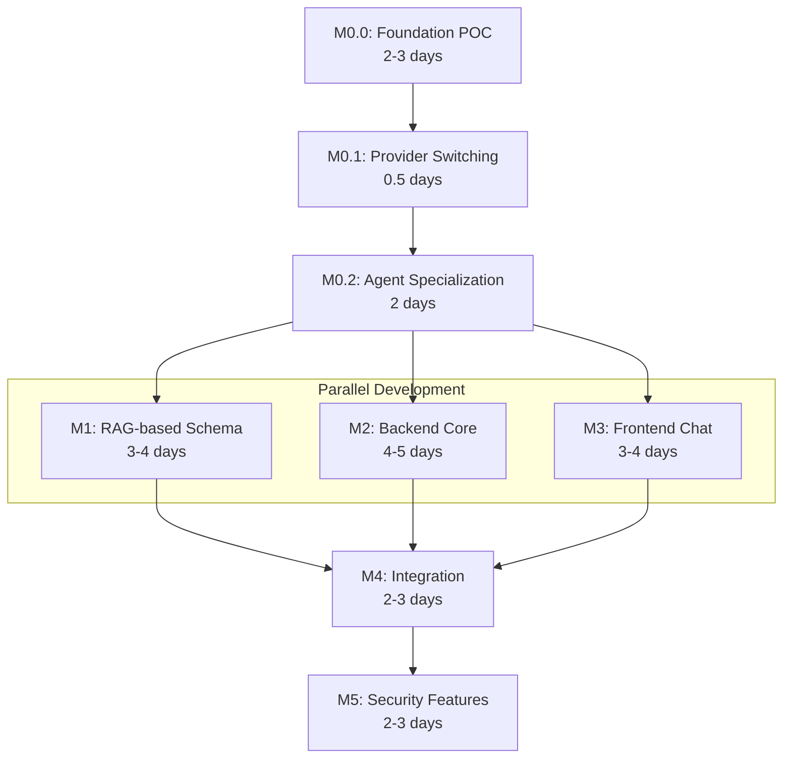

# Implementation Plan: Catalyst - LLM-Powered Lab Data Assistant

**Branch**: `spec/OGC-070-catalyst-assistant` | **Date**: 2026-01-21 | **Spec**:
[spec.md](./spec.md)  
**Jira**: [OGC-70](https://uwdigi.atlassian.net/browse/OGC-70)

## Summary

Catalyst enables lab managers to query OpenELIS data using natural language. The
system converts plain-language questions into SQL queries, executes them against
a read-only database connection, and displays results. **To ensure privacy, any
cloud LLM calls receive only schema metadata, and never any patient, clinical,
PHI data.**

**Primary Goal**: Rapid MVP prototype (2-3 sprints) that validates the
chat→SQL→results flow with **standards-based multi-agent architecture** (A2A
protocol + MCP for tools).

**Key Architectural Decisions**:

1. **A2A Multi-Agent Team (MVP)**: Simple 3-agent team based on med-agent-hub
   patterns - RouterAgent (orchestration), SchemaAgent (RAG via MCP), SQL
   Generator Agent (text-to-SQL). Single-agent fallback mode for simpler
   deployments.
2. **MCP for Tools**: Standalone Python MCP server for schema retrieval and SQL
   pre-validation (validate_sql), callable by SchemaAgent and SQLGenAgent via
   MCP protocol.
3. **Standards-First**: Validate A2A + MCP architecture early to enable future
   scaling without refactoring.

## Technical Context

**Language/Version**:

- Java 21 LTS (OpenJDK/Temurin) - OpenELIS backend
- Python 3.11+ - MCP Schema Server

**Framework**: Spring Framework 6.2.2 (Traditional Spring MVC - NOT Spring Boot)

**Primary Dependencies**:

- Backend (Java): HTTP client (Apache HttpClient or OkHttp) for
  OpenAI-compatible API calls to Catalyst Gateway, Jackson for JSON, Hibernate
  6.x, Jakarta EE 9
- A2A Agents (Python): a2a-sdk 0.3.22+ (with http-server extra), FastAPI,
  uvicorn, Google Generative AI SDK, httpx (for LM Studio OpenAI-compatible API)
- MCP Server (Python): mcp SDK, langchain, chromadb (for RAG embeddings),
  psycopg2-binary (PostgreSQL schema extraction)
- Frontend: React 17, @carbon/react v1.15, @carbon/ai-chat v1.0, React Intl

**LLM Providers (MVP)**:

- **Cloud**: Google Gemini (latest available)
- **Local**: LM Studio (exposes an OpenAI-compatible HTTP API for locally hosted
  models)

**Storage**: PostgreSQL 14+ (OpenELIS database - read-only connection for
Catalyst SQL query execution; audit logging writes to `catalyst_query` table via
separate write connection)  
**Testing**: JUnit 4 + Mockito (backend), pytest (MCP server), Jest + React
Testing Library (frontend), Cypress 12.17 (E2E)  
**Target Platform**: Docker containers deployed via existing OpenELIS
infrastructure  
**Project Type**: Multi-agent application (A2A agents in Python + Java backend
for OpenELIS integration + Python MCP server + React frontend)  
**Constraints**: LLM never receives patient data, read-only database access,
<10k row limit  
**Scale/Scope**: Single-user MVP, production will support concurrent OpenELIS
users

## Constitution Check

_GATE: Verified before research. Re-check after design._

- [x] **Configuration-Driven (I)**: LLM provider selection via properties file,
      not code branches
- [x] **Carbon Design System (II)**: @carbon/ai-chat for chat UI, no
      Bootstrap/Tailwind
- [x] **FHIR/IHE Compliance (III)**: N/A for MVP (internal read-only queries),
      future phases may expose FHIR resources
- [x] **Layered Architecture (IV)**:
  - CatalystQuery valueholder → CatalystQueryDAO → CatalystQueryService →
    CatalystRestController
  - JPA/Hibernate annotations (NO XML mappings)
  - @Transactional in services ONLY
- [x] **Test Coverage (V)**:
  - Unit tests for service layer (>80% target)
  - ORM validation test for entity mappings
  - One E2E test for MVP (chat→SQL→results flow)
  - Cypress best practices (V.5): individual test execution, console log review
- [x] **Schema Management (VI)**: Liquibase changesets for audit log table
- [x] **Internationalization (VII)**: All UI strings via React Intl (en, fr
      minimum)
- [x] **Security & Compliance (VIII)**:
  - RBAC (MVP): Two-level access control:
    - Endpoint-level: Restrict `/rest/catalyst/query` to privileged roles
      (`Global Administrator`, `Reports`) via `UserRoleService` (FR-021)
    - Table-level: Blocked-table list (FR-013)
    - Per-user row-level filtering deferred to Phase 2
  - Audit: Log all generated queries with user ID + timestamp
  - Validation: Block restricted tables (sys_user, login_user)
- [x] **Spec-Driven Iteration (IX)**: Milestones defined below, each milestone =
      1 PR

**No complexity justifications required** - all approaches use standard
patterns.

## Milestone Plan

_Features >3 days MUST define milestones per Constitution Principle IX._

### Milestone Table

| ID     | Branch Suffix           | Scope                                           | User Stories            | Verification                       | Depends On       |
| ------ | ----------------------- | ----------------------------------------------- | ----------------------- | ---------------------------------- | ---------------- |
| M0.0   | m0-foundation-poc       | Gateway + Router + CatalystAgent + MCP skeleton | US1 (partial), US2      | Router → Agent → MCP flow works    | -                |
| M0.1   | m0-provider-switching   | LLM provider switching (Gemini + LM Studio)     | US3                     | Both providers work                | M0.0             |
| M0.2   | m0-agent-specialization | Split into SchemaAgent + SQLGenAgent            | US1 (partial), US2      | Multi-agent flow works             | M0.1             |
| [P] M1 | m1-rag-schema           | ChromaDB RAG-based schema retrieval             | US1 (partial), US2      | MCP tools with real schema work    | M0.2             |
| [P] M2 | m2-backend-core         | Java OpenELIS integration, SQL execution        | US1 (partial), US2, US3 | Unit tests pass, ORM test passes   | M0.2             |
| [P] M3 | m3-frontend-chat        | Carbon chat sidebar, i18n, basic UI             | US1 (partial)           | Jest tests pass, renders correctly | -                |
| M4     | m4-integration          | Wire agents + backend + frontend, basic E2E     | US1, US4                | Integration + basic E2E test pass  | M0.2, M1, M2, M3 |
| M5     | m5-security             | Security features (PHI detection, RBAC, tokens) | US2                     | Security unit + integration tests  | M4               |

**Note**: M0 represents the foundational POC milestones (M0.0 → M0.1 → M0.2)
that validate the A2A + MCP architecture before full feature implementation.

**Legend**:

- **[P]**: Parallel milestone
- **Sequential** (no prefix): M4 requires all parallel milestones (M1, M2, M3)
  to complete; M5 requires M4 to complete

### Milestone Details

#### M0.0: Foundation POC (Estimate: 2-3 days)

**Goal**: Prove OpenAI-compatible Gateway → A2A Router → Agent → MCP tool flow
works end-to-end

**Scope**:

- **Catalyst Gateway** (skeleton): Exposes OpenAI-compatible
  `/v1/chat/completions` endpoint, bridges to RouterAgent via A2A
- RouterAgent (simple pass-through delegation, like med-agent-hub)
- CatalystAgent (single "everything" agent combining schema + SQL generation)
- MCP skeleton (2 tools: `get_query_context` + `validate_sql` with table
  allowlist enforcement, minimal non-PHI default profile)
- Agent Cards for Router + CatalystAgent per A2A specification
- Single LLM provider (LM Studio)
- med-agent-hub-style project structure under `projects/catalyst/`

**Files to Create**:

```
projects/catalyst/catalyst-gateway/
├── pyproject.toml                    # FastAPI, httpx, a2a-sdk (client)
├── src/
│   ├── __init__.py
│   ├── gateway.py                    # OpenAI-compatible /v1/chat/completions endpoint
│   ├── a2a_client.py                  # A2A client to call RouterAgent
│   └── config.py                     # Gateway configuration
├── tests/
│   └── test_gateway.py
└── Dockerfile

projects/catalyst/catalyst-agents/
├── pyproject.toml                    # a2a-sdk, mcp, httpx, google-generativeai
├── src/
│   ├── __init__.py
│   ├── config.py                     # LLM + endpoint configuration
│   ├── llm_clients.py                # LLM provider abstraction
│   ├── agents/
│   │   ├── __init__.py
│   │   ├── router_executor.py        # Simple delegation logic
│   │   ├── router_server.py          # FastAPI + A2A SDK server
│   │   ├── catalyst_executor.py      # Schema retrieval + SQL generation
│   │   └── catalyst_server.py        # FastAPI + A2A SDK server
│   ├── agent_cards/
│   │   ├── router.json               # RouterAgent card
│   │   └── catalyst.json             # CatalystAgent card
│   └── config/
│       └── agents_config.yaml        # LLM provider configuration
├── tests/
│   ├── test_router.py
│   ├── test_catalyst_agent.py
│   └── test_integration.py
└── .well-known/
    └── agent.json                    # Points to RouterAgent for discovery

projects/catalyst/catalyst-mcp/
├── pyproject.toml                    # mcp, chromadb, langchain, psycopg2
├── src/
│   ├── __init__.py
│   └── tools/
│       └── schema_tools.py           # Hardcoded get_schema tool (3-5 tables)
└── tests/
    └── test_mcp_tools.py
```

**Verification**:

```bash
# Start services
cd projects/catalyst/catalyst-gateway
python -m src.gateway &
cd ../catalyst-agents
python -m src.agents.router_server &
python -m src.agents.catalyst_server &

# Test end-to-end flow via OpenAI-compatible API
curl -X POST http://localhost:8000/v1/chat/completions \
  -H "Content-Type: application/json" \
  -d '{"model": "catalyst", "messages": [{"role": "user", "content": "How many samples today?"}]}' \
  → Gateway bridges to RouterAgent (A2A)
  → Router delegates to CatalystAgent (A2A)
  → CatalystAgent calls MCP get_query_context (returns allowlisted schema)
  → CatalystAgent generates SQL via LLM
  → MCP validate_sql checks SQL against allowlist
  → Returns OpenAI-compatible response with SQL
```

---

#### M0.1: Provider Switching (Estimate: 1 day)

**Goal**: Prove same agent works with local AND cloud providers

**Scope**:

- Add Gemini provider to CatalystAgent (cloud)
- LM Studio already implemented in M0.0 (local)
- Config-driven switching between cloud and local providers
- **2026 Best Practices**:
  - Gemini: use structured outputs/function calling for reliable SQL JSON format
  - LM Studio: model-dependent tool calling (prefer native tool support models)

**Files to Modify/Create**:

```
projects/catalyst/catalyst-agents/
├── src/
│   ├── llm_clients.py                     # Add Gemini provider
│   ├── agents/
│   │   └── catalyst_executor.py           # Update to use provider abstraction
│   └── config/
│       └── agents_config.yaml             # Provider configuration
├── tests/
│   └── test_catalyst_agent.py             # Verify both providers
```

**Verification**:

```bash
# Test with LM Studio (local)
CATALYST_LLM_PROVIDER=lmstudio pytest tests/test_provider_switching.py

# Test with Gemini (cloud)
CATALYST_LLM_PROVIDER=gemini pytest tests/test_provider_switching.py
```

---

#### M0.2: Agent Specialization (Estimate: 2 days)

**Goal**: Split CatalystAgent into specialized SchemaAgent + SQLGenAgent

**Scope**:

- Split CatalystAgent into SchemaAgent + SQLGenAgent
- RouterAgent delegates: query → SchemaAgent → SQLGenAgent → response
- SchemaAgent calls MCP `get_query_context` tool (still hardcoded/mocked)
- SQLGenAgent receives schema context from SchemaAgent
- Agent Cards for all 3 agents
- Single-agent fallback mode (CatalystAgent still works)
- NO PHI detection (defer to M5)
- NO confirmation tokens (defer to M5)

**Files to Create/Modify**:

```
projects/catalyst/catalyst-agents/src/agents/
├── schema_executor.py                # New: schema retrieval
├── schema_server.py                  # New: FastAPI + A2A SDK
├── sqlgen_executor.py                # New: SQL generation only
├── sqlgen_server.py                  # New: FastAPI + A2A SDK
├── router_executor.py                # Modified: orchestrate 2 agents
└── catalyst_executor.py              # Kept for single-agent fallback

projects/catalyst/catalyst-agents/src/agent_cards/
├── router.json                       # Updated: knows about schema + sqlgen
├── schema.json                       # New
└── sqlgen.json                       # New
```

**Verification**:

- pytest: All agent tests pass
- RouterAgent delegates correctly: SchemaAgent → SQLGenAgent
- Single-agent fallback mode works when `mode=single`

---

#### M1: RAG-based Schema (Estimate: 3-4 days) [PARALLEL]

**Goal**: Replace hardcoded schema with ChromaDB RAG-based retrieval

**Scope**:

- Replace hardcoded `get_schema` MCP tool with real PostgreSQL schema extraction
- Add ChromaDB for embedding-based schema retrieval
- Add MCP tools: `get_relevant_tables`, `get_table_ddl`, `get_relationships`,
  `validate_sql`
- SchemaAgent calls real MCP tools via Streamable HTTP
- SQLGenAgent calls `validate_sql` for agent-side pre-validation
- Docker container for MCP server
- **2026 Best Practices**:
  - MCP Streamable HTTP conformance test (protocol version header + session
    handling)
  - PostgreSQL introspection via `pg_catalog` (authoritative FK/constraint data)
  - ChromaDB operational guardrails (version pinning, persistence, rebuild
    procedure)
  - Evaluation harness (golden queries, Recall@K, execution accuracy)

**Files to Create/Modify**:

```
projects/catalyst/catalyst-mcp/
├── src/
│   ├── tools/
│   │   ├── schema_tools.py           # Modified: real PostgreSQL extraction
│   │   ├── relationship_tools.py     # New: get_relationships
│   │   └── validation_tools.py       # New: validate_sql
│   ├── rag/
│   │   ├── __init__.py
│   │   ├── retriever.py              # ChromaDB retriever
│   │   └── embeddings.py             # Embedding generation
│   └── db/
│       ├── __init__.py
│       └── schema_extractor.py       # PostgreSQL introspection
├── Dockerfile                        # MCP server container
└── tests/
    ├── test_rag_retrieval.py         # New: RAG tests
    ├── test_schema_extraction.py     # New: PostgreSQL tests
    └── test_validation_tools.py       # New: validate_sql tests
```

**Verification**:

- pytest: All MCP tool tests pass with real schema (including validate_sql)
- MCP server responds to tool calls via Streamable HTTP (with protocol version
  header + session ID)
- SchemaAgent retrieves relevant tables based on query semantics
- SQLGenAgent pre-validates SQL via MCP validate_sql before submitting
- Evaluation harness exists with golden query set defined (metric thresholds
  deferred to future phase)

---

#### M2: Backend Core (Estimate: 4-5 days) [PARALLEL]

**Scope**:

- Java OpenELIS integration layer (REST API, SQL execution, audit)
- OpenAI-compatible HTTP client to call Catalyst Gateway
- Privacy guardrails (blocked tables, schema-only context)
- CatalystQuery valueholder + DAO for audit logging (without security fields)
- SQL execution against read-only database connection
- **Note**: Security features (PHI detection, confirmation tokens) deferred to
  M5

**Files to Create**:

```
src/main/java/org/openelisglobal/catalyst/
├── config/
│   ├── CatalystGatewayConfig.java         # Gateway client configuration
│   └── CatalystDatabaseConfig.java        # Read-only connection config
├── gateway/
│   ├── CatalystGatewayClient.java          # OpenAI-compatible API client
│   └── CatalystGatewayClientImpl.java
├── service/
│   ├── CatalystQueryService.java          # Orchestrates agent calls + SQL exec
│   └── CatalystQueryServiceImpl.java
├── valueholder/CatalystQuery.java         # Audit entity
├── dao/
│   ├── CatalystQueryDAO.java
│   └── CatalystQueryDAOImpl.java
└── guardrails/SQLGuardrails.java          # Blocked tables, validation

src/main/resources/liquibase/catalyst/     # Audit table changeset
volume/properties/catalyst.properties      # Agent + database configuration
```

**Verification**:

- Unit tests: CatalystQueryServiceTest (mocked agent), SQLGuardrailsTest
- ORM validation test: HibernateMappingValidationTest (CatalystQuery entity)
- Integration: Java backend calls RouterAgent successfully

---

#### M3: Frontend Chat (Estimate: 3-4 days) [PARALLEL]

**Scope**:

- CatalystSidebar component using @carbon/ai-chat
- Internationalized strings (en.json, fr.json)
- Query input, response display, SQL preview
- Loading states, error handling

**Files to Create**:

```
frontend/src/components/catalyst/
├── CatalystSidebar.jsx                    # Main sidebar component
├── ChatInterface.jsx                      # Chat message list
├── QueryInput.jsx                         # Text input with submit
├── ResultsDisplay.jsx                     # Table/JSON display
├── SQLPreview.jsx                         # Generated SQL preview
└── index.js                               # Module exports

frontend/src/languages/en.json             # Add catalyst.* keys
frontend/src/languages/fr.json             # Add catalyst.* keys
```

**Verification**:

- Jest tests: CatalystSidebar.test.jsx, ChatInterface.test.jsx
- Manual: Component renders, i18n works for en/fr

---

#### M4: Integration (Estimate: 2-3 days)

**Scope**:

- Wire all components: Frontend → Java backend → Catalyst Gateway → A2A agents →
  MCP server
- CatalystRestController with /rest/catalyst/query endpoint
- Agent Card discovery endpoint (/.well-known/agent.json proxy)
- Response formatting (table, JSON, CSV export)
- Basic E2E test proving chat→agents→SQL→results flow (without security
  features)
- Single-agent fallback mode toggle
- **Note**: Security features (PHI detection, RBAC, confirmation tokens)
  deferred to M5 to allow independent testing

---

#### M5: Security Features (Estimate: 2-3 days)

**Goal**: Implement and thoroughly test security features with independent unit
tests before integration

**Scope**:

- **Role-based endpoint access control (FR-021)**: Restrict
  `/rest/catalyst/query` to users with `Global Administrator` or `Reports` roles
  using `UserRoleService.userInRole()`. Return 403 Forbidden for unauthorized
  users.
- **PHI detection in RouterAgent (FR-018)**: Detect likely PHI/identifiers in
  user queries
- **Provider routing for PHI-flagged queries**: Route to local provider or block
  if PHI detected and cloud provider configured
- **Confirmation token generation and validation (FR-016)**: Generate and
  validate confirmation tokens for SQL execution
- **Add security fields to CatalystQuery entity**: `phi_gated`,
  `confirmation_token` fields
- **Security Testing**: Independent unit tests for PHI detection logic, RBAC
  enforcement, and token validation before E2E integration tests

**Files to Create/Modify (M5)**:

```
src/main/java/org/openelisglobal/catalyst/
├── controller/CatalystRestController.java          # Modified: Add RBAC check
├── service/CatalystQueryService.java                # Modified: Add confirmation token validation
├── guardrails/PHIDetector.java                      # New: PHI detection logic
└── valueholder/CatalystQuery.java                   # Modified: Add phi_gated, confirmation_token fields

projects/catalyst/catalyst-agents/src/agents/
└── router_executor.py                               # Modified: Add PHI detection + provider routing

src/test/java/org/openelisglobal/catalyst/
├── guardrails/PHIDetectorTest.java                  # New: Unit tests for PHI detection
├── controller/CatalystRestControllerSecurityTest.java  # New: RBAC enforcement tests
└── service/CatalystQueryServiceSecurityTest.java    # New: Token validation tests

frontend/cypress/e2e/catalyst-security.cy.js         # New: E2E test with security features

src/main/resources/liquibase/catalyst/
└── catalyst-002-add-security-fields.xml            # New: Add security fields to audit table
```

**Files to Create (M4)**:

```
src/main/java/org/openelisglobal/catalyst/
├── controller/CatalystRestController.java
├── form/CatalystQueryForm.java
└── form/CatalystQueryResponse.java

frontend/cypress/e2e/catalyst.cy.js        # Basic E2E test (without security)

projects/catalyst/catalyst-dev.docker-compose.yml  # Full stack compose
```

**Verification (M4)**:

- Controller integration test: POST /rest/catalyst/query returns valid response
- Basic E2E test: User types query → Router delegates → SQL generated → results
  shown (without security features)
- Fallback test: Single-agent mode works when multi-agent disabled

---

**Verification (M5)**:

- **Unit tests**: PHI detection logic tested in isolation (RouterAgent unit
  tests)
- **Unit tests**: RBAC enforcement tested independently (Controller unit tests)
- **Unit tests**: Confirmation token generation/validation tested independently
- **Integration tests**: Security features work together (PHI detection →
  provider routing, RBAC → endpoint access)
- **E2E test**: Full security flow (unauthorized user blocked, PHI detected →
  local provider, confirmation token required for execution)

### Milestone Dependency Graph



### PR Strategy

- **Spec PR**: `spec/OGC-070-catalyst-assistant` → `develop` (this spec + plan)
- **M0.0 PR**: `feat/OGC-070-catalyst-assistant-m0-foundation-poc` → `develop`
- **M0.1 PR**: `feat/OGC-070-catalyst-assistant-m0-provider-switching` →
  `develop`
- **M0.2 PR**: `feat/OGC-070-catalyst-assistant-m0-agent-specialization` →
  `develop`
- **M1 PR**: `feat/OGC-070-catalyst-assistant-m1-rag-schema` → `develop`
- **M2 PR**: `feat/OGC-070-catalyst-assistant-m2-backend-core` → `develop`
- **M3 PR**: `feat/OGC-070-catalyst-assistant-m3-frontend-chat` → `develop`
- **M4 PR**: `feat/OGC-070-catalyst-assistant-m4-integration` → `develop`
- **M5 PR**: `feat/OGC-070-catalyst-assistant-m5-security` → `develop`

**Estimated Total**: ~16-19 days (3-4 sprints) for working MVP with A2A + MCP
architecture (includes security milestone)

### Future Phases (Post-MVP)

| Phase   | Scope                                               | Prerequisite  |
| ------- | --------------------------------------------------- | ------------- |
| Phase 2 | Row-level RBAC integration, per-user data filtering | MVP validated |
| Phase 3 | Report storage, scheduling, dashboards              | MVP validated |

**Independent Future Work** (can proceed in parallel with Phase 2/3):

- **Advanced Multi-Agent Orchestration**: Dynamic agent discovery, external
  agent federation, more sophisticated routing patterns. This work is
  independent of Phase 2 row-level RBAC and can proceed in parallel if resources
  allow.
- **Performance Evaluation & Optimization**: Establish evaluation harness with
  golden query sets, measure SQL generation accuracy, response time benchmarks,
  and optimize based on real-world usage patterns.
- **Multi-Language Query Support**: Extend natural language query understanding
  to all OpenELIS-supported languages (fr, ar, es, hi, pt, sw), building on the
  English-first MVP foundation.
- **Advanced Schema RAG**: Enhancements beyond MCP-based schema filtering (e.g.,
  fine-tuned embeddings, query-specific context optimization, relationship graph
  traversal).
- **Query Refinement & Suggestions**: Natural language query refinement
  suggestions, multi-step analytical query support, query history learning.

**Note**: Basic A2A multi-agent team (Router + Schema + SQLGen) is now in MVP
scope. Advanced orchestration patterns, dynamic agent discovery, and external
agent collaboration are independent future enhancements that don't require Phase
2 completion.

## Project Structure

### Repository Scoping (Tooling Under `projects/`)

To keep Catalyst work scoped and reviewable, **supporting services and tooling**
(e.g., the Python MCP server and Catalyst-specific Docker Compose) live under:

- `projects/catalyst/`

Only **required OpenELIS integration changes** should touch:

- Backend: `src/main/java/org/openelisglobal/catalyst/`
- Frontend: `frontend/src/components/catalyst/`
- Config: `volume/properties/catalyst.properties`

### Documentation (this feature)

```text
specs/OGC-070-catalyst-assistant/
├── spec.md              # Feature specification
├── plan.md              # This file
├── research.md          # Technology research
├── data-model.md        # Entity documentation
├── quickstart.md        # Developer quick start
├── contracts/           # API contracts
│   └── catalyst-api.yaml
└── checklists/
    └── requirements.md  # Quality checklist
```

### Source Code (repository root)

```text
# Catalyst Gateway (Python - OpenAI-compatible entrypoint)
projects/catalyst/catalyst-gateway/
├── pyproject.toml
├── Dockerfile
├── src/
│   ├── gateway.py                    # OpenAI-compatible /v1/chat/completions
│   ├── a2a_client.py                  # A2A client to RouterAgent
│   └── config.py
├── tests/
└── README.md

# A2A Agent Team (Python - A2A SDK)
projects/catalyst/catalyst-agents/
├── pyproject.toml
├── Dockerfile
├── src/
│   ├── main.py                  # Agent server entry point
│   ├── agents/                  # Agent implementations
│   │   ├── router_agent.py      # RouterAgent
│   │   ├── schema_agent.py      # SchemaAgent
│   │   └── sqlgen_agent.py      # SQLGenAgent
│   ├── agent_cards/             # A2A Agent Cards
│   └── config/
├── tests/                       # pytest tests
└── .well-known/
    └── agent.json               # RouterAgent discovery

# MCP Schema Server (Python - Standalone)
projects/catalyst/catalyst-mcp/
├── pyproject.toml
├── Dockerfile
├── src/
│   ├── server.py                # MCP entry point
│   ├── tools/                   # MCP tool implementations
│   ├── rag/                     # Embedding + retrieval
│   └── db/                      # Schema extraction
├── tests/                       # pytest tests
└── config/
    └── mcp_config.yaml

# Backend (Java - Traditional Spring MVC)
src/main/java/org/openelisglobal/catalyst/
├── config/              # Gateway + database configuration
├── gateway/              # OpenAI-compatible API client
├── controller/          # REST endpoints
├── dao/                 # Data access
├── form/                # Request/response DTOs
├── guardrails/          # SQL validation
├── service/             # Business logic
└── valueholder/         # JPA entities

src/main/resources/liquibase/catalyst/
└── catalyst-001-create-audit-table.xml

src/test/java/org/openelisglobal/catalyst/
├── service/             # Unit tests
├── mcp/                 # MCP client tests
├── controller/          # Integration tests
└── HibernateMappingValidationTest.java

# Frontend (React + Carbon)
frontend/src/components/catalyst/
├── CatalystSidebar.jsx
├── ChatInterface.jsx
├── QueryInput.jsx
├── ResultsDisplay.jsx
├── SQLPreview.jsx
└── __tests__/           # Jest tests

frontend/cypress/e2e/
└── catalyst.cy.js       # E2E test

# Configuration
volume/properties/catalyst.properties    # Java backend config (gateway URL, guardrails)
projects/catalyst/catalyst-gateway/src/config/gateway_config.yaml  # Gateway config (A2A RouterAgent URL, mode)
projects/catalyst/catalyst-agents/src/config/agents_config.yaml  # Agent runtime config (LLM provider, MCP URL)
projects/catalyst/catalyst-dev.docker-compose.yml  # Full stack (gateway + agents + MCP)
```

**Structure Decision**: Multi-agent architecture - Python A2A agent runtime
(RouterAgent, SchemaAgent, SQLGenAgent) for AI orchestration, Python MCP server
for schema retrieval (standards-based), Java backend for OpenELIS integration +
SQL execution + audit, React frontend for chat UI.

## Testing Strategy

**Reference**: [OpenELIS Testing Roadmap](.specify/guides/testing-roadmap.md)

### Coverage Goals

- **Backend**: >80% for service layer (JaCoCo)
- **Frontend**: >70% for catalyst components (Jest)
- **Critical Paths**: 100% coverage for SQL guardrails (blocked tables,
  injection prevention)

### Test Types

- [x] **A2A Agent Tests**: Python (pytest)

  - `test_router_agent.py` - Test orchestration logic
  - `test_schema_agent.py` - Test MCP tool delegation
  - `test_sqlgen_agent.py` - Test SQL generation
  - **SDD Checkpoint**: After M0, all agent tests MUST pass

- [x] **MCP Server Tests**: Python (pytest)

  - `test_schema_tools.py` - Test MCP tool implementations
  - `test_retriever.py` - Test RAG embedding search
  - **SDD Checkpoint**: After M1, all MCP tests MUST pass

- [x] **Unit Tests**: Service layer (JUnit 4 + Mockito)

  - `CatalystQueryServiceTest` - Mock agent responses, test orchestration
  - `CatalystGatewayClientTest` - Mock gateway server, test OpenAI-compatible
    API calls
  - `SQLGuardrailsTest` - Test blocked table detection, SQL validation
  - Template: `.specify/templates/testing/JUnit4ServiceTest.java.template`
  - **SDD Checkpoint**: After M2, all unit tests MUST pass

- [x] **ORM Validation Tests**: Entity mapping (Constitution V.4)

  - `HibernateMappingValidationTest` - Validate CatalystQuery entity mappings
  - MUST execute in <5 seconds, MUST NOT require database
  - **SDD Checkpoint**: After M2, ORM test MUST pass

- [x] **Controller Tests**: REST endpoints (BaseWebContextSensitiveTest)

  - `CatalystRestControllerTest` - Test /rest/catalyst/query endpoint
  - Template: `.specify/templates/testing/WebMvcTestController.java.template`
  - **SDD Checkpoint**: After M4, basic integration tests MUST pass
  - **SDD Checkpoint**: After M5, security integration tests MUST pass

- [x] **Frontend Unit Tests**: React components (Jest + RTL)

  - `CatalystSidebar.test.jsx` - Component rendering, i18n
  - `ChatInterface.test.jsx` - Message display
  - Template: `.specify/templates/testing/JestComponent.test.jsx.template`
  - **SDD Checkpoint**: After M3, Jest tests MUST pass

- [x] **E2E Tests**: Critical workflow (Cypress)
  - `catalyst.cy.js` - Full chat→agents→SQL→results flow
  - Run individually during development (Constitution V.5)
  - Template: `.specify/templates/testing/CypressE2E.cy.js.template`
  - **SDD Checkpoint**: After M4, basic E2E test MUST pass (without security)
  - **SDD Checkpoint**: After M5, full E2E test with security features MUST pass

### Test Data Management

- **Backend Unit Tests**: Mock LLM responses for deterministic testing

  ```java
  // Canned responses for predictable tests
  when(mockLLM.generate(anyString())).thenReturn(
      "SELECT COUNT(*) FROM sample WHERE entered_date = CURRENT_DATE"
  );
  ```

- **E2E Tests (Cypress)**:
  - Use `cy.intercept()` to spy on /rest/catalyst/query (NOT stub)
  - Use existing OpenELIS test database with sample data
  - Login via `cy.session()` (Constitution V.5)

### Checkpoint Validations

- [x] **After M0 (A2A Agents)**: Agent tests MUST pass, Agent Cards valid
- [x] **After M1 (MCP Server)**: pytest tests MUST pass, MCP tools callable
- [x] **After M2 (Backend Core)**: ORM validation + unit tests MUST pass
- [x] **After M3 (Frontend Chat)**: Jest tests MUST pass
- [x] **After M4 (Integration)**: Controller integration tests + basic E2E test
      MUST pass, multi-agent flow verified (without security features)
- [x] **After M5 (Security)**: Security unit tests + security integration
      tests + full E2E test with security features MUST pass

## Protocol Boundaries & Communication Architecture

### Protocol Layering

The Catalyst system uses three distinct protocols, each serving a specific
purpose:

1. **OpenELIS Backend → AI System**: **OpenAI-compatible Chat Completions API**

   - OpenELIS Java backend calls a **Catalyst Gateway** service using the
     standard OpenAI-compatible `/v1/chat/completions` endpoint
   - This provides a stable, industry-standard interface for non-agent clients
   - Both MVP providers (Gemini, LM Studio) support this format
   - **Rationale**: OpenELIS is not an AI agent and should not need to implement
     agent discovery/identity semantics. Using OpenAI-compatible API keeps
     OpenELIS's integration surface stable and provider-swappable.

2. **Agent Team Internal Communication**: **A2A Protocol**

   - The Catalyst Gateway bridges OpenAI-compatible requests to the A2A
     RouterAgent
   - RouterAgent coordinates with SchemaAgent and SQLGenAgent via A2A protocol
   - A2A handles agent discovery (Agent Cards), task delegation, and message
     lifecycle
   - **Rationale**: A2A is designed for agent-to-agent coordination; the agent
     team is where standards-based multi-agent architecture belongs.

3. **All LLM/Agent Interactions with OpenELIS Data**: **MCP Protocol**
   - Agents (SchemaAgent, SQLGenAgent) call **OpenELIS MCP Server** tools to
     access schema metadata and validate SQL
   - MCP tools: `get_relevant_tables`, `get_table_ddl`, `get_relationships`,
     `validate_sql`
   - **Agents never call OpenELIS directly** - MCP is the single entrypoint for
     all AI access to OpenELIS data
   - **Rationale**: MCP is explicitly designed as the tool boundary where LLMs
     (via host/client) access external systems. This ensures privacy (schema
     only, no patient data) and provides a clean abstraction layer. The
     `validate_sql` tool enables agent-side pre-validation before submitting SQL
     to the backend.

### Architecture Flow

```
React UI → Java Backend (REST) → Catalyst Gateway (OpenAI-compat) → RouterAgent (A2A)
                                                                         ↓
                                                              SchemaAgent (A2A) → MCP Server (tools)
                                                              SQLGenAgent (A2A) → MCP Server (tools)
```

## Agent Responsibilities & Integration

### Agent-Owned Responsibilities

**SQL Generation + LLM Provider Switching** (SQLGenAgent - Python):

- SQLGenAgent owns text-to-SQL generation using configured LLM provider
- Supports 2 providers: Google Gemini, LM Studio (OpenAI-compatible API)
- Provider selection configured via agent runtime config (YAML/properties)
- PHI detection and cloud provider blocking logic lives in RouterAgent
  (delegates to SQLGenAgent only if safe)

**Schema Retrieval via MCP** (SchemaAgent - Python):

- SchemaAgent calls MCP server tools for RAG-based schema retrieval
- MCP tools: `get_relevant_tables`, `get_table_ddl`, `get_relationships`
- MCP transport: Streamable HTTP (SSE optional for streaming)
- Reference:
  https://modelcontextprotocol.io/specification/2025-11-25/basic/transports

**SQL Generation with Pre-Validation** (SQLGenAgent - Python):

- SQLGenAgent generates SQL using LLM with schema context from SchemaAgent
- SQLGenAgent calls MCP `validate_sql` tool before submitting SQL to backend
- Pre-validation reduces invalid submissions and enables agent iteration
- MCP transport: Streamable HTTP

**Orchestration** (RouterAgent - Python):

- RouterAgent orchestrates query flow: delegates to SchemaAgent for schema, then
  SQLGenAgent for SQL generation (with pre-validation)
- Performs PHI detection on user query before delegation
- Returns generated SQL to Java backend (no execution in agent layer)

### Java Backend Responsibilities

**OpenELIS Integration** (CatalystRestController + CatalystQueryService):

- Receives HTTP requests from frontend
- Calls **Catalyst Gateway** via OpenAI-compatible Chat Completions API
  (`POST /v1/chat/completions`)
- Validates generated SQL via `SQLGuardrails` (defense-in-depth, re-validates
  agent pre-validation)
- Sets status: SUBMITTED → VALIDATED (or REJECTED if validation fails)
- Generates confirmation token for validated SQL
- Executes SQL against read-only database connection (after user confirmation)
- Persists audit records (CatalystQuery entity) with FR-019 metadata
- Validates confirmation token before execution (review-before-execute
  enforcement)

**No Direct LLM/MCP/A2A Access**: Java backend does NOT directly call LLM
providers, MCP server, or A2A agents. All AI operations happen via the Catalyst
Gateway, which bridges to the A2A agent team internally.

### Python MCP Server Tools

```python
# projects/catalyst/catalyst-mcp/src/tools/schema_tools.py
from mcp import tool

@tool
def get_relevant_tables(query: str) -> list[str]:
    """Find tables relevant to the user's natural language query using RAG."""
    # Embed query and search ChromaDB for similar table descriptions
    results = retriever.search(query, k=10)
    return [r.table_name for r in results]

@tool
def get_table_ddl(table_name: str) -> str:
    """Get CREATE TABLE statement for a specific table."""
    return schema_extractor.get_ddl(table_name)

@tool
def get_relationships(table_names: list[str]) -> list[dict]:
    """Get foreign key relationships between specified tables."""
    return schema_extractor.get_fk_relationships(table_names)

@tool
def validate_sql(sql: str, user_query: str) -> dict:
    """
    Validate SQL before submission (agent-side pre-validation).

    Checks:
    - SQL syntax validity
    - Blocked table access (sys_user, login_user, user_role)
    - Estimated row count via EXPLAIN (warn if >10k)

    Returns:
        {
            "valid": bool,
            "blockedTables": list[str],  # Empty if none
            "estimatedRows": int,
            "syntaxError": str | None,
            "warnings": list[str]
        }
    """
    # Full validation logic (mirrors Java SQLGuardrails)
    return validator.validate(sql, user_query)
```

### Configuration

**Java Backend** (`volume/properties/catalyst.properties`):

```properties
# Catalyst Gateway (OpenAI-compatible entrypoint)
catalyst.gateway.url=http://catalyst-gateway:8000
catalyst.gateway.api-key=not-required-for-mvp  # Gateway may require auth in future

# Guardrails (enforced in Java backend)
catalyst.guardrails.max-rows=10000
catalyst.guardrails.query-timeout=30s
catalyst.guardrails.blocked-tables=sys_user,login_user,user_role
```

**Agent Runtime Dependency Pinning (Security)**:

For production deployments, Python dependencies in `pyproject.toml` MUST use
exact version pinning (not `>=`) for security-sensitive packages that have
access to database credentials and LLM API keys:

```toml
[project]
dependencies = [
    "a2a-sdk[http-server]==0.3.22",       # Exact version (security)
    "google-generativeai==0.8.3",         # Exact version (security)
    "httpx==0.27.0",                      # Exact version (security)
    "mcp==1.1.2",                         # Exact version (security)
    "chromadb==0.4.22",                   # Exact version (security)
    "langchain==0.1.16",                  # Exact version (security)
]
```

Upgrades to these dependencies MUST be explicit, reviewed changes with
compatibility testing. For development, `>=` may be acceptable, but production
builds MUST pin versions.

**Agent Runtime Configuration**
(`projects/catalyst/catalyst-agents/src/config/agents_config.yaml`):

```yaml
# LLM Provider Selection (SQLGenAgent)
llm:
  provider: lmstudio # Options: gemini, lmstudio

  # Cloud provider
  gemini:
    model: latest # Use most recent available Gemini model
    api_key: ${GOOGLE_API_KEY}

  # Local provider
  lmstudio:
    base_url: http://host.docker.internal:1234/v1
    model: local-model # Use most recent available OpenAI-compatible model

# MCP Server (SchemaAgent)
mcp:
  server_url: http://catalyst-mcp:8000/mcp
```

### PHI-Aware Provider Gating (MVP Safety)

**Goal**: Preserve the privacy-first constraint even when users include
identifiers/PHI in the _question text_.

**Rule (MVP)**:

- RouterAgent detects likely PHI/identifiers in user query
- If PHI detected **and** configured provider is externally-hosted (Gemini),
  RouterAgent **MUST NOT** delegate to SQLGenAgent with that provider
- RouterAgent attempts to route to on-premises provider (LM Studio) if
  configured and healthy
- If no on-premises provider available, RouterAgent returns error to Java
  backend, which blocks request with user-facing message

**Reference**: This is required to make US2/FR-004 testable in real workflows
where users paste patient identifiers into questions.

## A2A Multi-Agent Architecture

**Reference**: [A2A Protocol](https://google.github.io/A2A/),
[med-agent-hub](https://github.com/pmanko/med-agent-hub)

### Agent Team Overview

MVP implements a simple 3-agent team based on med-agent-hub patterns:

```
┌─────────────────────────────────────────────────────────────────┐
│                     OpenELIS Frontend                           │
│                    (CatalystSidebar.jsx)                        │
└────────────────────────────┬────────────────────────────────────┘
                             │ HTTP
┌────────────────────────────▼────────────────────────────────────┐
│                   Java Backend (OpenELIS)                       │
│               CatalystRestController + Service                  │
└────────────────────────────┬────────────────────────────────────┘
                             │ A2A Task Request
┌────────────────────────────▼────────────────────────────────────┐
│                      RouterAgent                                │
│           (Orchestrates query flow, delegates)                  │
│                 /.well-known/agent.json                         │
└───────────┬─────────────────────────────────┬───────────────────┘
            │ A2A                             │ A2A
┌───────────▼───────────┐         ┌───────────▼───────────┐
│     SchemaAgent       │         │     SQLGenAgent       │
│  (RAG schema lookup)  │         │   (Text-to-SQL LLM)   │
└───────────┬───────────┘         └───────────────────────┘
            │ MCP
┌───────────▼───────────┐
│    MCP Schema Server  │
│  (ChromaDB + Postgres)│
└───────────────────────┘
```

### Agent Responsibilities

| Agent           | Skill               | Input                  | Output              | Validation           |
| --------------- | ------------------- | ---------------------- | ------------------- | -------------------- |
| **RouterAgent** | `orchestrate_query` | Natural language query | Final SQL + results | PHI detection        |
| **SchemaAgent** | `retrieve_schema`   | Query text             | Relevant table DDL  | N/A                  |
| **SQLGenAgent** | `generate_sql`      | Query + schema context | Valid SQL statement | Pre-validate via MCP |

### Agent Card Structure (A2A Specification)

**Required Fields** (per A2A spec v0.3.0+):

- `protocolVersions`: Array of supported A2A protocol versions (e.g.,
  `["0.3.0"]`)
- `name`: Human-readable agent name
- `description`: Agent purpose
- `url`: Base URL for A2A service
- `version`: Agent implementation version (not protocol version)
- `capabilities`: Feature flags (streaming, pushNotifications, etc.)
- `defaultInputModes`: Supported input MIME types (e.g.,
  `["text/plain", "application/json"]`)
- `defaultOutputModes`: Supported output MIME types
- `skills`: Array of AgentSkill objects (at least one required)

**Example RouterAgent Card**:

```json
{
  "protocolVersions": ["0.3.0"],
  "name": "CatalystRouterAgent",
  "description": "Orchestrates text-to-SQL query flow for OpenELIS lab data",
  "url": "http://catalyst-agents:8000",
  "version": "1.0.0",
  "capabilities": {
    "streaming": false,
    "pushNotifications": false
  },
  "defaultInputModes": ["text/plain", "application/json"],
  "defaultOutputModes": ["application/json"],
  "skills": [
    {
      "id": "orchestrate_query",
      "name": "Orchestrate Query",
      "description": "Convert natural language to SQL and return results",
      "tags": ["text-to-sql", "lab-data", "query"]
    }
  ]
}
```

**Discovery Path**: RouterAgent publishes Agent Card at
`/.well-known/agent.json` (or `/.well-known/agent-card.json` per A2A SDK 0.3.x
default). **Note**: This endpoint should only be exposed internally within the
Docker network, not publicly, as it's used for agent discovery within the
Catalyst system.

### Single-Agent Fallback Mode

For simpler deployments, Catalyst supports single-agent mode where all logic
runs in one agent (no inter-agent communication). The Gateway handles routing to
either the multi-agent team or a single CatalystAgent based on configuration.

```properties
# volume/properties/catalyst.properties
catalyst.gateway.url=http://catalyst-gateway:8000
```

The Gateway configuration (in `projects/catalyst/catalyst-gateway/src/config/`)
determines whether to route to the multi-agent team (RouterAgent) or directly to
a single CatalystAgent. When in single-agent mode, the CatalystAgent performs
all tasks internally without delegating to SchemaAgent or SQLGenAgent.

## References

- **Spec**: [specs/OGC-070-catalyst-assistant/spec.md](./spec.md)
- **Research**: [specs/OGC-070-catalyst-assistant/research.md](./research.md)
- **API Contract**:
  [specs/OGC-070-catalyst-assistant/contracts/catalyst-api.yaml](./contracts/catalyst-api.yaml)
- **Constitution**:
  [.specify/memory/constitution.md](../../.specify/memory/constitution.md)
- **Testing Roadmap**:
  [.specify/guides/testing-roadmap.md](../../.specify/guides/testing-roadmap.md)
- **Jira Issue**: [OGC-70](https://uwdigi.atlassian.net/browse/OGC-70)

### External References

- [A2A Python SDK](https://pypi.org/project/a2a-sdk/)
- [Google Generative AI Python SDK](https://github.com/google/generative-ai-python)
- [Carbon AI Chat](https://chat.carbondesignsystem.com/)
- [MCP Documentation](https://modelcontextprotocol.io/) (MVP - Python SDK)
- [MCP Python SDK](https://github.com/modelcontextprotocol/python-sdk)
- [MCP Java SDK](https://github.com/modelcontextprotocol/java-sdk)
- [ChromaDB](https://www.trychroma.com/) (RAG vector store)
- [Google Gemini API](https://ai.google.dev/)
- [LM Studio](https://lmstudio.ai/) (OpenAI-compatible local inference)
- [A2A Protocol](https://google.github.io/A2A/) (MVP - multi-agent architecture)
- [A2A Python SDK](https://github.com/a2aproject/a2a-samples) (agent
  implementation)
- [med-agent-hub](https://github.com/pmanko/med-agent-hub) (reference patterns)
