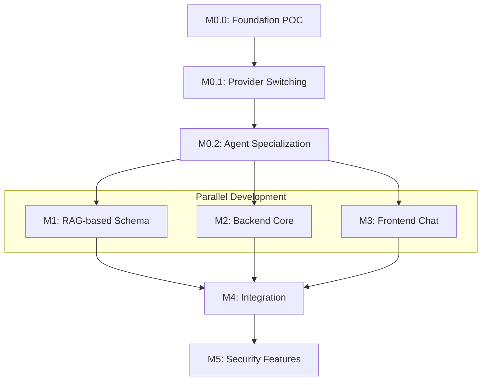

# Tasks: Catalyst - LLM-Powered Lab Data Assistant

**Branch**: `spec/OGC-070-catalyst-assistant` | **Date**: 2026-01-21  
**Input**: Design documents from `/specs/OGC-070-catalyst-assistant/`  
**Prerequisites**: plan.md, spec.md, research.md, data-model.md, contracts/

**Organization**: Tasks are organized by **Milestone** per Constitution
Principle IX. Tests are **MANDATORY** per Constitution Principle V (TDD).

## Format: `[ID] [P?] [M#] Description`

- **[P]**: Can run in parallel (different files, no dependencies)
- **[M#]**: Which milestone this task belongs to (e.g., M0, M1, M2, M3, M4)
- Include exact file paths in descriptions

## Total Task Count

- **M0.0 (Foundation POC)**: 24 tasks (Gateway + Router + CatalystAgent + MCP
  skeleton + FR-004 validation)
- **M0.1 (Provider Switching)**: 4 tasks
- **M0.2 (Agent Specialization)**: 10 tasks (split CatalystAgent)
- **M1 (RAG-based Schema)**: 20 tasks (RAG + MCP tools + evaluation harness +
  ChromaDB ops)
- **M2 (Backend Core)**: 25 tasks (reduced - security deferred, includes
  @Transactional verification + read-only DB verification)
- **M3 (Frontend Chat)**: 19 tasks (reduced - token handling deferred)
- **M4 (Integration)**: ~20 tasks (wiring, controller, export, basic E2E without
  security)
- **M5 (Security Features)**: ~17 tasks (RBAC, PHI detection, confirmation
  tokens, security tests)
- **Total**: 175 tasks (sequentially renumbered, no duplicates)

---

## Milestone 0.0: Foundation POC (Estimate: 2-3 days)

**Branch**: `feat/OGC-070-catalyst-assistant-m0-foundation-poc`  
**Goal**: Prove A2A Router → Agent → MCP tool flow works end-to-end  
**Verification**: Router → CatalystAgent → MCP → LLM → SQL flow complete  
**FR Coverage**: FR-020 (A2A multi-agent architecture - partial), FR-003 (MCP
schema retrieval - skeleton)

### M0.0.1: Branch Setup & Project Structure (med-agent-hub style)

- [x] T001 [M0.0] Create milestone branch
      `feat/OGC-070-catalyst-assistant-m0-foundation-poc` from `develop`
- [x] T002 [M0.0] Create project directory structure
      `projects/catalyst/catalyst-agents/` with med-agent-hub-style layout
      (src/, tests/, .well-known/)
- [x] T002a [M0.0] Create `projects/catalyst/catalyst-agents/pyproject.toml`
      with dependencies: a2a-sdk[http-server] >=0.3.22, mcp, httpx,
      google-generativeai
- [x] T002b [M0.0] Add `projects/catalyst/.python-version` for Python 3.11+
      (aligns with version manager guidance from similar agent repos)
- [x] T003 [P] [M0.0] Create `projects/catalyst/catalyst-agents/src/__init__.py`
- [x] T003a [P] [M0.0] Create
      `projects/catalyst/catalyst-agents/src/agents/__init__.py`
- [x] T003b [P] [M0.0] Create `projects/catalyst/catalyst-mcp/src/__init__.py`
      (separate MCP server)
- [x] T003c [P] [M0.0] Create
      `projects/catalyst/catalyst-agents/src/agent_cards/` directory
- [x] T003d [P] [M0.0] Create
      `projects/catalyst/catalyst-agents/tests/__init__.py`

### M0.0.1a: Catalyst Gateway Skeleton (OpenAI-compatible entrypoint)

- [x] T003e [P] [M0.0] Create project directory structure
      `projects/catalyst/catalyst-gateway/` with src/, tests/
- [x] T003f [P] [M0.0] Create
      `projects/catalyst/catalyst-gateway/pyproject.toml` with dependencies:
      fastapi, uvicorn, httpx, a2a-sdk (client only)
- [x] T003g [P] [M0.0] Create
      `projects/catalyst/catalyst-gateway/src/__init__.py`
- [x] T003h [P] [M0.0] Create
      `projects/catalyst/catalyst-gateway/src/gateway.py` skeleton with
      `/v1/chat/completions` endpoint (OpenAI-compatible)
- [x] T003i [P] [M0.0] Create
      `projects/catalyst/catalyst-gateway/src/a2a_client.py` skeleton for A2A
      client to call RouterAgent
- [x] T003j [P] [M0.0] Create `projects/catalyst/catalyst-gateway/src/config.py`
      for Gateway configuration
- [x] T003k [P] [M0.0] Create
      `projects/catalyst/catalyst-gateway/tests/test_gateway.py` skeleton for
      Gateway tests (TDD - MANDATORY, write test FIRST)
- [x] T003l [P] [M0.0] Create `projects/catalyst/catalyst-gateway/Dockerfile`
      for containerized Gateway deployment

### M0.0.2: MCP Skeleton Test (TDD - MANDATORY)

> **NOTE: Write this test FIRST, ensure it FAILS before implementation**

- [x] T004 [P] [M0.0] Write pytest test for MCP tools (`get_query_context` +
      `validate_sql`) in
      `projects/catalyst/catalyst-mcp/tests/test_mcp_tools.py`

### M0.0.3: MCP Skeleton Implementation

- [x] T005 [M0.0] Implement MCP tools (`get_query_context` + `validate_sql`) in
      `projects/catalyst/catalyst-mcp/src/tools/schema_tools.py` with table
      allowlist enforcement (minimal non-PHI default: test, test_section,
      dictionary, etc.)

### M0.0.4: CatalystAgent Test (TDD - MANDATORY)

> **NOTE: Write this test FIRST, ensure it FAILS before implementation**

- [x] T006 [P] [M0.0] Write pytest test for CatalystAgent (schema + SQL
      generation) in
      `projects/catalyst/catalyst-agents/tests/test_catalyst_agent.py`

### M0.0.5: CatalystAgent Implementation

- [x] T007 [M0.0] Implement
      `projects/catalyst/catalyst-agents/src/llm_clients.py` with LM Studio
      provider support (OpenAI-compatible API)
- [x] T008 [M0.0] Implement `projects/catalyst/catalyst-agents/src/config.py`
      for LLM configuration loading
- [x] T009 [M0.0] Implement CatalystAgent executor in
      `projects/catalyst/catalyst-agents/src/agents/catalyst_executor.py` (calls
      MCP get_query_context, then generates SQL via LLM)
- [x] T010 [M0.0] Implement CatalystAgent server in
      `projects/catalyst/catalyst-agents/src/agents/catalyst_server.py` with
      FastAPI + A2A SDK
- [x] T011 [M0.0] Create CatalystAgent card at
      `projects/catalyst/catalyst-agents/src/agent_cards/catalyst.json` per A2A
      spec

### M0.0.6: RouterAgent Test (TDD - MANDATORY)

> **NOTE: Write this test FIRST, ensure it FAILS before implementation**

- [x] T012 [P] [M0.0] Write pytest test for RouterAgent delegation in
      `projects/catalyst/catalyst-agents/tests/test_router.py`

### M0.0.7: RouterAgent Implementation

- [x] T013 [M0.0] Implement RouterAgent executor in
      `projects/catalyst/catalyst-agents/src/agents/router_executor.py` (simple
      pass-through delegation to CatalystAgent)
- [x] T014 [M0.0] Implement RouterAgent server in
      `projects/catalyst/catalyst-agents/src/agents/router_server.py` with
      FastAPI + A2A SDK
- [x] T015 [M0.0] Create RouterAgent card at
      `projects/catalyst/catalyst-agents/src/agent_cards/router.json` per A2A
      spec
- [x] T016 [M0.0] RouterAgent discovery endpoint automatically served by A2A SDK
      at `/.well-known/agent-card.json` (no static file needed - A2A SDK serves
      from AgentCard object)

### M0.0.8: Integration Test (TDD - MANDATORY)

> **NOTE: Write this test FIRST, ensure it FAILS before implementation**

- [x] T017 [P] [M0.0] Write pytest integration test for full Router →
      CatalystAgent → MCP flow in
      `projects/catalyst/catalyst-agents/tests/test_integration.py`

### M0.0.9: Verification & PR

- [x] T018 [M0.0] Run pytest to verify all M0.0 tests pass, verify curl to
      Router returns SQL, create PR
      `feat/OGC-070-catalyst-assistant-m0-foundation-poc` → `develop`
      **Status**: All M0.0 tests pass (6/6 tests: gateway, mcp, catalyst agent,
      router, integration). Integration tests validate full Gateway →
      RouterAgent → CatalystAgent → MCP flow. Ready for PR creation (manual
      step).
- [x] T018a [M0.0] Add validation test to verify FR-004 compliance: LLM prompts
      contain ONLY schema metadata (from MCP get_query_context) and user query
      text, with NO patient data or PHI. Test in
      `projects/catalyst/catalyst-agents/tests/test_catalyst_agent.py` by
      inspecting audit logs or mock LLM client calls. **Status**: Test
      `test_fr004_llm_prompt_contains_only_schema_and_query_no_phi` validates
      prompt contains only schema and user query, with no PHI patterns.

---

## Milestone 0.1: Provider Switching (Estimate: 0.5 days)

**Branch**: `feat/OGC-070-catalyst-assistant-m0-provider-switching`  
**Goal**: Prove same agent works with local AND cloud providers  
**Verification**: Both providers (LM Studio, Gemini) generate SQL  
**FR Coverage**: FR-007 (multiple AI provider support)

**2026 Best Practice Notes**:

- **Gemini structured outputs**: Use JSON schema or function calling to enforce
  `{sql, tablesUsed}` structure (reduces hallucination/format errors)
- **LM Studio tool calling**: Reliability is model-dependent; prioritize models
  with "native tool support" (e.g., Qwen, Llama 3.x, Mistral)

### M0.1.1: Provider Switching Tests (TDD - MANDATORY)

> **NOTE: Write these tests FIRST, ensure they FAIL before implementation**

- [ ] T019 [P] [M0.1] Write pytest test for CatalystAgent provider switching
      (Gemini/LM Studio) in
      `projects/catalyst/catalyst-agents/tests/test_catalyst_agent.py` (FR-007)

### M0.1.2: Provider Implementation

- [ ] T020 [M0.1] Add Gemini provider support to
      `projects/catalyst/catalyst-agents/src/llm_clients.py`
- [ ] T021 [M0.1] Update CatalystAgent executor in
      `projects/catalyst/catalyst-agents/src/agents/catalyst_executor.py` to use
      provider-agnostic LLM client
- [ ] T022 [M0.1] Create agent configuration in
      `projects/catalyst/catalyst-agents/src/config/agents_config.yaml` with
      both providers (Gemini, LM Studio)

### M0.1.3: Verification & PR

- [ ] T023 [M0.1] Run pytest to verify all provider tests pass, test with each
      provider (LM Studio and Gemini), create PR
      `feat/OGC-070-catalyst-assistant-m0-provider-switching` → `develop`

---

## Milestone 0.2: Agent Specialization (Estimate: 2 days)

**Branch**: `feat/OGC-070-catalyst-assistant-m0-agent-specialization`  
**Goal**: Split CatalystAgent into specialized SchemaAgent + SQLGenAgent  
**Verification**: Router → SchemaAgent → SQLGenAgent flow works, CatalystAgent
fallback works  
**FR Coverage**: FR-020 (A2A multi-agent architecture - complete 3-agent team)

### M0.2.1: SchemaAgent Test (TDD - MANDATORY)

> **NOTE: Write this test FIRST, ensure it FAILS before implementation**

- [ ] T024 [P] [M0.2] Write pytest test for SchemaAgent (calls MCP
      get_query_context) in
      `projects/catalyst/catalyst-agents/tests/test_schema_agent.py`

### M0.2.2: SchemaAgent Implementation

- [ ] T025 [M0.2] Implement SchemaAgent executor in
      `projects/catalyst/catalyst-agents/src/agents/schema_executor.py` (calls
      MCP get_query_context, returns schema context)
- [ ] T026 [M0.2] Implement SchemaAgent server in
      `projects/catalyst/catalyst-agents/src/agents/schema_server.py` with
      FastAPI + A2A SDK
- [ ] T027 [M0.2] Create SchemaAgent card at
      `projects/catalyst/catalyst-agents/src/agent_cards/schema.json` per A2A
      spec

### M0.2.3: SQLGenAgent Test (TDD - MANDATORY)

> **NOTE: Write this test FIRST, ensure it FAILS before implementation**

- [ ] T028 [P] [M0.2] Write pytest test for SQLGenAgent (receives schema
      context) in `projects/catalyst/catalyst-agents/tests/test_sqlgen_agent.py`

### M0.2.4: SQLGenAgent Implementation

- [ ] T029 [M0.2] Implement SQLGenAgent executor in
      `projects/catalyst/catalyst-agents/src/agents/sqlgen_executor.py`
      (receives schema from SchemaAgent, generates SQL via LLM)
- [ ] T030 [M0.2] Implement SQLGenAgent server in
      `projects/catalyst/catalyst-agents/src/agents/sqlgen_server.py` with
      FastAPI + A2A SDK
- [ ] T031 [M0.2] Create SQLGenAgent card at
      `projects/catalyst/catalyst-agents/src/agent_cards/sqlgen.json` per A2A
      spec

### M0.2.5: RouterAgent Update

- [ ] T032 [M0.2] Update RouterAgent executor in
      `projects/catalyst/catalyst-agents/src/agents/router_executor.py` to
      orchestrate: query → SchemaAgent → SQLGenAgent → response
- [ ] T033 [M0.2] Update RouterAgent card at
      `projects/catalyst/catalyst-agents/src/agent_cards/router.json` to
      reference SchemaAgent + SQLGenAgent

### M0.2.6: Integration Test

> **NOTE: Write this test FIRST, ensure it FAILS before implementation**

- [ ] T034 [P] [M0.2] Write pytest integration test for Router → SchemaAgent →
      SQLGenAgent flow in
      `projects/catalyst/catalyst-agents/tests/test_multi_agent_flow.py`

### M0.2.7: Single-Agent Fallback

- [ ] T035 [M0.2] Add single-agent fallback mode to RouterAgent (direct to
      CatalystAgent when `mode=single`)
- [ ] T036 [P] [M0.2] Write pytest test for single-agent fallback in
      `projects/catalyst/catalyst-agents/tests/test_fallback_mode.py`

### M0.2.8: Verification & PR

- [ ] T037 [M0.2] Run pytest to verify all M0.2 tests pass, verify multi-agent
      flow works, verify fallback mode works, create PR
      `feat/OGC-070-catalyst-assistant-m0-agent-specialization` → `develop`

---

## Milestone 1: RAG-based Schema (Estimate: 3-4 days) [PARALLEL]

**Branch**: `feat/OGC-070-catalyst-assistant-m1-rag-schema`  
**Goal**: Replace hardcoded schema with ChromaDB RAG-based retrieval  
**Verification**: MCP tools return real schema, RAG retrieval works  
**Depends On**: M0 (MCP skeleton and SchemaAgent exist)  
**FR Coverage**: FR-003 (RAG-based schema retrieval), FR-015 (JOIN/aggregation
support via accurate schema metadata)

**2026 Best Practice Notes**:

- **MCP Streamable HTTP**: Requires `MCP-Protocol-Version` header and session ID
  handling (`MCP-Session-Id`). Pin MCP SDK version and add conformance test.
- **PostgreSQL introspection**: Use `pg_catalog` (not `information_schema`) for
  authoritative FK/constraint data (actions, validation state, match types).
- **ChromaDB ops**: Pin version, configure persistence volume, document index
  rebuild/backup procedure.
- **Evaluation harness**: Add golden query set (25-50 NL→expected-result) +
  Recall@K for schema retrieval + execution accuracy tests.

### M1.1: Branch Setup

- [ ] T038 [M1] Create milestone branch
      `feat/OGC-070-catalyst-assistant-m1-rag-schema` from `develop` (after M0.2
      merged)

### M1.2: RAG Retrieval Tests (TDD - MANDATORY)

> **NOTE: Write these tests FIRST, ensure they FAIL before implementation**

- [ ] T039 [P] [M1] Write pytest test for RAG retriever in
      `projects/catalyst/catalyst-agents/tests/test_rag_retrieval.py`
- [ ] T040 [P] [M1] Write pytest test for PostgreSQL schema extraction in
      `projects/catalyst/catalyst-agents/tests/test_schema_extraction.py`
- [ ] T041 [P] [M1] Write pytest test for `get_relevant_tables` with RAG in
      `projects/catalyst/catalyst-agents/tests/test_mcp_tools.py` (update
      existing test)
- [ ] T042 [P] [M1] Write pytest test for `get_table_ddl` in
      `projects/catalyst/catalyst-agents/tests/test_mcp_tools.py`
- [ ] T043 [P] [M1] Write pytest test for `get_relationships` in
      `projects/catalyst/catalyst-agents/tests/test_mcp_tools.py`

### M1.3: PostgreSQL Schema Extraction

- [ ] T044 [M1] Add chromadb and langchain dependencies to
      `projects/catalyst/catalyst-mcp/pyproject.toml` for RAG
- [ ] T045 [M1] Create `projects/catalyst/catalyst-mcp/src/tools/db/__init__.py`
- [ ] T046 [M1] Implement PostgreSQL schema extractor in
      `projects/catalyst/catalyst-mcp/src/tools/db/schema_extractor.py` (extract
      table DDL, columns, relationships)

### M1.4: RAG Implementation

- [ ] T047 [M1] Create
      `projects/catalyst/catalyst-mcp/src/tools/rag/__init__.py`
- [ ] T048 [M1] Implement embeddings in
      `projects/catalyst/catalyst-mcp/src/tools/rag/embeddings.py`
- [ ] T049 [M1] Implement ChromaDB retriever in
      `projects/catalyst/catalyst-mcp/src/tools/rag/retriever.py` (embedding
      generation + similarity search)

### M1.5: MCP Tools Enhancement

- [ ] T050 [M1] Update
      `projects/catalyst/catalyst-mcp/src/tools/schema_tools.py` to use
      RAG-based retrieval (replace hardcoded get_schema with
      get_relevant_tables)
- [ ] T051 [M1] Implement `get_table_ddl` MCP tool in schema_tools.py using
      schema extractor
- [ ] T052 [M1] Create
      `projects/catalyst/catalyst-mcp/src/tools/relationship_tools.py`
- [ ] T053 [M1] Implement `get_relationships` MCP tool in relationship_tools.py
- [ ] T053a [M1] Add MCP Streamable HTTP conformance test in
      `projects/catalyst/catalyst-mcp/tests/test_mcp_protocol.py` (verify
      `MCP-Protocol-Version` header, session ID handling, tool listing, tool
      invocation)

### M1.6: Evaluation Harness (2026 Best Practice)

- [ ] T053b [P] [M1] Create golden query dataset in
      `projects/catalyst/catalyst-mcp/tests/fixtures/golden_queries.json` (25-50
      NL questions → expected results for "top 5" query types: counts, joins,
      aggregations, date filters, turnaround times)
- [ ] T053c [M1] Implement schema retrieval evaluation in
      `projects/catalyst/catalyst-mcp/tests/test_retrieval_metrics.py` (Recall@K
      for relevant tables given NL query)
- [ ] T053d [M1] Implement SQL execution accuracy test in
      `projects/catalyst/catalyst-agents/tests/test_execution_accuracy.py`
      (golden queries → generated SQL → actual results vs expected results)

### M1.7: MCP Validation Tool

- [ ] T053f [M1] Implement `validate_sql` tool in
      `projects/catalyst/catalyst-mcp/src/tools/validation_tools.py`
  - Syntax validation via sqlparse or similar
  - Blocked table detection (configurable list from DB)
  - Row estimation via EXPLAIN ANALYZE on safe queries
  - Return structured validation result
- [ ] T053g [M1] Write pytest for `validate_sql` in
      `projects/catalyst/catalyst-mcp/tests/test_validation_tools.py`
  - Test valid SQL passes
  - Test blocked table detection
  - Test excessive row estimation warning
  - Test syntax error detection

### M1.8: ChromaDB Operational Guardrails

- [ ] T053h [M1] Pin ChromaDB version in
      `projects/catalyst/catalyst-mcp/pyproject.toml` (e.g., chromadb==0.4.22)
- [ ] T053i [M1] Configure persistence volume for ChromaDB in
      `projects/catalyst/catalyst-dev.docker-compose.yml` (mount
      `/app/chroma_data`)
- [ ] T053j [M1] Document index rebuild procedure in
      `projects/catalyst/catalyst-mcp/README.md` (schema change → re-embed →
      rebuild index)

### M1.9: Deployment

- [ ] T054 [M1] Create Dockerfile.mcp in `projects/catalyst/Dockerfile.mcp` for
      containerized MCP server deployment
- [ ] T055 [M1] Update `projects/catalyst/catalyst-dev.docker-compose.yml` to
      add MCP server as separate container (if not already present)

### M1.10: Verification & PR

- [ ] T056 [M1] Run pytest to verify all M1 tests pass, verify MCP tools return
      real schema from PostgreSQL, verify SchemaAgent retrieves relevant tables
      based on query semantics, verify evaluation harness tests pass, create PR
      `feat/OGC-070-catalyst-assistant-m1-rag-schema` → `develop`

---

## Milestone 2: Backend Core (Estimate: 4-5 days) [PARALLEL]

**Branch**: `feat/OGC-070-catalyst-assistant-m2-backend-core`  
**Goal**: Implement Java OpenELIS integration with A2A client, SQL guardrails,
audit logging (no security features)  
**Verification**: Unit tests pass, ORM test passes, A2A client calls
RouterAgent  
**Depends On**: M0 (needs RouterAgent to call)  
**FR Coverage**: FR-001 (NL query interface - backend), FR-002 (NL→SQL
conversion via agents), FR-005 (read-only SQL execution), FR-008 (blocked table
validation), FR-009 (row estimation), FR-010 (audit logging - partial), FR-013
(table-level access control)  
**Note**: Security features (PHI detection, confirmation tokens, role-based
endpoint access) deferred to M4

### M2.1: Branch Setup & Package Structure

- [ ] T057 [M2] Create milestone branch
      `feat/OGC-070-catalyst-assistant-m2-backend-core` from `develop`
- [ ] T057a [M2] Add HTTP client dependency to `pom.xml` for Catalyst Gateway
      communication (OpenAI-compatible Chat Completions API, e.g., Apache
      HttpClient or OkHttp)
- [ ] T057b [M2] Add JSON processing dependency to `pom.xml` if not already
      present (Jackson)
- [ ] T058 [M2] Create package structure
      `src/main/java/org/openelisglobal/catalyst/` with subpackages (config,
      gateway, service, dao, valueholder, guardrails, form)

### M2.2: Backend Tests (TDD - MANDATORY)

> **NOTE: Write these tests FIRST, ensure they FAIL before implementation**

- [ ] T059 [P] [M2] Write ORM validation test for CatalystQuery entity in
      `src/test/java/org/openelisglobal/catalyst/HibernateMappingValidationTest.java`
      (Constitution V.4)
- [ ] T060 [P] [M2] Write JUnit test for CatalystQueryService in
      `src/test/java/org/openelisglobal/catalyst/service/CatalystQueryServiceTest.java`
      with mocked A2A client
- [ ] T060a [P] [M2] Write JUnit test for audit metadata capture (providerType,
      providerId, tablesUsed) in
      `src/test/java/org/openelisglobal/catalyst/service/CatalystQueryServiceTest.java`
      (FR-019 - without phiGated, deferred to M5)
- [ ] T061 [P] [M2] Write JUnit test for CatalystGatewayClient in
      `src/test/java/org/openelisglobal/catalyst/gateway/CatalystGatewayClientTest.java`
- [ ] T062 [P] [M2] Write JUnit test for SQLGuardrails in
      `src/test/java/org/openelisglobal/catalyst/guardrails/SQLGuardrailsTest.java`
      (blocked tables only, NO PHI detection - deferred to M4)
- [ ] T062a [P] [M2] Write JUnit test for row estimation (EXPLAIN-based) in
      `src/test/java/org/openelisglobal/catalyst/guardrails/SQLGuardrailsTest.java`
      (FR-009)
- [ ] T062b [P] [M2] Write JUnit test for >10k row warning/truncation logic in
      `src/test/java/org/openelisglobal/catalyst/guardrails/SQLGuardrailsTest.java`
      (FR-009)

### M2.3: Entity Layer (Valueholder)

- [ ] T063 [M2] Create CatalystQuery valueholder in
      `src/main/java/org/openelisglobal/catalyst/valueholder/CatalystQuery.java`
      extending BaseObject with JPA annotations (user_id, query_text,
      generated_sql, provider_type, provider_id, tables_used, timestamp)
      (FR-019 - without phi_gated and confirmation_token, deferred to M5)

### M2.4: DAO Layer

- [ ] T064 [M2] Create CatalystQueryDAO interface in
      `src/main/java/org/openelisglobal/catalyst/dao/CatalystQueryDAO.java`
- [ ] T065 [M2] Implement CatalystQueryDAOImpl in
      `src/main/java/org/openelisglobal/catalyst/dao/CatalystQueryDAOImpl.java`
      extending BaseDAOImpl with @Component

### M2.5: Service Layer

- [ ] T066 [M2] Create CatalystQueryService interface in
      `src/main/java/org/openelisglobal/catalyst/service/CatalystQueryService.java`
- [ ] T067 [M2] Implement CatalystQueryServiceImpl in
      `src/main/java/org/openelisglobal/catalyst/service/CatalystQueryServiceImpl.java`
      with @Service and @Transactional
- [ ] T067a [M2] Implement row estimation using EXPLAIN in
      `src/main/java/org/openelisglobal/catalyst/service/CatalystQueryServiceImpl.java`
      (FR-009)
- [ ] T068 [M2] Implement SQL guardrails in
      `src/main/java/org/openelisglobal/catalyst/guardrails/SQLGuardrails.java`
      (blocked tables, SQL validation - NO PHI detection, deferred to M5)

### M2.6: Catalyst Gateway Client

- [ ] T069 [M2] Create CatalystGatewayClient interface in
      `src/main/java/org/openelisglobal/catalyst/gateway/CatalystGatewayClient.java`
- [ ] T070 [M2] Implement CatalystGatewayClientImpl in
      `src/main/java/org/openelisglobal/catalyst/gateway/CatalystGatewayClientImpl.java`
      with HTTP client to call Catalyst Gateway via OpenAI-compatible Chat
      Completions API (`POST /v1/chat/completions`)

### M2.7: Configuration

- [ ] T071 [M2] Create CatalystGatewayConfig in
      `src/main/java/org/openelisglobal/catalyst/config/CatalystGatewayConfig.java`
      with @Configuration for Gateway URL (OpenAI-compatible endpoint)
- [ ] T072 [M2] Create CatalystDatabaseConfig in
      `src/main/java/org/openelisglobal/catalyst/config/CatalystDatabaseConfig.java`
      for read-only connection
- [ ] T072a [M2] Add verification test to confirm read-only DB connection
      configuration (FR-005). Test in
      `src/test/java/org/openelisglobal/catalyst/config/CatalystDatabaseConfigTest.java`
      that connection string includes read-only flags or uses read-only user
      credentials.
- [ ] T073 [M2] Create Catalyst properties file in
      `volume/properties/catalyst.properties` with gateway URL, guardrails
      config

### M2.8: Database Schema

- [ ] T074 [M2] Create Liquibase changeset in
      `src/main/resources/liquibase/catalyst/catalyst-001-create-audit-table.xml`
      for CatalystQuery table without security fields (phi_gated,
      confirmation_token added in M5) (Constitution VI)

### M2.9: Forms (DTOs)

- [ ] T075 [P] [M2] Create CatalystQueryForm in
      `src/main/java/org/openelisglobal/catalyst/form/CatalystQueryForm.java`
      for request mapping
- [ ] T076 [P] [M2] Create CatalystQueryResponse in
      `src/main/java/org/openelisglobal/catalyst/form/CatalystQueryResponse.java`
      for response mapping

### M2.10: Verification & PR

- [ ] T077 [M2] Run ORM validation test (MUST pass in <5s, no database)
- [ ] T078 [M2] Run unit tests with Maven (MUST pass, >80% coverage target)
- [ ] T079 [M2] Format code with `mvn spotless:apply` (MANDATORY before commit)
- [ ] T080 [M2] Build backend with
      `mvn clean install -DskipTests -Dmaven.test.skip=true`
- [ ] T081 [M2] Verify Gateway client can call Catalyst Gateway (integration
      check)
- [ ] T081a [M2] Verify @Transactional annotations are ONLY in service layer,
      NOT in any controller classes (Constitution Principle IV). Add note to
      verify when CatalystRestController is created in M4.
- [ ] T082 [M2] Create PR `feat/OGC-070-catalyst-assistant-m2-backend-core` →
      `develop`

---

## Milestone 3: Frontend Chat (Estimate: 3-4 days) [PARALLEL]

**Branch**: `feat/OGC-070-catalyst-assistant-m3-frontend-chat`  
**Goal**: Implement Carbon chat sidebar with i18n, query input, results
display  
**Verification**: Jest tests pass, component renders correctly with en/fr
translations  
**FR Coverage**: FR-001 (chat interface), FR-006 (table result display), FR-011
(error handling - frontend), FR-014 (example queries)

### M3.1: Branch Setup & Component Structure

- [ ] T083 [M3] Create milestone branch
      `feat/OGC-070-catalyst-assistant-m3-frontend-chat` from `develop`
- [ ] T083a [M3] Add @carbon/ai-chat dependency to `frontend/package.json`
      (version 1.0+)
- [ ] T084 [M3] Create component directory `frontend/src/components/catalyst/`
      with index.js

### M3.2: Frontend Tests (TDD - MANDATORY)

> **NOTE: Write these tests FIRST, ensure they FAIL before implementation**

- [ ] T085 [P] [M3] Write Jest test for CatalystSidebar in
      `frontend/src/components/catalyst/__tests__/CatalystSidebar.test.jsx`
      (render, i18n)
- [ ] T086 [P] [M3] Write Jest test for ChatInterface in
      `frontend/src/components/catalyst/__tests__/ChatInterface.test.jsx`
      (message display)
- [ ] T087 [P] [M3] Write Jest test for QueryInput in
      `frontend/src/components/catalyst/__tests__/QueryInput.test.jsx` (user
      input)
- [ ] T088 [P] [M3] Write Jest test for ResultsDisplay in
      `frontend/src/components/catalyst/__tests__/ResultsDisplay.test.jsx`
      (table rendering)

### M3.3: Component Implementation

- [ ] T089 [M3] Implement CatalystSidebar in
      `frontend/src/components/catalyst/CatalystSidebar.jsx` using
      @carbon/ai-chat
- [ ] T090 [M3] Implement ChatInterface in
      `frontend/src/components/catalyst/ChatInterface.jsx` with message list and
      Carbon components
- [ ] T091 [M3] Implement QueryInput in
      `frontend/src/components/catalyst/QueryInput.jsx` with Carbon TextInput
      and Button
- [ ] T092 [M3] Implement ResultsDisplay in
      `frontend/src/components/catalyst/ResultsDisplay.jsx` with Carbon
      DataTable
- [ ] T092a [M3] Implement >10k row warning UI in
      `frontend/src/components/catalyst/ResultsDisplay.jsx` (FR-009)
- [ ] T093 [M3] Implement SQLPreview in
      `frontend/src/components/catalyst/SQLPreview.jsx` with Carbon CodeSnippet
- [ ] T093a [M3] Implement example prompts display in
      `frontend/src/components/catalyst/CatalystSidebar.jsx` with Carbon
      components (FR-014)
- [ ] T093b [M3] Add example prompts i18n keys to
      `frontend/src/languages/en.json` and `frontend/src/languages/fr.json`
      (FR-014)

### M3.4: Internationalization (Constitution VII - MANDATORY)

- [ ] T094 [M3] Add Catalyst keys to `frontend/src/languages/en.json`
      (catalyst.sidebar.title, catalyst.query.placeholder,
      catalyst.button.submit, catalyst.results.title, catalyst.sql.preview,
      etc.)
- [ ] T095 [M3] Add Catalyst keys to `frontend/src/languages/fr.json` with
      French translations (Constitution VII - minimum en + fr)

### M3.5: Component Exports

- [ ] T096 [M3] Export components from
      `frontend/src/components/catalyst/index.js`

### M3.6: Verification & PR

- [ ] T097 [M3] Run Jest tests with `npm test` (MUST pass, >70% coverage target)
- [ ] T098 [M3] Format code with `npm run format` (MANDATORY before commit)
- [ ] T099 [M3] Verify components render correctly with `npm start` (manual
      check)
- [ ] T100 [M3] Verify i18n works for en/fr by switching language in browser
- [ ] T101 [M3] Create PR `feat/OGC-070-catalyst-assistant-m3-frontend-chat` →
      `develop`

---

## Milestone 4: Integration (Estimate: 2-3 days) [SEQUENTIAL - depends on M0.2, M1, M2, M3]

**Branch**: `feat/OGC-070-catalyst-assistant-m4-integration`  
**Goal**: Wire all components, implement REST controller, export endpoints,
basic E2E test (without security features)  
**Verification**: Controller integration tests pass, basic E2E test passes
(chat→agents→SQL→results), multi-agent flow verified  
**FR Coverage**: FR-001 (chat interface - integration), FR-004 (schema-only
context verified end-to-end), FR-010 (audit logging - basic), FR-012 (CSV/JSON
export)  
**Note**: Security features (PHI detection, RBAC, confirmation tokens) deferred
to M5 to allow independent testing

### M4.1: Branch Setup & REST Controller

- [ ] T102 [M4] Create milestone branch
      `feat/OGC-070-catalyst-assistant-m4-integration` from `develop` (merge
      M0.2, M1, M2, M3 first)
- [ ] T103 [M4] Implement CatalystRestController in
      `src/main/java/org/openelisglobal/catalyst/controller/CatalystRestController.java`
      with @RestController and /rest/catalyst/query endpoint
- [ ] T103a [M4] Verify CatalystRestController has NO @Transactional annotations
      (Constitution Principle IV - transaction boundaries in services ONLY). Add
      verification comment in controller class or test assertion in
      `src/test/java/org/openelisglobal/catalyst/controller/CatalystRestControllerTest.java`.

### M4.2: Integration Tests (TDD - MANDATORY)

> **NOTE: Write these tests FIRST, ensure they FAIL before implementation**

- [ ] T104 [P] [M4] Write controller integration test for /rest/catalyst/query
      in
      `src/test/java/org/openelisglobal/catalyst/controller/CatalystRestControllerTest.java`
      extending BaseWebContextSensitiveTest
- [ ] T105 [M4] Write Cypress E2E test in `frontend/cypress/e2e/catalyst.cy.js`
      proving full chat→agents→SQL→confirmation→results flow (Constitution V.5)
- [ ] T105a [M4] Write Cypress E2E test for JOIN queries in
      `frontend/cypress/e2e/catalyst.cy.js` (FR-015)
- [ ] T105b [M4] Write Cypress E2E test for aggregation queries in
      `frontend/cypress/e2e/catalyst.cy.js` (FR-015)
- [ ] T105c [M4] Write Cypress E2E test for date filtering queries in
      `frontend/cypress/e2e/catalyst.cy.js` (FR-015)

### M4.3: Full Stack Integration

- [ ] T106 [M4] Wire frontend CatalystSidebar to backend REST endpoint with
      fetch/axios in `frontend/src/components/catalyst/CatalystSidebar.jsx`
- [ ] T106a [M4] Implement basic query handling in frontend (confirmation token
      handling deferred to M5)
- [ ] T107 [M4] Configure full stack Docker Compose in
      `projects/catalyst/catalyst-dev.docker-compose.yml` (agents + MCP +
      OpenELIS + frontend)
- [ ] T108 [M4] Add Agent Card discovery endpoint proxy at
      `/.well-known/agent.json` in
      `src/main/java/org/openelisglobal/catalyst/controller/CatalystRestController.java`

### M4.4: Response Formatting & Export

- [ ] T109 [M4] Implement table response formatting in
      `src/main/java/org/openelisglobal/catalyst/service/CatalystQueryServiceImpl.java`
- [ ] T110 [M4] Implement CSV export endpoint in
      `src/main/java/org/openelisglobal/catalyst/controller/CatalystRestController.java`
      (GET /export/{queryId}?format=csv per contract)
- [ ] T111 [M4] Implement JSON export endpoint in
      `src/main/java/org/openelisglobal/catalyst/controller/CatalystRestController.java`
      (GET /export/{queryId}?format=json per contract)

### M4.5: Verification & PR

- [ ] T112 [M4] Run controller integration tests with Maven (MUST pass)
- [ ] T113 [M4] Run Cypress E2E test individually with
      `npm run cy:run -- --spec "cypress/e2e/catalyst.cy.js"` (Constitution V.5)
- [ ] T114 [M4] Verify multi-agent flow works (Router delegates to Schema +
      SQLGen)
- [ ] T115 [M4] Verify single-agent fallback mode works when configured
- [ ] T117 [M4] Create PR `feat/OGC-070-catalyst-assistant-m4-integration` →
      `develop`

---

## Milestone 5: Security Features (Estimate: 2-3 days) [SEQUENTIAL - depends on M4]

**Branch**: `feat/OGC-070-catalyst-assistant-m5-security`  
**Goal**: Implement and thoroughly test security features with independent unit
tests before integration  
**Verification**: Security unit tests pass, security integration tests pass,
full E2E test with security features passes  
**FR Coverage**: FR-016 (confirmation token workflow), FR-018 (PHI detection +
provider routing), FR-019 (audit metadata capture - security fields), FR-021
(role-based endpoint access control)

### M5.1: Branch Setup

- [ ] T118 [M5] Create milestone branch
      `feat/OGC-070-catalyst-assistant-m5-security` from `develop` (after M4
      merged)

### M5.2: Security Unit Tests (TDD - MANDATORY)

> **NOTE: Write these tests FIRST, ensure they FAIL before implementation**

- [ ] T111a [P] [M5] Write integration test for role-based access control in
      `src/test/java/org/openelisglobal/catalyst/controller/CatalystRestControllerSecurityTest.java`:
      test that users with `Global Administrator` role can access endpoint, test
      that users with `Reports` role can access endpoint, test that users
      without these roles receive 403 Forbidden
- [ ] T102i [P] [M5] Write pytest test for RouterAgent PHI detection and
      provider routing in
      `projects/catalyst/catalyst-agents/tests/test_router_agent.py` (FR-018)
- [ ] T102j [P] [M5] Write unit test for confirmation token validation in
      `src/test/java/org/openelisglobal/catalyst/service/CatalystQueryServiceSecurityTest.java`
      (test token mismatch rejection)
- [ ] T102k [P] [M5] Write unit test for PHI gating in
      `src/test/java/org/openelisglobal/catalyst/service/CatalystQueryServiceSecurityTest.java`

### M5.3: Role-Based Endpoint Access Control (FR-021)

- [ ] T111b [M5] Implement role check in CatalystRestController: inject
      `UserRoleService`, check
      `userInRole(sysUserId, Constants.ROLE_GLOBAL_ADMIN)` or
      `userInRole(sysUserId, Constants.ROLE_REPORTS)` before processing request.
      Return 403 Forbidden if user lacks required roles. (Pattern: see
      `PatientMergeRestController` and `StorageLocationRestController`)
- [ ] T111c [M5] Write Cypress E2E test in
      `frontend/cypress/e2e/catalyst-security.cy.js` verifying that
      non-privileged users cannot access Catalyst (shows access denied message)
- [ ] T111d [M5] Add user-friendly "Access Denied" UI message in
      `frontend/src/components/catalyst/CatalystSidebar.jsx` when backend
      returns 403 (i18n key: `catalyst.error.accessDenied`)

### M5.4: PHI Detection & Provider Routing (FR-018)

- [ ] T102a [M5] Add PHI detection to RouterAgent in
      `projects/catalyst/catalyst-agents/src/agents/router_executor.py` (FR-018)
- [ ] T102b [M5] Add provider routing for PHI-flagged queries in RouterAgent: if
      PHI detected and provider is external, route to local provider if healthy,
      else block

### M5.5: Confirmation Token Workflow (FR-016)

- [ ] T102c [M5] Add confirmation_token column to CatalystQuery entity in
      `src/main/java/org/openelisglobal/catalyst/valueholder/CatalystQuery.java`
      (FR-016)
- [ ] T102e [M5] Create Liquibase changeset to add confirmation_token and
      phi_gated columns to catalyst_query table in
      `src/main/resources/liquibase/catalyst/catalyst-002-add-security-fields.xml`
- [ ] T102f [M5] Implement confirmation token generation in
      `src/main/java/org/openelisglobal/catalyst/service/CatalystQueryServiceImpl.java`
      (compute hash from generated SQL) (FR-016)
- [ ] T102g [M5] Implement confirmation token validation in
      `src/main/java/org/openelisglobal/catalyst/service/CatalystQueryServiceImpl.java`
      (validate token matches SQL before execution) (FR-016)
- [ ] T102l [M5] Implement confirmation token handling in frontend: store token
      from generation response, include in execution request in
      `frontend/src/components/catalyst/CatalystSidebar.jsx`
- [ ] T102n [M5] Write E2E test for confirmation flow in
      `frontend/cypress/e2e/catalyst-security.cy.js` (FR-016)

### M5.6: Audit Metadata - Security Fields (FR-019)

- [ ] T102d [M5] Add phi_gated column to CatalystQuery entity in
      `src/main/java/org/openelisglobal/catalyst/valueholder/CatalystQuery.java`
      (FR-019)
- [ ] T102h [M5] Update audit metadata capture to include phiGated in
      `src/main/java/org/openelisglobal/catalyst/service/CatalystQueryServiceImpl.java`
      (FR-019)

### M5.7: Security Integration & E2E Tests

- [ ] T102m [M5] Write E2E test for PHI blocking in
      `frontend/cypress/e2e/catalyst-security.cy.js` (FR-018)
- [ ] T119 [M5] Write security integration test in
      `src/test/java/org/openelisglobal/catalyst/controller/CatalystRestControllerSecurityTest.java`
      verifying security features work together (PHI detection → provider
      routing, RBAC → endpoint access)

### M5.8: Verification & PR

- [ ] T120 [M5] Run security unit tests (MUST pass independently)
- [ ] T121 [M5] Run security integration tests (MUST pass)
- [ ] T122 [M5] Run Cypress E2E test with security features individually with
      `npm run cy:run -- --spec "cypress/e2e/catalyst-security.cy.js"`
      (Constitution V.5)
- [ ] T123 [M5] Verify role-based access control works (privileged users can
      access, non-privileged users get 403)
- [ ] T124 [M5] Verify PHI detection routes to local provider or blocks
      appropriately
- [ ] T125 [M5] Verify confirmation token workflow (generation, validation,
      execution)
- [ ] T126 [M5] Create PR `feat/OGC-070-catalyst-assistant-m5-security` →
      `develop`

---

## Dependencies & Execution Order

### Milestone Dependencies



- **M0.0 → M0.1 → M0.2**: Sequential (foundational architecture validation)
- **M1, M2, M3**: Can be developed in parallel after M0.2 (marked [P] in
  milestone table)
- **M4**: MUST wait for M0.2, M1, M2, M3 to complete (sequential)
- **M5**: MUST wait for M4 to complete (sequential)

### Within Each Milestone

1. **Branch creation task** runs first
2. **Tests** MUST be written before implementation (TDD - Constitution V)
3. **Implementation** follows Red-Green-Refactor cycle
4. **Verification** confirms all tests pass
5. **PR creation** marks milestone complete

### Parallel Opportunities

- **M0-M3** can be worked on by different developers simultaneously
- Within each milestone, tasks marked [P] can run in parallel
- Tests within a milestone marked [P] can run in parallel

---

## Parallel Example: M2 (Backend Core)

```bash
# Launch all tests together (TDD):
# Example: Write ORM validation test for CatalystQuery entity
# Example: Write JUnit test for CatalystQueryService
# Example: Write JUnit test for CatalystGatewayClient
# Example: Write JUnit test for SQLGuardrails

# Launch all form DTOs together:
# Example: Create CatalystQueryForm
# Example: Create CatalystQueryResponse
```

---

## Implementation Strategy

### MVP Delivery (All Milestones)

1. **Week 1**: M0.0 (Foundation POC) → M0.1 (Provider Switching) → M0.2 (Agent
   Specialization)
2. **Week 2**: M1 (RAG-based Schema) + M2 (Backend Core) + M3 (Frontend Chat) in
   parallel
3. **Week 3**: M4 (Integration) + M5 (Security Features) + Testing + Bug fixes
4. **Deploy MVP**: Full chat→agents→SQL→results flow validated with security
   features

### Constitution Checkpoints (MANDATORY)

- **After M0.0**: Router → CatalystAgent → MCP flow MUST work end-to-end
- **After M0.1**: Provider switching tests MUST pass, both providers (Gemini +
  LM Studio) work
- **After M0.2**: Router → SchemaAgent → SQLGenAgent flow MUST work,
  single-agent fallback works
- **After M1**: MCP tests MUST pass, MCP tools callable
- **After M2**: ORM test + unit tests MUST pass (>80% coverage)
- **After M3**: Jest tests MUST pass (>70% coverage)
- **After M4**: Basic E2E test MUST pass (without security features)
- **After M5**: Security unit tests + security integration tests + full E2E test
  with security features MUST pass (Constitution V.5)

### Pre-Commit Checklist (MANDATORY)

```bash
# Backend (M2, M4)
mvn spotless:apply                                    # Format code
mvn clean install -DskipTests -Dmaven.test.skip=true  # Build
mvn test                                              # Run tests

# Frontend (M3, M4)
npm run format                                        # Format code
npm test                                              # Run tests
npm run cy:run -- --spec "cypress/e2e/catalyst.cy.js" # E2E test (M4 only)

# Python (M0, M1)
pytest                                                # Run tests
```

---

## Notes

- **[P]** tasks = different files, no dependencies, can run in parallel
- **[M#]** label maps task to specific milestone for traceability
- Each milestone is independently completable and testable
- **Tests FIRST** (TDD - Constitution V): Verify tests fail before implementing
- **Format code** before EVERY commit (Constitution: `mvn spotless:apply`,
  `npm run format`)
- **Individual E2E tests** during development (Constitution V.5:
  `npm run cy:run -- --spec "cypress/e2e/catalyst.cy.js"`)
- Commit after each task or logical group
- Stop at any checkpoint to validate milestone independently
