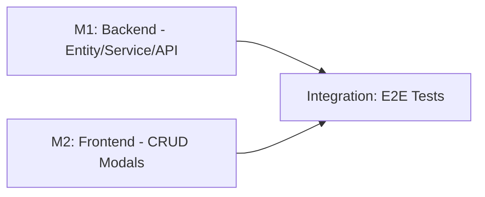

# Implementation Plan: Storage Location Management & Configuration

**Branch**: `OGC-68-storage-location-crud` | **Date**: 2025-12-11 | **Spec**:
[spec.md](./spec.md)  
**Input**: Feature specification from
`/specs/OGC-68-storage-location-crud/spec.md`  
**Jira**: [OGC-68](https://uwdigi.atlassian.net/browse/OGC-68)

## Summary

Implement full CRUD (Create, Read, Update, Delete) capabilities for storage
locations (Room, Device, Shelf, Rack) in the Storage Dashboard. Includes adding
connectivity configuration fields (`ip_address`, `port`,
`communication_protocol`) to `StorageDevice` for future IoT monitoring
integration. Strict referential integrity prevents deletion of locations with
children or assigned samples.

**Technical Approach**: Extend existing storage infrastructure (Feature 001) by:

1. Adding 3 new columns to `storage_device` table via Liquibase
2. Extending `StorageDevice` entity with connectivity fields
3. Updating `StorageLocationFhirTransform` with new FHIR extensions
4. Adding deletion validation logic in service layer
5. Creating Carbon Design System modals for Add/Edit/Delete operations
6. Integrating CRUD actions into existing dashboard tabs via overflow menus

## Technical Context

**Language/Version**: Java 21 LTS (backend), React 17 (frontend)  
**Primary Dependencies**:

- Backend: Spring Framework 6.2.2, Hibernate 6.x, HAPI FHIR R4 (v6.6.2), JPA
- Frontend: @carbon/react v1.15.0, React Intl 5.20.12, Formik 2.2.9

**Storage**: PostgreSQL 14+ (existing OpenELIS database)  
**Testing**:

- Backend: JUnit 4 (4.13.1) + Mockito 2.21.0 (unit/integration)
- Frontend: Jest + React Testing Library (unit), Cypress 12.17.3 (E2E)

**Target Platform**: Web application (Linux server deployment, browser-based
UI)  
**Project Type**: Web (backend + frontend integration)  
**Performance Goals**: Standard web app expectations (CRUD operations <2s)  
**Constraints**: >70% test coverage per constitution, FHIR R4 integration
mandatory  
**Scale/Scope**:

- 1 entity update (StorageDevice + 3 fields)
- 4 CRUD-enabled entity types (Room, Device, Shelf, Rack)
- 3 modal components (Add/Edit, Delete confirmation, shared across entity types)
- 1 service method update (deletion validation)
- 1 FHIR transform update (3 new extensions)

## Constitution Check

_GATE: Must pass before Phase 0 research. Re-check after Phase 1 design._

Verify compliance with
[OpenELIS Global 3.0 Constitution](../../.specify/memory/constitution.md):

- [x] **Configuration-Driven**: No country-specific code branches planned
- [x] **Carbon Design System**: UI uses @carbon/react exclusively (Modal,
      TextInput, Select, OverflowMenu)
- [x] **FHIR/IHE Compliance**: New device fields map to FHIR Location extensions
- [x] **Layered Architecture**: Backend follows 5-layer pattern
      (Valueholder→DAO→Service→Controller→Form)
  - Valueholders use JPA/Hibernate annotations (existing StorageDevice.java)
  - Transaction management in service layer only
- [x] **Test Coverage**: Unit + integration + E2E tests planned (>80%
      backend, >70% frontend)
  - E2E tests follow Cypress best practices (Constitution V.5)
- [x] **Schema Management**: Database changes via Liquibase changesets only
- [x] **Internationalization**: All UI strings use React Intl
- [x] **Security & Compliance**: RBAC (Manage Storage permission), audit trail
      via BaseObject

**Complexity Justification Required If**: None - fully compliant with
constitution.

## Milestone Plan

_GATE: Features >3 days MUST define milestones per Constitution Principle IX._

**Effort Estimate**: ~3-4 days (borderline - using 2 milestones for manageable
PR scope per PR #2421 guidance)

### Milestone Table

| ID     | Branch Suffix | Scope                                             | User Stories      | Verification                  | Depends On |
| ------ | ------------- | ------------------------------------------------- | ----------------- | ----------------------------- | ---------- |
| M1     | m1-backend    | Entity, Liquibase, DAO, Service, Controller, FHIR | P1, P2 (backend)  | Unit + Integration tests pass | -          |
| [P] M2 | m2-frontend   | CRUD modals, overflow menu actions, i18n          | P1, P2 (frontend) | Jest + E2E tests pass         | -          |

**Legend**:

- **[P]**: Parallel milestone - M2 can be developed alongside M1
- **Branch**: Full path is `feat/OGC-68-storage-location-crud/{suffix}`

### Milestone Dependency Graph



### PR Strategy

Per Constitution Principle IX and PR #2421 (Project Branch Deployment Strategy):

- **Milestone PRs**:
  - `feat/OGC-68-storage-location-crud/m1-backend` → `develop`
  - `feat/OGC-68-storage-location-crud/m2-frontend` → `develop`
- **Small Feature Optimization**: Since M1 and M2 are independent, both can
  target `develop` directly (no feature integration branch needed)

**PR Scope Guidelines** (per PR #2421):

- Each milestone PR should be 15-25 tasks maximum
- No process comments in code (e.g., "per review", "AI-generated")
- Use spec path references: `specs/OGC-68-storage-location-crud/spec.md FR-XXX`

## Project Structure

### Documentation (this feature)

```text
specs/OGC-68-storage-location-crud/
├── spec.md              # Feature specification
├── plan.md              # This file
├── research.md          # Phase 0 output
├── data-model.md        # Phase 1 output
├── quickstart.md        # Phase 1 output
├── contracts/           # Phase 1 output (API contracts)
│   └── storage-crud-api.json
├── checklists/
│   └── requirements.md  # Spec quality checklist
└── tasks.md             # Phase 2 output
```

### Source Code (repository root)

```text
# Backend
src/main/java/org/openelisglobal/storage/
├── valueholder/
│   └── StorageDevice.java          # UPDATE: Add ip_address, port, communication_protocol
├── dao/
│   └── StorageDeviceDAOImpl.java   # No changes expected
├── service/
│   └── StorageLocationServiceImpl.java  # UPDATE: Add deletion validation logic
├── controller/
│   └── StorageLocationRestController.java  # UPDATE: Add DELETE endpoints
├── form/
│   └── StorageDeviceForm.java      # UPDATE: Add new fields to DTO
└── fhir/
    └── StorageLocationFhirTransform.java  # UPDATE: Add connectivity extensions

src/main/resources/liquibase/3.3.x.x/
└── 023-storage-device-connectivity.xml  # NEW: Add columns changeset

# Frontend
frontend/src/components/storage/
├── StorageLocationModal.jsx        # NEW: Shared Add/Edit modal
├── DeleteLocationModal.jsx         # NEW: Delete confirmation modal
├── StorageRoomsTab.jsx             # UPDATE: Add overflow menu actions
├── StorageDevicesTab.jsx           # UPDATE: Add overflow menu + config fields
├── StorageShelvesTab.jsx           # UPDATE: Add overflow menu actions
└── StorageRacksTab.jsx             # UPDATE: Add overflow menu actions

frontend/src/languages/
├── en.json                         # UPDATE: Add CRUD strings
└── fr.json                         # UPDATE: Add CRUD strings

# Tests
src/test/java/org/openelisglobal/storage/
├── service/StorageLocationServiceTest.java  # UPDATE: Add deletion tests
└── controller/StorageLocationRestControllerTest.java  # UPDATE: Add CRUD tests

frontend/cypress/e2e/
└── storageLocationCrud.cy.js       # NEW: E2E tests for CRUD operations
```

## Testing Strategy

**Reference**:
[OpenELIS Testing Roadmap](../../.specify/guides/testing-roadmap.md)

### Coverage Goals

- **Backend**: >80% code coverage (measured via JaCoCo)
- **Frontend**: >70% code coverage (measured via Jest)
- **Critical Paths**: 100% coverage for deletion validation logic

### Test Types

- [x] **Unit Tests**: Service layer deletion validation (JUnit 4 + Mockito)
  - Template: `.specify/templates/testing/JUnit4ServiceTest.java.template`
  - **SDD Checkpoint**: After M1 (Backend), all unit tests MUST pass
- [x] **Controller Tests**: REST API CRUD endpoints
      (BaseWebContextSensitiveTest)
  - Template: `.specify/templates/testing/WebMvcTestController.java.template`
  - Test CREATE, UPDATE, DELETE for each entity type
  - Test deletion validation error responses
- [x] **ORM Validation Tests**: Entity mapping validation (Constitution V.4)

  - Verify new StorageDevice columns map correctly
  - MUST execute in <5 seconds, MUST NOT require database

- [x] **Frontend Unit Tests**: React component logic (Jest + React Testing
      Library)
  - Template: `.specify/templates/testing/JestComponent.test.jsx.template`
  - Test modal state management, form validation, error display
- [x] **E2E Tests**: Critical user workflows (Cypress)
  - Template: `.specify/templates/testing/CypressE2E.cy.js.template`
  - Test: Add Room → Add Device (with IP/Port) → Edit → Delete
  - Test: Deletion blocked when children exist

### Test Data Management

- **Backend**:
  - Unit Tests: Use builders/factories for StorageDevice, StorageRoom, etc.
  - Integration: Use `@Transactional` rollback
- **Frontend**:
  - E2E Tests (Cypress):
    - [x] Use API-based setup via `cy.request()` (10x faster than UI)
    - [x] Use `cy.session()` for login state
    - [x] Use `cy.intercept()` for consistent test data

### Checkpoint Validations

- [x] **After M1 (Backend)**: Unit + Integration tests MUST pass
- [x] **After M2 (Frontend)**: Jest tests + E2E tests MUST pass

---

## Phase 0: Research

### Research Questions

1. **Existing CRUD Patterns**: How are other OpenELIS entities (Patient, Test)
   managed via CRUD?
2. **Deletion Cascade**: Does Hibernate cascade delete handle referential
   integrity, or manual validation needed?
3. **IP Validation**: Standard IPv4/IPv6 regex patterns for form validation
4. **Communication Protocols**: What protocols besides BACnet might be supported
   in future?

**Output**: See [research.md](./research.md) for findings.

---

## Phase 1: Design

### Data Model Updates

**StorageDevice Entity** (existing, update):

- Add: `ip_address VARCHAR(45)` (nullable) - IPv6 max length
- Add: `port INTEGER` (nullable) - 1-65535
- Add: `communication_protocol VARCHAR(20)` (nullable, default 'BACnet')

**Liquibase Changeset**:

```xml
<changeSet id="storage-151-001-add-device-connectivity" author="dev-team">
  <addColumn tableName="storage_device">
    <column name="ip_address" type="VARCHAR(45)"/>
    <column name="port" type="INTEGER"/>
    <column name="communication_protocol" type="VARCHAR(20)" defaultValue="BACnet"/>
  </addColumn>
</changeSet>
```

**Output**: See [data-model.md](./data-model.md) for complete schema.

### API Contracts

**New Endpoints**:

- `POST /rest/storage/rooms` - Create Room
- `PUT /rest/storage/rooms/{id}` - Update Room
- `DELETE /rest/storage/rooms/{id}` - Delete Room (with validation)
- (Similar for devices, shelves, racks)

**Deletion Response**:

```json
{
  "success": false,
  "error": "REFERENTIAL_INTEGRITY_VIOLATION",
  "message": "Cannot delete Room 'Main Lab': contains 3 active devices"
}
```

**Output**: See
[contracts/storage-crud-api.json](./contracts/storage-crud-api.json).

### FHIR Extensions

New extensions for StorageDevice → FHIR Location:

- `http://openelis.org/fhir/extension/device-ip-address` (valueString)
- `http://openelis.org/fhir/extension/device-port` (valueInteger)
- `http://openelis.org/fhir/extension/device-communication-protocol`
  (valueString)

---

## Implementation Notes

### M1: Backend Implementation Order

1. **Liquibase** - Add columns to storage_device table
2. **Entity** - Update StorageDevice.java with new fields
3. **DAO** - No changes needed (inherited CRUD)
4. **Service** - Add deletion validation logic
5. **Controller** - Add DELETE endpoints with validation
6. **FHIR** - Update StorageLocationFhirTransform.java
7. **Tests** - Unit + Integration tests

### M2: Frontend Implementation Order

1. **i18n** - Add translation keys for CRUD strings
2. **StorageLocationModal** - Create shared Add/Edit modal
3. **DeleteLocationModal** - Create confirmation modal
4. **Tab Updates** - Add overflow menu actions to each tab
5. **Device Form** - Add IP/Port/Protocol fields
6. **Tests** - Jest unit tests + Cypress E2E

### Key Technical Decisions

1. **Shared Modal Pattern**: Single `StorageLocationModal` component handles all
   entity types (Room, Device, Shelf, Rack) with dynamic field rendering based
   on `entityType` prop.

2. **Deletion Validation in Service Layer**: Check for children and assignments
   in `StorageLocationServiceImpl.canDelete(entityType, id)` - returns
   validation result with error details.

3. **Optimistic UI**: Frontend shows loading state during CRUD operations,
   refreshes table on success.

---

**Next Step**: Run `/speckit.tasks` to generate task breakdown by milestone.
